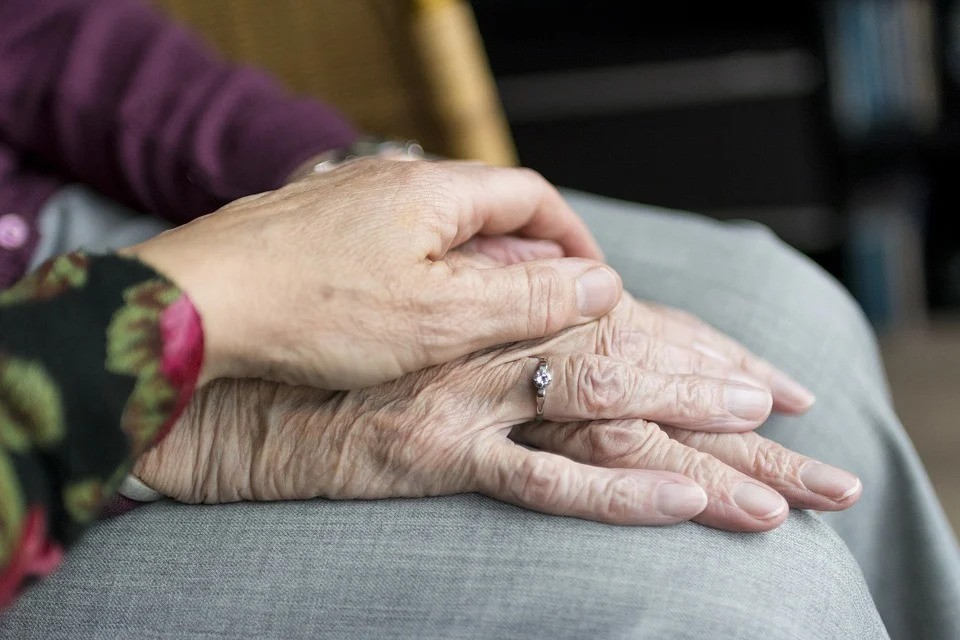
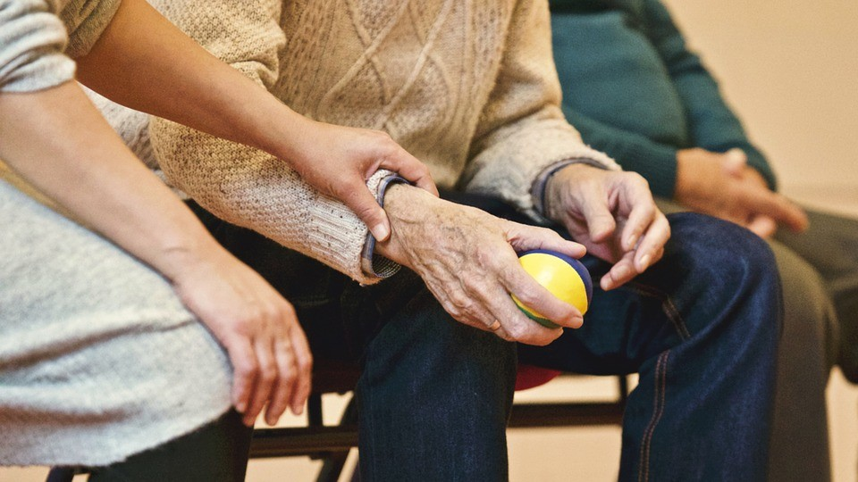

“Es importante y necesario una toma de conciencia y sensibilización de la familia, así como del Centro Espirita, en el sentido de atender al espíritu reencarnado en la Tierra, en la etapa de la Tercera Edad, mejorándole las condiciones y calidad de vida material, física, como también y principalmente espiritual, dispensándole no solo atencióin, sino haciéndolo sentirse apoyado y amado.” María Aparecida Valente, Elaine Curti Ramazzini, El anciano en el Centro Espirita, p. 11).

**Importancia**

“Es muy importante valorar a aquellos que adentraron a la tercera edad, incentivarlos a desarrollar sus potencialidades, propicia?ndoles una adaptación positiva y constructiva en el núcleo familiar, en la vida comunitaria y en nuestras Casas Espiritas, enseñándolos a vivir generosamente, educando sus sentimientos, dándoles oportunidad de crecer espiritualmente, a trave?s de los recursos y enseñanzas que el Espiritismo nos concede.” (Lucy Diaz Ramos, Hojas de otoño, p. 24).

**Modalidades de trabajo**

*   **Institucional:** Son instituciones de larga permanencia, gubernamentales o no gubernamentales (asilos, abrigos, hogares).
*   **Grupos de Ancianos o Grupos de Convivencia:** consiste de trabajo semanal comunes desarrollados con ancianos de ambos sexos e interesados en asuntos comunes a su grupo de edad.

**Objetivos**

*   Atender al anciano en sus necesidades físicas, morales y espirituales;
*   Ofrecer al anciano orientaciones a la luz dela Doctrina Espirita favoreciendo su convivencia familiar y comunitaria, bien con el conocimiento de la inmortalidad del alma, de la vida futura y de la realidad del mundo espiritual;
*   Orientar al anciano para la accesibilidad de los programas y beneficios a que tienen derecho dentro de la Política de Atendimiento;
*   Desarrollar actividades físicas, laborales, culturales y de asistencia social junto al anciano.

**Día, Horario, Cronograma**

El grupo de Anciano podría funcionar una o mas veces en la semana, con días y horarios conforme la opción de la Casa Espirita, pero se sugiere que sea preferencialmente en el periodo vespertino, en atención a las características del público atendido, conforme la sugestión de abajo:  

**Actividades**

Son innumerables las actividades que podrían ser implantadas en la Casa Espirita, para atendimiento al anciano. Veamos algunas:

**a) Cursos Doctrinarios**

“Contenido: se sugiere los mismos temas abordados en las reuniones públicas y disponibles en el sitio www.ocentroespirita.com, así como temas de El Evangelio Según el Espiritismo y otras obras espiritas, de acuerdo a la necesidad del grupo atendido.

“Las enseñanzas espiritas nos dan subsidios para saber de donde venimos, que estamos haciendo aquí en la Tierra, para donde iremos después de la muerte física, ampliando nuestra visión en torno del real sentido de la existencia, porque la fe razonada nos confiere un entendimiento mas amplio de la Justicia Divina y de Sua sabias leyes.” (Lucy Diaz Ramos, Hojas de otoño, p. 64).

**b) Tratamiento Espiritual**

*   El tratamiento espiritual es de fundamental importancia para el anciano, debiendo el mismo de ser orientado y/o encaminado por el equipo para el atendimiento en la Casa Espirita. Se debe también, estimularlo a implantar el Culto del Evangelio en el Hogar y matricularse en las Escuelas de Evangelización de Adultos y de Estudios Espiritas.

**c) Conferencias dirigidas a las necesidades específicas de esta etapa.**

*   Mas allá de los cursos doctrinarios, el abordaje de otros temas también es necesario: mantenimiento de la salud, alimentación, auto-medicación, prevención de caídas, preparación para el envejecimiento, abstención del cigarro, alcohol y otras drogas, las limitaciones de esta etapa, dentro de otros.

**d) Dinámicas de Grupos**

*   Las dinámicas de grupos con ancianos estimulan los sentidos, promueven la integración y la coordinación motora.

**e) Integración del anciano en la Casa Espirita**

*   Da oportunidad al anciano a la integración en actividades desarrolladas en la Casa Espirita, dentro de sus condiciones (actividades asistenciales, sociales, visitas fraternas, evangelización infanto-juvenil, de entre otras). 

**f) Talleres artesanales**

*   Los talleres artesanales estimulan la creatividad, ejercita la mente y la capacidad motora.

**g) Talleres Culturales, paseos y visitasteis**

*   Elaboración y registro de la historia personal, expresando y señalando hechos de la vida de cada uno;
*   Elaboración/producción de un pequeño libro, donde puedan relatar la historia de vida;
*   Acceso a la biblioteca (cuentos, historias, lectura);
*   Paseos y visitas (hogar de ancianos, hogar de niños, clubes y otros eventos culturales);
*   Grupo de Canto Coral.

**h) Talleres de Ciudadanía – Momento de reflexión con el ancianos**

*   Apoyar al anciano en la conquista y defensa de sus derechos y deberes; Beneficios conferidos a los ancianos – Previsión social;
*   Garantías de derecho.

**i) Taller – Centinela de salud**

*   Estímulo al auto-cuidado, dirigiendo hábitos de vida saludable; Grupo de yoga;
*   Programa de prevención y cuidados con la salud; Alimentación saludable.

**j) Taller de Vivencias**

*   Proporciona mejoría en las relaciones sociales y familiares.

**k) Taller de Cocina**

*   El arte de la cocina;
*   Producción del libro de recetas (Recetas de la Abuela);
*   Aulas prácticas: elección y preparación de las mejores recetas compartidas en el grupo.

**l) Taller de Inclusión Digital**

La inclusión digital en la Tercera Edad posibilita el fortalecimiento del funcionamiento cognitivo, contribuyendo para el bienestar social, emocional y físico del anciano, bien como la manutención e independencia de sus actividades diarias.

Mas allá de las actividades ya descritas, otras también son fundamentales, como:

**a) Trabajo con la Familia/Visitas Domiciliares**

En el trabajo con el anciano es fundamental el involucramiento de la familia, pues muchos desajustes y conflictos pueden ser minimizados cuando el anciano se siente amado y respetado en su grupo familiar. De ahí, el trabajo no puede ser realizado de forma aislada, debiendo, por lo tanto, la familia a ser estimulada periódicamente a participar de las reuniones.

“La familia es el punto de sustentación y equilibrio para el anciano. El anciano bien ajustado en el grupo familiar encuentra mas facilidad para integrarse en el medio social y para mantenerse activo. El resultado de una buena relación en familia es el incentivo que lo lleva a participar de grupos de apoyo y buscar ayuda, cuando es necesario.

Indiscutiblemente, el hogar es el lugar mas adecuado para el bienestar físico y espiritual del anciano.” (Lucy Diaz Ramos, Hojas de otoño, p. 51).

**b) Atendimiento Psico-social**

Es muy importante que la Casa Espirita cuente con psicólogos y profesionales del servicio social para auxiliar al anciano a lidiar con sus limitaciones de orden físico, social, económicos o de cualquier otra naturaleza, bien como proceder encaminamientos y realizar acompañamientos.

**Equipo de trabajadores- Quienes son**

“El trabajo junto al anciano exige un equipo armónico y preparado. Es importante resaltar que algunas actividades desarrolladas en el grupo de ancianos pueden ser ejecutadas por personas no espiritas pero que tengan afinidad con el trabajo. Son actividades eminentemente técnicas, como la de los médicos, fisioterapeutas, terapeutas ocupacionales, dentistas, de entre otras. Las actividades que hablan respecto a educación del alma (cursos doctrinarios), deben ser ejercidos por voluntario espirita, que alinearan la técnica con los conocimientos doctrinarios, teniendo siempre en vista, los objetivos y finalidades del trabajo.

Servicio Voluntario: se recomienda que los voluntarios firmen una declaración en la cual quede expreso el trabajo que será por el realizado, así como la carga horaria.

**Capacitación de Voluntarios**

“La capacitación del equipo de voluntarios para actuar en el grupo de ancianos es imprescindible para el buen desempeño de la tarea. Es necesario que el trabajador entienda los objetivos del trabajo, así como los deberes que les cabe. Para esto es muy importante la realización de entrenamientos, seminarios y simposios, mas allá de las reuniones semanales.

“Los Centros Espiritas deben reunir, seleccionar y capacitar continuamente al trabajador del Servicio de Asistencia y Promoción Social en los aspectos doctrinarios y técnicos, con miras a su mejor desempeño. Es preferible hacer un trabajo modesto, pero de buena calidad, buscar realizaciones de gran logro dentro de la improvisación y de la improvidencia.” (Federación Espirita Brasileña, El Centro Espirita, cap. VIII, ítem 4).

**Requisitos mínimos para trabajar con ancianos**

Son requisitos mínimos para trabajar con personas de la Tercera Edad:

*   **conocimientos específicos en los aspectos:** físico, psíquico, social y espiritual, en las diversas áreas de atendimiento: médica, enfermería, odontológica, nutricional, psicología, fisioterapia, terapéutica- ocupacional, artes (canto, danza, teatro, etc.), artesanía y evangelización;
*   **personalidad:** estable, alegre, cariñosa, paciente, comunicativa;
*   **relacionamiento:** considerar al anciano como un ser, especial en todos los aspectos: físico-psíquico, social-espiritual, llamándolo siempre por el nombre. Tratamientos como: “abuelo, abuelo”, aunque cariñosos, son despersonalizantes.
*   **amar lo que hace:** Tener amor por su trabajo y por las personas con quien se relaciona;
*   **conocimiento de la persona:** interés, amistad. Considerar al anciano siempre como miembro de su familia, contactando a los familiares y, en la ausencia de estos, los amigos mas cercanos. En caso de problemas o rechazo, usar todos los medios para que la familia acepte y comprenda a su anciano.
*   **saber oír:** estimular el diálogo, no hablar de sí, pero dejando al anciano hablar, oyéndolo con paciencia e interés;
*   **tener disponibilidad:** atención, atender con presteza, no hacerse esperar;
*   **intuición y creatividad:** dejarse llevar por la intuición direccionada para el propósito de servir. Esto aumenta la creatividad en el trabajo, haciéndolo placentero y provechoso en el atendimiento a cada ser;
*   **amor:** dispensándolo alas criaturas y vivir plenamente el “Amaos los unos a los otros…” de Jesús (María Aparecida Valente, Elaine Curti Ramazzini, El anciano en el Centro Espirita, p. 16-18).

**Jesús – el mayor ejemplo de trabajador voluntario**

“El mayor ejemplo de trabajador voluntario lo tenemos en Jesús, que solamente se dedicó a todos, sin ningún pedido de retribución. Prometiendo el reino de los Cielos, modificó los paisajes de la Tierra. (…)

Terapia bendecida, el trabajo es mensajero de recursos emocionales, psíquicos y orgánica que restauran el bienestar en el ser humano e impulsándonos al crecimiento interior, al desarrollo de valores que le duermen innatos, preparándolo para la liberación de los impositivos materiales cuando es llamado de retorno a la Vida.” (Joanna de Ángelis, Liberación por el amor, p. 93).