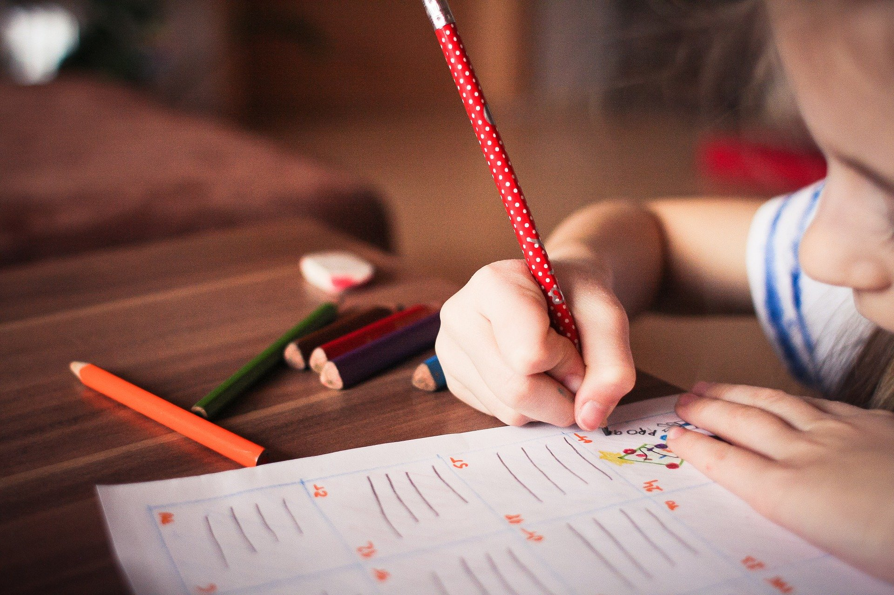

A educação encontra no espiritismo respostas precisas para melhor compreensão do educando e maior eficiência do educador

“**CONCEITO** – A educação é base para a vida em comunidade, por meio de legítimos processos de aprendizagem que fomentam as motivações de crescimento e evolução do indivíduo.  
   
Não apenas um preparo para a vida, mediante a transferência de conhecimentos pelos métodos da aprendizagem. Antes é um processo de desenvolvimento de experiências, no qual educador e educando desdobram as aptidões inatas, aprimorando-as como recursos para a utilização consciente, nas múltiplas oportunidades da existência.

Objetivada como intercâmbio de aprendizagens, merece considerá-la nas matérias, nos métodos e fins, quando se restringe à instrução. Não somente a formar hábitos e desenvolver o intelecto, deve dedicar-se a educação, mas, sobretudo, realizar um continuum permanente, em que as experiências por não cessarem se fixam ou se reformulam, tendo em conta as necessidades da convivência em sociedade e da auto-realização do educando.  
   
Os métodos na experiência educacional devem ser consentâneos às condições mentais e emocionais do aprendiz. Em vez de se lhe impingir, por meio do processo repetitivo, os conhecimentos adquiridos, o educador há de motivá-lo às próprias descobertas, com ele crescendo, de modo que a sua contribuição não seja o resultado do “pronto e concluído”, processo que, segundo a experiência de alguns, “deu certo até aqui”.  
   
Na aplicação dos métodos e escolha das matérias merece considerar as qualidades do educador, sejam de natureza intelectual ou emocional e psicológica, como de caráter afetivo ou sentimental.  
   
Os fins, sem dúvida, estão além das linhas da escolaridade. Erguem-se como permanente etapa a culminar na razão do crescimento do indivíduo, sempre além, até transcender-se na realidade espiritual do porvir.  

A criança não é um “adulto miniaturizado”, nem uma “cera plástica”, facilmente moldável.  
   
Trata-se de um espírito em recomeço, momentaneamente em esquecimento das realizações positivas e negativas que traz das vidas pretéritas, empenhado na conquista da felicidade.  
   
Redescobrindo o mundo e se reidentificando, tende a repetir atitudes e atividades familiares em que se comprazia antes, ou através das quais sucumbiu.  
 

Tendências, aptidões, percepções são lembranças evocadas inconscientemente, que renascem em forma de impressões atraentes, dominantes, assim como limitações, repulsas, frustrações, agressividade e psicoses constituem impositivos constritores ou restritivos – não poucas vezes dolorosos – de que se utilizam as Leis Divinas para corrigir e disciplinar o rebelde que, apesar da manifestação física em período infantil, é espírito relapso, mais de uma vez acumpliciado com o erro, a ele fortemente vinculado, em fracassos morais sucessivos.  
   
Ao educador, além do currículo a que se deve submeter, são indispensáveis os conhecimentos da psicologia infantil, das leis da reencarnação, alta compreensão afetiva junto aos problemas naturais do processus educativo e harmonia interior, valores esses capazes de auxiliar eficientemente a experiência educacional.  
   
As leis da reencarnação quando conhecidas, penetradas necessariamente e aplicadas, conseguem elucidar os mais intrincados enigmas que defronta o educador no processo educativo, isto porque, sem elucidação bastante ampla, nem sempre exitosas, hão redundado as mais avançadas técnicas e modernas experiências.  
   
A instrução é setor da educação, na qual os valores do intelecto encontram necessário cultivo.  
   
A educação, porém, abrange área muito grande, na quase totalidade da vida. No período de formação do homem é pedra fundamental, por isso que ao instituto da família compete a indeclinável tarefa, porquanto pela educação, e não pela instrução apenas, se dará a transformação do indivíduo e consequentemente da Humanidade.  
   
No lar assentam os alicerces legítimos da educação, que se trasladam para a escola que tem a finalidade de continuar aquele mister, de par com a contribuição intelectual, as experiências sociais…  
   
O lar constrói o homem. A escola forma o cidadão.  
   
**DESENVOLVIMENTO** – A escola tradicional fundamentada no rigor da transmissão dos conhecimentos elaborava métodos repetitivos de imposição, mediante o desgoverno da força, sem abrir oportunidades ao aprendiz de formular as próprias experiências, mediante o redescobrimento da vida e do mundo.  
   
O educador, utilizando-se da posição de semideus, fazia-se um simples repetidor das expressões culturais ancestrais, asfixiando as germinações dos interesses novos no educando e matando-as, como recalcando por imposição, os sentimentos formosos e nobres, ao tempo em que assinalava irremediavelmente de forma negativa os que recomeçavam a vida física sob o abençoado impositivo da reencarnação.  
   
Expunha-se o conhecimento, impondo-o.  
   
Com a escola progressiva, porém, surgiu mais ampla visão, em torno da problemática da educação, e o educando passou a merecer o necessário respeito, de modo a desdobrar possibilidades próprias, fomentando intercâmbios experienciais a benefício de mais valiosa aprendizagem.  
   
Não mais a fixidez tradicional, porém os métodos móveis da oportunidade criativa.  
   
Atualizada através de experiências de liberdade exagerada – graças à técnica da enfática da própria liberdade – vem pecando pela libertinagem que enseja, porquanto, em se fundamentando em filosofias materialistas, não percebe no educando um espírito em árdua luta de evolução, mas um corpo e uma mente novos a armazenarem num cérebro em formação e desenvolvimento a herança cultural do passado e as aquisições do presente, com hora marcada para o aniquilamento, após a transposição do portal do túmulo…  
   
Nesse sentido, conturbadas e infelizes redundaram as tentativas mais modernas no campo educacional, produzindo larga e expressiva faixa de jovens desajustados, inquietos, indisciplinados, quais a multidão que ora desfila, com raras exceções, a um passo da alucinação e do suicídio.  
   
Inegavelmente, na educação a liberdade é primacial, porém com responsabilidade, a fim de que as conquistas se incorporem nos seus efeitos ao educando, que os ressarcirá quando negativos, como os fruirá em bem-estares quando positivos.  
   
Nesse sentido, nem agressão nem abandono ao educando. Nem severidade exagerada nem negligência contumaz. Antes, técnicas de amor, através de convivência digna, assistência fraternal e programa de experiências vívidas, atuantes, em tarefas dinâmicas.  
   
**ESPIRITISMO E EDUCAÇÃO** – Doutrina eminentemente racional, o Espiritismo dispõe de vigorosos recursos para a edificação do templo da educação, porquanto penetra nas raízes da vida, jornadeando com o espírito através dos tempos, de modo a elucidar recalques, neuroses, distonias que repontam desde os primeiros dias da conjuntura carnal, a se fixarem no carro somático para complexas provas ou expiações.  
   
Considerando os fatores preponderantes como os secundários que atuam e desorganizam os implementos físicos e psíquicos, equaciona como problemas obsessivos as conjunturas em que padecem os trânsfugas da responsabilidade, agora travestidos em roupagem nova, reencetando tarefas, repetindo experiências para a libertação.  
   
A educação encontra no Espiritismo respostas precisas para melhor compreensão do educando e maior eficiência do educador no labor produtivo de ensinar a viver, oferecendo os instrumentos do conhecimento e da serenidade, da cultura e da experiência aos reiniciantes do sublime caminho redentor, através dos quais os tornam homens voltados para Deus, o bem e o próximo. (Joanna de Ângelis, Estudos Espíritas,3.ed.,p.169 a 173)