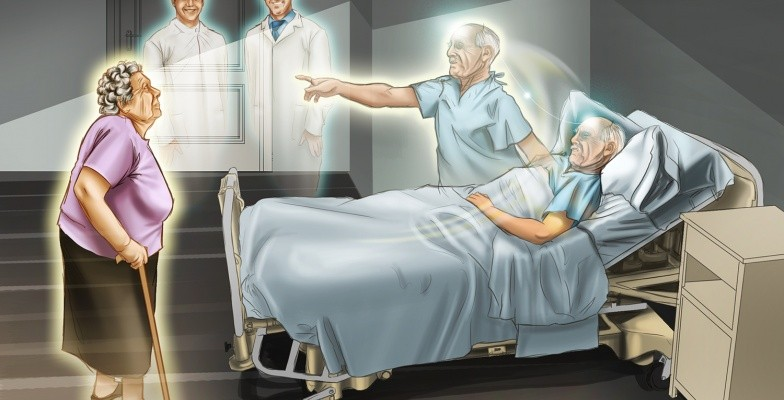
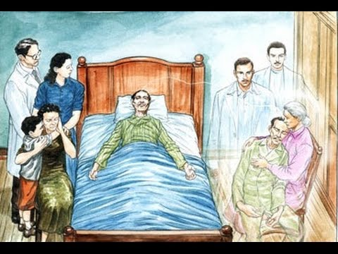

Que se passa no momento da morte e como se desprende o Espírito da sua prisão material? Que Impressões, que sensações o esperam nessa ocasião temerosa? É isso o que interessa a todos conhecer, porque todos cumprem essa jornada. A vida foge-nos a todo instante: nenhum de nós escapará à morte.  
           Ora, o que todas as religiões e filosofias nos deixaram ignorar os Espíritos, em multidão, no-lo vêm ensinar. Dizem-nos que as sensações que precedem e se seguem à morte são infinitamente variadas e dependentes sobretudo do caráter, dos méritos, da elevação moral do Espírito que abandona a Terra. A separação é quase sempre lenta, e o desprendimento da alma opera-se gradualmente. Começa, algumas vezes, muito tempo antes da morte, e só se completa quando ficam rotos os últimos laços fluídicos que unem o perispírito ao corpo. A impressão sentida pela alma revela-se penosa e prolongada quando esses laços são mais fortes e numerosos. Causa permanente da sensação e da vida, a alma experimenta todas as comoções, todos os despedaçamentos do corpo material.  
          Dolorosa, cheia de angústias para uns, a morte não é, para outros, senão um sono agradável seguido de um despertar silencioso. O desprendimento é fácil para aquele que previamente se desligou das coisas deste mundo, para aquele que aspira aos bens espirituais e que cumpriu os seus deveres. Há, ao contrário, luta, agonia prolongada no Espírito preso à Terra, que só conheceu os gozos materiais e deixou de preparar-se para essa viagem.  
          Entretanto, em todos os casos, a separação da alma e do corpo é seguida de um tempo de perturbação, fugitivo para o Espírito justo e bom, que desde cedo despertou ante todos os esplendores da vida celeste; muito longo, a ponto de abranger anos inteiros, para as almas culpadas, impregnadas de fluídos grosseiros. Grande número destas últimas crê permanecer na vida corpórea, muito tempo mesmo depois da morte. Para estas, o perispírito é um segundo corpo carnal, submetido aos mesmos hábitos e, algumas vezes, às mesmas sensações físicas como durante a vida terrena.  
           Outros Espíritos de ordem inferior se acham mergulhados em uma noite profunda, em um completo Insulamento no seio das trevas. Sobre eles pesa a Incerteza, o terror. Os criminosos são atormentados pela visão terrível e incessante das suas vítimas.  
           A hora da separação é cruel para o Espírito que só acredita no nada. Agarra-se como desesperado a esta vida que lhe foge; no supremo momento Insinua-se-lhe a dúvida; vê um mundo temível abrir-se para abismá-lo, e quer, então, retardar a queda. Daí, uma luta terrível entre a matéria, que se esvai, e a alma, que teima em reter o corpo miserável. Algumas vezes, ela fica presa até à decomposição completa, sentindo mesmo, segundo a expressão de um Espírito, “os vermes lhe corroerem as carnes”.     
          Pacífica, resignada, alegre mesmo, é a morte do justo, a partida da alma que, tendo muito lutado e sofrido, deixa a Terra confiante no futuro.  
          Para esta, a morte é a libertação, o fim das provas. Os laços enfraquecidos que a ligam à matéria, destacam-se docemente; sua perturbação não passa de leve entorpecimento, algo semelhante ao sono.

Deixando sua residência corpórea, o Espírito, purificado pela dor e pelo 122 sofrimento, vê sua existência passada recuar, afastar-se pouco a pouco com seus amargores e ilusões; depois, dissipar-se como as brumas que a aurora encontra estendidas sobre o solo e que a claridade do dia faz desaparecer. O Espírito acha-se, então, como que suspenso entre duas sensações: a das coisas materiais que se apagam e a da vida nova que se lhe desenha à frente. Entrevê essa vida como através de um véu, cheia de encanto misterioso, temida e desejada ao mesmo tempo. Após, expande-se a luz, não mais a luz solar que nos é conhecida, porém uma luz espiritual, radiante, por toda parte disseminada. Pouco a pouco o inunda, penetra-o, e, com ela, um tanto de vigor, de remoçamento e de serenidade. O Espírito mergulha nesse banho reparador. Aí se despoja de suas incertezas e de seus temores. Depois, seu olhar destaca-se da Terra, dos seres lacrimosos que cercam seu leito mortuário, e dirige-se para as alturas. Divisa os céus Imensos e outros seres amados, amigos de outrora, mais jovens, mais vivos, mais belos que vêm recebê-lo, guiá-lo no seio dos espaços. Com eles caminha e sobe às regiões etéreas que seu grau de depuração permite atingir. Cessa, então, sua perturbação, despertam faculdades novas, começa o seu destino feliz.

           A entrada em uma vida nova traz impressões tão variadas quanto o permite a posição moral dos Espíritos. Aqueles — e o número é grande — cujas existências se desenrolam indecisas, sem faltas graves nem méritos assinalados, acham-se, a princípio, mergulhados em um estado de torpor, em um acabrunhamento profundo; depois, um choque vem sacudir-lhes o ser. O Espírito sai, lentamente, de seu invólucro: como uma espada da bainha; recobra a liberdade, porém, hesitante, tímido, não se atreve a utilizá-la ainda, ficando cerceado pelo temor e pelo hábito aos laços em que viveu. Continua a sofrer e a chorar com os entes que o estimaram em vida. Assim corre o tempo, sem ele o medir; depois de muito, outros Espíritos auxiliam-no com seus conselhos, ajudando a dissipar sua perturbação, a libertá-lo das últimas cadeias terrestres e a elevá-lo para ambientes menos obscuros.

           Em geral, o desprendimento da alma é menos penoso depois de uma longa moléstia, pois o efeito desta é desligar pouco a pouco os laços carnais. As mortes súbitas, violentas, sobrevindo quando a vida orgânica está em sua plenitude, produzem sobre a alma um despedaçamento doloroso e lançam-na em prolongada perturbação. Os suicidas são vítimas de sensações horríveis. Experimentam, durante anos, as angústias do último momento e reconhecem, com espanto, que não trocaram seus sofrimentos terrestres senão por outros ainda mais vivazes.

          O conhecimento do futuro espiritual, o estudo das leis que presidem à desencarnação são de grande importância como preparativos à morte. Podem suavizar os nossos últimos momentos e proporcionar-nos fácil desprendimento, permitindo mais depressa nos reconhecermos no mundo novo que se nos desvenda. (Léon Denis, _Depois da morte_, 28.ed., Cap. XXX)