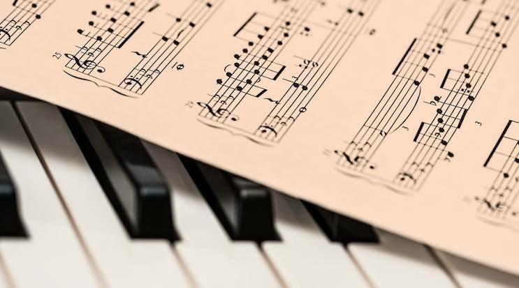

“Diversos trabalhos espíritas, para maior eficiência, se beneficiam de música apropriada como, por exemplo: o de vibrações para curas, o de efeitos físicos e outros. A música apropriada não será, naturalmente, a música mundana, fútil, criada para a dança e o lazer como, também não será aquela criada como expressão das paixões e dos sentimentos animalizados do homem, mas sim a música serena, a melodia suave que enleva o espírito e o transporta às esferas celestiais, a música harmoniosa cujas vibrações correspondem às dos sentimentos elevados de fé, amor e alegria. Para preparar o ambiente, auxiliar as vibrações, para apaziguar os corações, para ajudar a emissão de fluidos, para saturar o ambiente de vibrações elevadas, para tudo serve a música, conquanto não represente um ato ritual, mas simplesmente preparatório e auxiliar, nos trabalhos espíritas. Nas reuniões ou atos públicos e piedosos do Espaço é a música utilizada como alto elemento inspirador e de deleite espiritual, conforme constatamos pelas obras que descrevem a vida nessas esferas felizes.” (Edgard Armond. _Trabalhos Práticos de Espiritismo_. Cap. V item 18 ).

## o valor da música para o Plano Espiritual

**A MÚSICA CELESTE**

“A música celeste não é produzida por fricções de arco sobre cordas: tudo é fluídico, tudo é espiritual, tudo é inspirado pelo pensamento de Deus.” (Léon Denis. _O Espiritismo na arte_. 3ª lição, parte IX)

**A música nobre influencia as almas**

“\[…\] os grandes músicos da Terra, \[…\] obedecem \[…\] a gloriosos impulsos das forças do Infinito, porquanto a música na Terra é, por excelência,  
a arte divina. \[…\]

Apenas desse modo podereis compreender a sagrada influência que a música nobre opera nas almas, arrebatando-as, em quaisquer ocasiões, às ideias indecisas da Terra, para as vibrações do íntimo com o Infinito.”(Emmanuel. _O consolador._ Psicografia de Francisco Cândido Xavier. Perg. 167)

**PODER E AÇÃO DAS VIBRAÇÕES SONORAS**

**Experiência de André Luiz na Colônia Nosso Lar**

“Mal terminara a explicação, as setenta e duas figuras começaram a  
cantar harmonioso hino, repleto de indefinível beleza. A fisionomia de  
Clarêncio, no círculo dos veneráveis companheiros, figurou-se-me tocada de  
mais intensa luz. O cântico celeste constituía-se de notas angelicais, de  
sublimado reconhecimento. Pairavam no recinto misteriosas vibrações de  
paz e de alegria e, quando as notas argentinas fizeram delicioso staccato,  
desenhou-se ao longe, em plano elevado, um coração maravilhosamente  
azul (1), com estrias douradas. Cariciosa música, em seguida, respondia aos louvores, procedente talvez de esferas distantes. Foi aí que abundante chuva de flores azuis se derramou sobre nós…” (André Luiz. _Nosso lar._ Psicografia de Francisco Cândido Xavier. Cap.3)

A música é o **médium** da harmonia; ela a recebe e a dá, como o refletor é o **médium** da luz, como tu és o **médium** dos Espíritos. (Allan Kardec. _Obras Póstumas_. A música celeste)

“\[…\] o som, o ritmo, a harmonia, são forças criadoras. Se nós pudéssemos calcular o poder das vibrações sonoras, avaliar sua ação sobre a matéria fluídica, sua forma de agrupar os turbilhoes de átomos, chegaríamos a um dos segredos da energia espiritual\[…\].” (Léon Denis. O Espiritismo na arte. Parte VI. A Música- parte 1)

**A MÚSICA EXPRIMINDO BOM ÂNIMO E ALEGRIA**

“\[…\] a caravana espiritual se dispunha a partir, quando Maria se lembrou dos discípulos perseguidos pela crueldade do mundo.\[…\] aproximando-se de uma jovem encarcerada, de rosto descarnado e macilento, lhe disse  
ao ouvido: **“Canta, minha filha! Tenhamos bom ânimo!**…\[…\]. Daí a instantes, seu canto melodioso era acompanhado pelas centenas de vozes dos que choravam no cárcere, aguardando o glorioso testemunho. \[…\], desde esse dia, nos tormentos mais duros, os discípulos de Jesus têm cantado na Terra, **exprimindo o seu bom ânimo e a sua alegria,** guardando a suave herança de nossa **Mãe Santíssima**.” (Humberto de Campos. _A Boa Nova_. Psicografia de Francisco Cândido Xavier. Cap.30)

**A MÚSICA NO CENTRO ESPÍRITA**

Podemos e devemos usar a música dentro de nossas Casas Espíritas, como forma de divulgação do Consolador Prometido, tendo, portanto, o cuidado de escolhermos as músicas adequadas para o ambiente. Tão importante quanto levarmos a música para dentro da Casa Espírita é proporcionarmos aos irmãos do Centro a oportunidade de cantarem as músicas juntamente com a equipe de Alegria Cristã. Os HINÁRIOS são a maneira mais fácil e prática de incentivarmos os nossos irmãos a cantarem conosco, uma vez que de posse das letras das músicas fica mais fácil aprender a melodia. Heis o valor e importância do HINÁRIO, companheiro inseparável da equipe de Alegria Cristã.

“Preferir as composições artísticas de feitura espírita, integral, preservando-se a pureza doutrinária.A Arte enobrecida estende o poder do Amor.”(André Luiz. _Conduta espírita_. Psicografado por Francisco Cândido Xavier. Cap. 44)