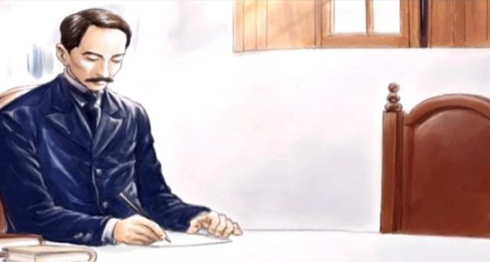
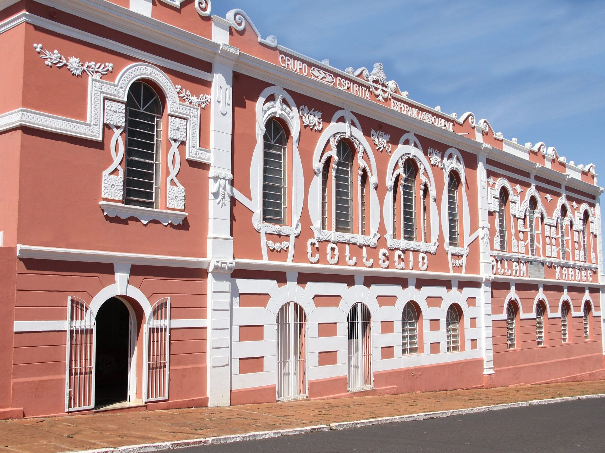

**O EXEMPLO DE EURÍPEDES**  
   
“Os companheiros de magistérios, no Liceu Sacramentano, abandonaram Eurípedes, após sua conversão ao Espiritismo.  
O mobiliário escolar fora retirado e o prédio requerido por seus proprietários.  
O jovem estava abatido, mas não desanimado. O testemunho reclamara-lhe determinações e pujança na fé nova. Por isso, continuava firme nas tarefas espíritas.  
Todos o estimavam como professor e respeitavam-no como cidadão precocemente em valiosas experiências, a favor da comunidade a que servia com  desinteresse e devotamento.  Ele passara anos no Liceu, no desempenho consciente de sua querida carreira de professor. Os alunos, por sua vez, não se conformavam a idéia de perder o mestre e amigo.  
Eurípedes foi procurada por numerosos pais, que lhe rogaram a continuidade das aulas.  
Após um planejamento rápido ficara assentado o aluguel de uma sala no antigo Colégio da Profa. Ana Borges, fechado desde 1885.  
Ali, com mobiliário improvisado e sem conforto, Eurípedes prosseguiu no esforço magnífico, em prol da Educação.  
Na frontal da porta modesta, lia-se: LICEU SACRAMENTANO. O currículo era o .mesmo, mais com a debandada dos colegas, Eurípedes desdobrava para ministrar as aulas de todas as matérias programadas.  
E acrescentara, corajosamente, o ensino da Doutrina Espírita ao currículo, o que suscitara o descontentamento dos pais católicos.  
A maioria levou a Eurípedes a ameaça de retirar os filhos do Liceu, caso mantivesse o Professor a decisão de lecionar Espiritismo.  
– “Que retirem os filhos, mais a finalidade salvadora do aprendizado espírita será mantida.”  
A resposta firme de Eurípedes não deixava margem a outras argumentações.  
Desse modo, grande numero de alunos viram suas matrículas no Liceu canceladas por seus pais.  
Aquele dardo atingira Eurípedes de maneira angustiante. Nessa ocasião, realizava verdadeiro prodígio de bom ânimo, na luta pela sobrevivência do Liceu.  
Um dia, porém, ele se entristecia profundamente. Achava-se abandonado quase, no vazio da sala de aula. Pusera-se a chorar, no silencio de ardorosa prece.  
Sentiu insinuante vontade de  escrever, enquanto todo o ser se lhe banhava em magnetismo suave, muito suave, de fluidez radiosa desconhecida.  
Um nome de elevado destaque das esferas superiores impusera-se-lhe aos canais intuitivos. Ele reage. Não pode ser, não merece receber o beneplácito direto da entidade anunciada.  
Deixa o papel, julgando-se vítima de um embuste.  
Eis que uma força superior toma-lhe do braço e, mecânicamente, transmite pequena mensagem, mais ou menos nestes termos:  
“Não  feche as portas da escola. Apague da tabuleta a denominação Liceu Sacramentano –  que é um resquício do orgulho humano. Em substituição coloque o nome – Colégio Allan Kardec. Ensine o Evangelho de meu filho às quartas-feiras e institua um curso de Astronomia. Acobertarei o Colégio Allan Kardec sob o manto do meu Amor.”      

  
A linguagem sublime da santíssima derrama-se em todo o conteúdo da mensagem, onde apõe Ela o selo de Sua identidade,  através das vibrações do Seu Amor.  
No final, firma o documento preciosa: – **_Maria, serva do Senhor._**  
Eurípedes seguiu à risca as instruções espirituais de Maria  Santíssima.

**NASCE O COLÉGIO ALLAN KARDEC –SACRAMENTO – 1907**  
  
Dos primeiros espinhos, surgira esplendorosa flor, que Eurípedes cultivou com o carinho maior de sua alma – o Colégio Allan Kardec.  
O fato se dera, exatamente a 31 de Janeiro de 1907, sob a égide da sublime Mãe de Jesus.  
Tem início para Sacramento a maior campanha educacional, conhecida até então.

  
Antigos alunos do Liceu Sacramentano reintegraram-se ao novo educandário e mais de duas centenas de outros estudantes são encaminhados ao Colégio Allan Kardec. Tal cifra era muito avantajada para a época, guardadas naturalmente as proporções da relatividade, tendo em vista a densidade demográfica local, bastante reduzida.  
No inicio o Colégio Allan Kardec funcionava na própria residência de Eurípedes. A casa já era pequena para comportar todos os alunos.  
Eurípedes providenciou a derrubada de algumas paredes, formando um salão  mais amplo.  
Restaram três cômodos: cozinha, uma saleta e o salão.  
Nessa época, Eurípedes recebia obsediados para o tratamento, dando-lhes carinhos e benéfica hospitalidade.  
Os alunos eram designados para a vigilância a esses enfermos. Alternavam-se os discípulos no exercício de enfermeiros improvisados. De tal forma  se habituaram àquela tarefa, que o fato corria-lhe à conta de rotineiro e natural.  
Os obsediados furiosos na cozinha, improvisada em cela. Postavam-se a porta um ou mais rapazes, ,em sentinela.  
Os doentes melhorados viviam entre os alunos do Colégio, quer no recreio ou no horário de aula na sala.  
Por essa época, Bezerra de Menezes, numa mensagem, solicita a Eurípedes que volte para o lar paterno a fim de que ambos pudessem iniciar a tarefa da farmácia, no que foi prontamente atendido. “   
  
(Corina Novelino, _Eurípedes_ – _O homem e a missão_, 5 ed., p.109-111)