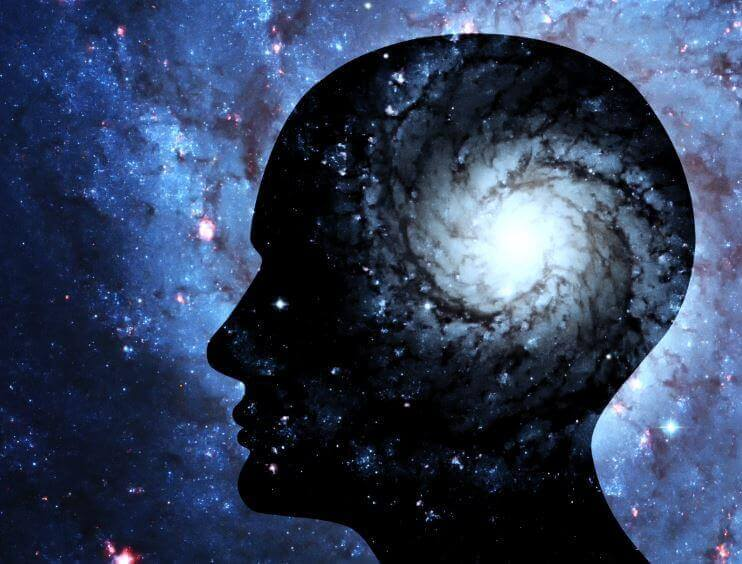

Todas as teorias que pretendem elucidar os fenômenos mediúnicos, alheios à Doutrina Espiritista, pecam pela insuficiência e falsidade.

Em vão, procura-se complicar a questão com termos rebuscados, apresentando-se as hipóteses mais descabidas e absurdas, porquanto os conhecimentos hodiernos da Física, da Fisiologia e da Psicologia não explicam fatos como os de levitação, de materialização, de natureza, afinal, genuinamente espírita.  
Para a ciência anquilosada nas concepções dogmáticas de cada escola, a fenomenologia mediúnica não deve constituir objeto de ridículo e de zombaria, mas sim um amontoado de materiais preciosos à sua observação.

Felizmente, se muitos dos pesquisadores criaram os mais complicados sistemas elucidativos, cheios de extravagância nas suas enganadoras ilações, alguns deles, desassombradamente, têm colaborado com a filosofia espiritualista para a consecução dos seus planos grandiosos, que implicam a felicidade humana.

**A Subconsciência**

A subconsciência, tão investigada em vosso tempo, não elucida os problemas dos chamados fenômenos intelectuais. Estudos levados a efeito sobre essa câmara escura da mente são ainda mal orientados, apesar disso, muitas teorias apressadas presumem explicar todo o mediunismo com a sua estranha influência sobre o “eu” consciente. De fato, existem fenômenos subliminais; todavia, a subconsciência é o acervo de experiências realizadas pelo o ser em suas existências passadas. O Espírito, no labor incessante de suas múltiplas existências, vai ajudando as séries de suas conquistas, de suas possibilidades, de seus trabalhos; no seu cérebro espiritual organiza-se, então, essa consciência profunda, em cujos domínios misteriosos se vão arquivando as recordações, e a alma, em cada etapa da sua vida imortal, renasce para uma nova conquista, objetivando sempre o aperfeiçoamento supremo.

**O Ovido Temporário**

 O esquecimento, nessas existências fragmentárias, obedecendo ás leis superiores que presidem ao destino, representa a diminuição do estado vibratório do Espírito, em contacto com a matéria. Esse olvido é necessário,e, afastando-se os benefícios espirituais que essa questão implica, à luz das concepções cientificas, pode esse problemas ser estudado atenciosamente.

Tomando um novo corpo, a alma tem necessidade de adaptar-se a esse instrumento. Precisa abandonar a bagagem dos seus vícios, dos seus defeitos, das suas lembranças nocivas, das suas vicissitudes nos pretéritos tenebrosos. Necessita de nova virgindade; um instrumento virgem lhe é então fornecido. Os neurônios desse novo cérebro fazem a função de aparelhos quebradores da luz; o sensório limita as percepções do Espírito, e , somente assim, pode o ser reconstruir o seu destino. Para que o homem colha benefícios da sua vida temporária, faz-se mister que assim seja.

Sua consciência é apenas a parte emergente da sua consciência espiritual; seus sentidos constituem apenas o necessário à sua evolução no plano terrestre. Daí, a exigüidade das suas percepções visuais e auditivas, em relação ao número inconcebível de vibrações que o cercam.

**As Recordações**

Todavia, dentro dessa obscuridade requerida pela sua necessidade de estudo e desenvolvimento, experimenta a alma, ás vezes, uma sensação indefinível… é uma vocação inata que impele para esse ou aquele caminho; é uma saudade vaga e incompreensível, que a persegue nas suas meditações; são os fenômenos introspectivos, que a assediam freqüentemente.

Nesses momentos, uma luz vaga da subconsciência atravessa a câmara de sombras, impostas pelas células cerebrais, e, através dessa luz coada, entra o Espírito em vaga relação com o seu passado longínquo; tais fatos são vulgares nos seres evolvidos, sobre quem a carne já não exerce atuação invencível. Nesses vagos instantes, parece que a alma encarnada ouve o tropel das lembranças que passam em revoada; aversões antigas, amores santificantes, gostos aprimorados, de tudo aparece numa fração no seu mundo consciente; mas, faz-se mister olvidar o passado para que alcance êxito na luta.

Emmanuel, Emmanuel. Psicografado por Francisco Candido Xavier, Cap. XIV.