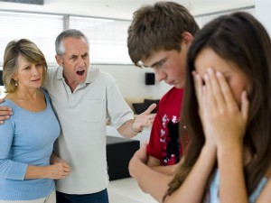
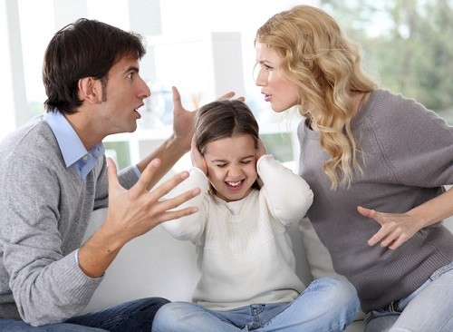

“Existem pais que agridem os filhos e tentam escravizá-los, qual se lhes fôssem objeto de propriedade exclusiva; todavia, encontramos, na mesma ordem de freqüência, filhos que agridem os pais e buscam escravizá-los, como se os progenitores lhes constituíssem alimárias domésticas.

A reencarnação traça rumos nítidos ao mútuo respeito que nos compete de uns para com os outros.

Entre pais e filhos, há naturalmente uma fronteira de apreço recíproco, que não se pode ultrapassar, em nome do amor, sem que o egoísmo apareça, conturbando-lhes a existência. \[…\].

Nunca é lícito o desprezo dos pais para com os filhos e vice-versa. \[…\].

A existência terrestre é muito importante no progresso e no aperfeiçoamento do Espírito; no entanto, ao mesmo tempo, é simples estágio da criatura eterna no educandário da experiência física à maneira de estudante no internato.”

Emmanuel. Vida e sexo. Psicografado por Frâncisco Cândido Xavier. FEB. 15. ed., p. 77-79.

“Às vezes sobrevivem alguns descendentes, vítimas inermes do meio-ambiente, cujos hábitos e costumes arraigados jungem-os a viciações de erradicação difícil, quando não perturbante, de que não se conseguem libertar, estiolando-se, mais tarde…\[…\].

A leviandade de mestres e educadores imaturos, não habilitados moralmente para os relevantes misteres de preparação das mentes e caracteres em formação, contribui, igualmente, com larga quota de responsabilidade no capítulo da delinqüência juvenil, da agressividade e da violência vigentes, ameaçadoras, câncer perigoso a dizimar com crueldade o organismo social do Planeta.\[…\].

O delinqüente, no entanto, padece, não raro, de distúrbios endógenos ou exógenos que o impelem ou predispõem à violência, que se desborda ante os demais contributos sociais, econômicos, mesológicos …

Sem qualquer dúvida, a desarmonia endócrina, resultante da exigência hereditária, as distonias psíquicas se fazem vigorosos impositivos para a alienação e a delinqüência. Muitos traumas psicológicos e recalques que procedem do próprio espírito aturdido e infeliz espocam como complexos destrutivos da personalidade expulsando-os para porões do desajuste da emoção e para a rebeldia sistemática a que se agarram, buscando sobreviver, não raro enlouquecendo pela falta de renovação e pela intoxicação dos fluidos e miasmas psíquicos que cultivam.

Além disso, os distúrbios orgânicos, as seqüelas de enfermidades várias, os traumatismos ocasionados por golpes e quedas são outra fonte de desarranjos do discernimento, ensejando a fácil eclosão da violência e da agressividade.

Pulula, ainda, nos complexos mecanismos da reencarnação em massa destes dias, mergulho no corpo somático de Espírito primário nos quadros da evolução, necessitados de progresso e ajuda para a própria ascensão que, não encontrando os estímulos superiores para o enobrecimento, são, antes, conduzidos à vivencia das sensações grosseiras em que transitam, desbordando os impulsos agressivos e os instintos violentos com que esperam impor-se e usufruir mais fogosas cargas de gozos em que se exaurem e sucumbem. Aderem à filosofia chã de viver intensamente um dia, a lutarem e viverem todos os dias. \[…\].

A terapêutica para tão urgente questão há de ser preventiva, exigindo dos adultos que se repletem de amor nas inexauríveis nascentes da Doutrina de Jesus, a fim de que, moralizando-se, possam educar as gerações novas propiciando-lhes clima salutar de sobrevivência psíquica e realização humana.

A valorização da vida e o respeito pela vida conduzirão pais, mestres, educadores, religiosos e psicólogos a uma engrenagem de entendimento fraternal com objetivos harmônicos e metódicos – exemplos capazes de sensibilizar a alma infantil e conduzi-la com segurança às metas felizes que devem perseguir.”

Joanna de Ângelis e espíritos diversos. S.O.S. família. Psicografado de Divaldo Pereira Franco. Editora Leal. 7. ed., p. 122-125.