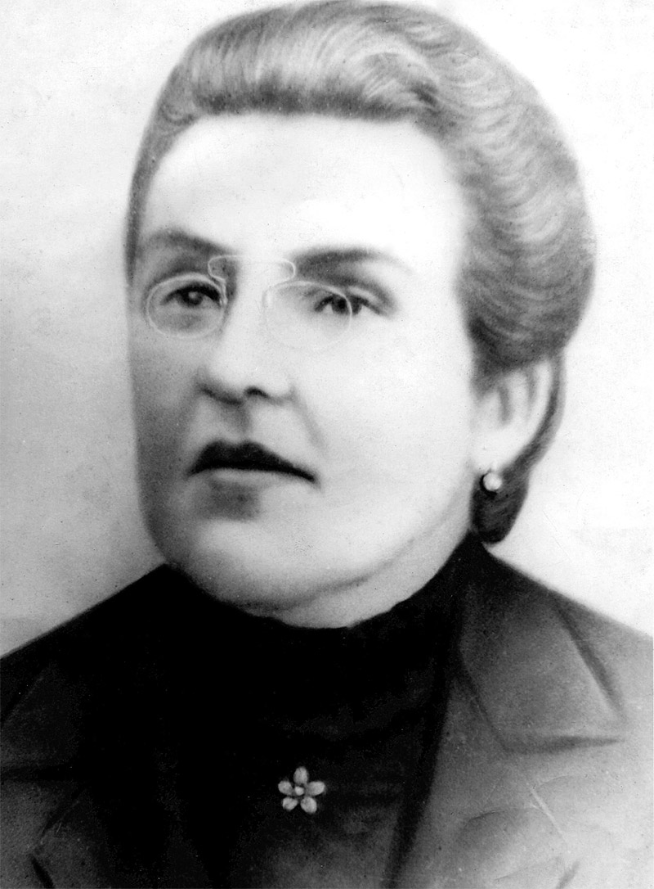

Nascida na cidade de Resende, Estado do Rio de Janeiro, no dia 1o. de fevereiro de 1856, e desencarnada em S. Paulo, no dia 13 de janeiro de 1919. Seu nome de solteira era Anália Emília Franco. Após consorciar- se em matrimônio com Francisco Antônio Bastos, seu nome passou a ser Anália Franco Bastos, entretanto, é mais conhecida por Anália Franco.

Com 16 anos de idade entrou num Concurso de Câmara dessa cidade e logrou aprovação para exercer o cargo de professora primária. Trabalhou como assistente de sua própria mãe durante algum tempo. Anteriormente a 1875 diplomou- se Normalista, em S. Paulo.  
  
  
**Vocação Literária  
**  
Foi após a Lei do Ventre Livre que sua verdadeira vocação se exteriorizou: a vocação literária. Já era por esse tempo notável como literata, jornalista e poetisa, entretanto, chegou ao seu conhecimento que os nascituros de escravas estavam previamente destinados à “Roda” da Santa Casa de Misericórdia. Já perambulavam, mendicantes, pelas estradas e pelas ruas, os negrinhos expulsos das fazendas por impróprios para o trabalho. Não eram, como até então “negociáveis”, com seus pais e os adquirentes de cativos davam preferência às escravas que não tinham filhos no ventre. Anália escreveu, apelando para as mulheres fazendeiras. Trocou seu cargo na Capital de São Paulo por outro no Interior, a fim de socorrer as criancinhas necessitadas. Num bairro duma cidade do norte doEstado de S. Paulo conseguiu uma casa para instalar uma escola primária. Uma fazendeira rica lhe cedeu a casa escolar com uma condição, que foi frontalmente repelida por Anália: não deveria haver promiscuidade de crianças brancas e negras. Diante dessa condição humilhante foi recusada a gratuidade do uso da casa, passando a pagar um aluguel. A fazendeira guardou ressentimento à altivez da professora, porém, naquele local Anália inaugurou a sua primeira e original “Casa Maternal”. Começou a receber todas as crianças que lhe batiam à porta, levadas por parentes ou apanhadas nas moitas e desvios dos caminhos. A fazendeira, abusando do prestígio político do marido, vendo que a sua casa, embora alugada, se transformara num albergue de negrinhos, resolveu acabar com aquele “escândalo” em sua fazenda. Promoveu diligências junto ao coronel e este conseguiu facilmente a remoção da professora. Anália foi para a cidade e alugou uma casa velha, pagando de seu bolso o aluguel correspondente à metade do seu ordenado. Como o restante era insuficiente para a alimentação das crianças, não trepidou em ir, pessoalmente, pedir esmolas para a meninada. Partiu de manhã, à pé, levando consigo o grupinho escuro que ela chamava, em seus escritos, de “meus alunos sem mães”. Numa folha local anunciou que, ao lado da escola pública, havia um pequeno “abrigo” para as crianças desamparadas. A fama, nem sempre favorável da novel professora, encheu a cidade. A curiosidade popular tomou- se de espanto, num domingo de festa religiosa. Ela apareceu nas ruas com seus “alunos sem mães”, em bando precatório. Moça e magra, modesta e altiva, aquela impressionante figura de mulher, que mendigava para filhos de escravas, tornou- se o escândalo do dia. Era uma mulher perigosa, na opinião de muitos. Seu afastamento da cidade principiou a ser objeto de consideração em rodas políticas, nas farmácias. Mas rugiu a seu favor um grupo de abolicionistas e republicanos, contra o grande grupo de católicos, escravocratas e monarquistas.

Com o decorrer do tempo, deixando algumas escolas maternais no Interior, veio para S. Paulo. Aqui entrou brilhantemente para o grupo abolicionista e republicano. Sua missão, porém, não era política. Sua preocupação maior era com as crianças desamparadas, o que a levou a fundar uma revista própria, intitulada “Álbum das Meninas”, cujo primeiro número veio a lume a 30 de abril de 1898. O artigo de fundo tinha o título “Às mães e educadoras”. Seu prestígio no seio do professorado já era grande quando surgiram a abolição da escravatura e a República. O advento dessa nova era encontrou Anália com dois grandes colégios gratuitos para meninas e meninos. E logo que as leis o permitiram, ela, secundada por vinte senhoras amigas, fundou o instituto educacional que se denominou “Associação Feminina Beneficente e Instrutiva”, no dia 17 de novembro de 1901, com sede no Largo do Arouche, em S. Paulo.

Em seguida criou várias “Escolas Maternais” e “Escolas Elementares”, instalando, com inauguração solene a 25 de janeiro de 1902, o “Liceu Feminino”, que tinha por finalidade instruir e preparar professoras para a direção daquelas escolas, com o curso de dois anos para as professoras de “Escolas Maternais” e de três anos para as “Escolas Elementares”.

Anália Franco publicou numerosos folhetos e opúsculos referentes aos cursos ministrados em suas escolas, tratados especiais sobre a infância, nos quais as professoras encontraram meios de desenvolver as faculdades afetivas e morais das crianças, instruindo- as ao mesmo tempo. O seu opúsculo “O Novo Manual Educativo”, era dividido em três partes: Infância, Adolescência e Juventude.

Em 1o. de dezembro de 1903, passou a publicar “A Voz Maternal”, revista mensal com a apreciável tiragem de 6.000 exemplares, impressos em oficinas próprias.

A Associação Feminina mantinha um Bazar na rua do Rosário n.o. 18, em S. Paulo, para a venda dos artefatos das suas oficinas, e uma sucursal desse estabelecimento na Ladeira do Piques n.o. 23.

**  
Obras**

Anália Franco mantinha Escolas Reunidas na Capital e Escolas Isoladas no Interior, Escolas Maternais, Creches na Capital e no Interior do Estado, Bibliotecas anexas às escolas, Escolas Profissionais, Arte Tipográfica, Curso de Escrituração Mercantil, Prática de Enfermagem e Arte Dentária, Línguas (francês, italiano, inglês e alemão); Música, Desenho, Pintura, Pedagogia, Costura, Bordados, Flores artificiais e Chapéus, num total de 37 instituições.

Era romancista, escritora, teatróloga e poetisa. Escreveu uma infinidade de livretos para a educação das crianças e para as Escolas, os quais são dignos de serem adotados nas Escolas públicas.

Era espírita fervorosa, revelando sempre inusitado interesse pelas coisas atinentes à Doutrina Espírita.

Produziu a sua vasta cultura três ótimos romances: “A Égide Materna”, “A Filha do Artista”, e “A Filha Adotiva”. Foi autora de numerosas peças teatrais, de diálogos e de várias estrofes, destacando- se “Hino a Deus”, “Hino a Ana Nery”, “Minha Terra”, “Hino a Jesus” e outros.

Em 1911 conseguiu, sem qualquer recurso financeiro, adquirir a “Chácara Paraíso”. Eram 75 alqueires de terra, parte em matas e capoeiras e o restante ocupado com benfeitorias diversas, entre as quais um velho solar, ocupado durante longos anos por uma das mais notáveis figuras da História do Brasil: Diogo Antônio Feijó.

Nessa chácara fundou Anália Franco a “Colônia Regeneradora D. Romualdo”, aproveitando o casarão, a estrebaria e a antiga senzala, internando ali sob direção feminina, os garotos mais aptos para a Lavoura, a horticultura e outras atividades agropastoris, recolhendo ainda moças desviadas, conseguindo assim regenerar centenas de mulheres.  
A vasta sementeira de Anália Franco consistiu em 71 Escolas, 2 albergues, 1 colônia regeneradora para mulheres, 23 asilos para crianças órfãs, 1 Banda Musical Feminina, 1 orquestra, 1 Grupo Dramático, além de oficinas para manufatura de chapéus, flores artificiais, etc., em 24 cidades do Interior e da Capital.  
 

**Desencarnação  
**  
Sua desencarnação ocorreu precisamente quando havia tomado a deliberação de ir ao Rio de Janeiro fundar mais uma instituição, ideia essa concretizada posteriormente pelo seu esposo, que ali fundou o “Asilo Anália Franco”.  
A obra de Anália Franco foi, incontestavelmente, uma das mais salientes e meritórias da História do Espiritismo.