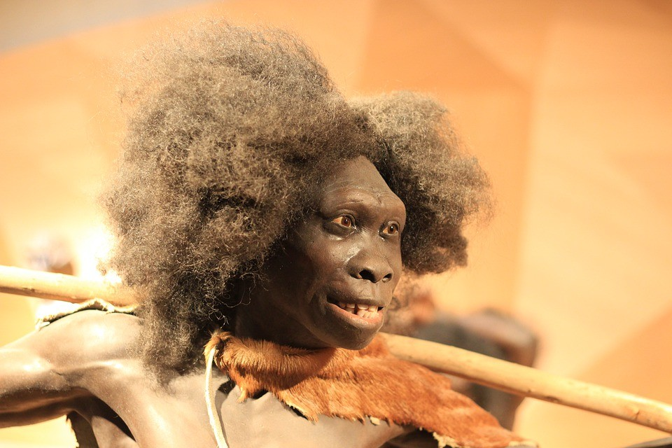
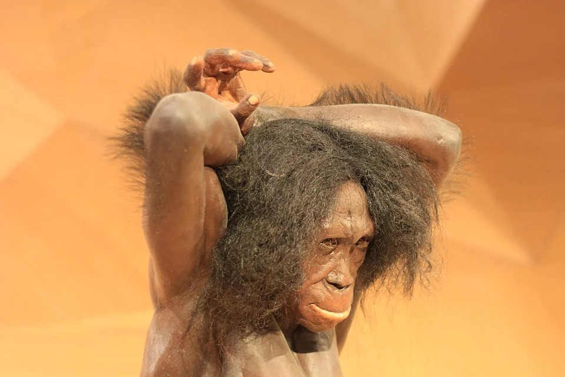
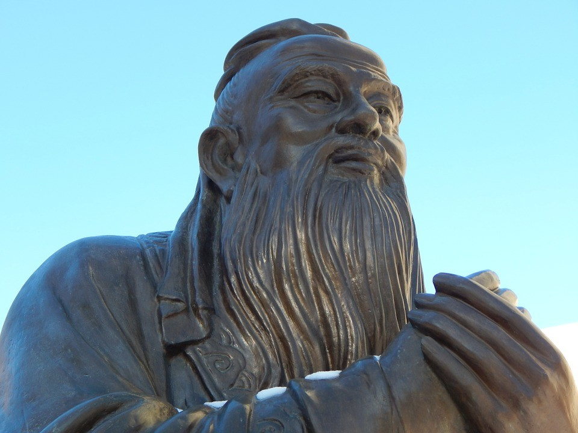

A história das civilizações terrestres é a da lenta evolução de um conjunto heterogêneo de Espíritos falidos, em regime de provas e expiações. Foi há cerca de quinhentos milênios que encarnaram neste orbe os primeiros Espíritos conscientes, embora muito primitivos, em fase de incipiente desenvolvimento. De pensamento ainda inseguro e habitando corpos animalescos, mas direta e carinhosamente amparados pelas falanges espirituais do Cristo Divino, tiveram de aperfeiçoar, pouco a pouco e com enormes dificuldades, o seu próprio perispírito e os seus veículos carnais de manifestação, submetidos a longo e áspero transformismo evolutivo, tanto quanto a própria natureza terrestre, ainda em difíceis processos de ajustamento e consolidação.

A Antropologia moderna e a moderna Paleontologia registram, como marcos desse transformismo, primeiro o chamado **Pithecanthropus** erectus, depois dele o **Sinanthropus pekinensis**, que já usava o fogo e instrumentos de pedra e de madeira, o **Homo heidelbergensis**, seguido pelo **Homo neandertalensis** e pelo **Homem de CroMagnon** que viviam em grupos e em cavernas, aprenderam a pintar e a fazer toscas esculturas. 

Foi somente há cerca de quarenta milênios, quando os selvagens descendentes dos **primatas** se estabeleceram na Ásia Central e depois migraram, em grandes grupamentos, para o vale do Nilo, para a Mesopotâmia e para a Atlântida, que surgiu no mundo o **Homo sapiens**, resultado da encarnação em massa, na Terra, dos exilados da Capela, cuja presença assinalou, neste planeta, o surgimento das raças adâmicas. 

É natural que, em contato com a matéria mais densa, aflorassem nos primitivos habitantes do nosso orbe, sob o automatismo dos instintos, as sensações e experiências vividas pelo Princípio Espiritual na sua demorada marcha para a aquisição da consciência. Esse fato, além de lógico e natural, por corresponder ao maior e quase único patrimônio de conquistas vitais daqueles seres, era também necessário para lhes assegurar a sobrevivência no mundo das formas materiais espessas e pesadas. Compreende-se que consciências ainda frágeis, mas rebeldes, assim servidas por todo um vasto arsenal de instintos inferiores, herdados da fase animal anteriormente vivida, surgissem no mundo em tão franco estado de selvageria, então agravada pelos novos poderes da vontade.  
  
Acresce que, acolhendo no seio de suas tabas numerosos Espíritos muito mais avançados em inteligência e em conhecimentos, porém revoltados e cruéis, sofreram-lhes a poderosa e deletéria influência moral, que ainda mais os inclinou à maldade deliberada, até mesmo através de cultos religiosos primários, sanguinolentos e perversos. Muitos, porém, dos exilados da Cabra, deixando-se tocar pelo sublime influxo das inspirações crísticas, pela saudade do seu paraíso distante e pelo sincero arrependimento de seus terríveis erros, conseguiram superar as suas imensas dificuldades psicológicas e inauguraram no mundo a era das grandes religiões.  
  
Organizadas pelas raças adâmicas, surgem então, no cenário do mundo, as quatro grandes civilizações da Antiguidade: a ariana, a egípcia, a hebraica e a hindu. Precisamos, porém, registrar que, muito antes de surgirem os arianos, já florescia no Oriente, como a mais bela e avançada das organizações primitivas do orbe, a grande civilização da velha China.

Das grandes organizações sociais criadas pelos excapelinos, a hindu é a mais antiga, vindo depois a egípcia, a hebréia e finalmente a ariana. Remontam a mais ou menos dez mil anos os primeiros surtos de civilização terráquea, embora, a rigor, só os acontecimentos dos últimos cinco milênios sejam convictamente registrados pela História. Em geral, as tábuas historiográficas começam as suas cronografias por volta do ano 3.000 a.C., assinalando apenas por tradição o estabelecimento do Império Tinita, inaugurado por Menés, unificador dos dois reinos egípcios. São também muito vagos os registros humanos sobre o Faraó Zoser, iniciador do Império Menfita, cuja capital foi mudada de Tinis para Mênfis. Pouco minuciosas são, por igual, as notícias sobre os semitas do Tigre-Eufrates e suas notáveis cidades de Akad, Isin e Larsa.  
  
A imponente civilização dos sumérios também floresceu no terceiro milênio a.C., nas cidades mesopotâmicas de Erech, Ur, Eridu, Lagach, Uruk, Kish e Nipur e existem registros suficientes sobre a boa capacidade de organização política e comercial desse povo, cujos dotes técnicos e artísticos são atestados pelos canais de irrigação que construiu, por seus trabalhos em metais e pela escrita cuneiforme que desenvolveu.  
  
Os sumérios possuíam sistema funcional de pesos e medidas e a eles, astrônomos competentes, se deve a primeira divisão do dia em 24 horas e da hora em minutos e segundos. Seu rei Hamurabi, o sexto da primeira dinastia, enérgico e sábio, promulgou, na Babilônia, o primeiro grande código humano de leis, que tanta influência iria exercer sobre a legislação mosaica.  
  
Nessa época, a China era um pequeno império, dividido em nove províncias, sob o poder autocrático dos soberanos dinásticos da Hissia, enquanto a Ásia Central era palco de contínuas incursões de tribos mongóis e alpinas. No atual território iraniano habitavam os cassitas, os ela mitas e os mitanos, arianos protonórdicos que formaram o reino do Ela, sob o governo de CuturLagar e que tinham em Susa e Anzã as suas cidades principais. Foram esses povos rudes, armados de arco e flecha, que introduziram o cavalo na Ásia Menor. Na índia, porém, nasciam a Filosofia e a Religião, no espírito e nas vozes dos grandes iniciados.  
  
Surgem, nos caracteres sânscritos, os Vedas (\*(\*) São quatro coleções de **_Mantras_** ou _**Samhitas**_, a saber: _**Big-Veda**, **Yajur,** **Sama** e **Atharva-Veda**. Os **Upanishads** somente surgiriam muitíssimo depois, por volta do século VI a.C.),_ com os seus cânticos e as suas preces de imorredoura beleza. Infelizmente, nascia também, no mundo, a dura discriminação racial, então estabelecida pela divisão da sociedade em castas. (\*(\*) _Sacerdotes e nobres (os **brâmanes**); guerreiros (os **xátrias**); mercadores (os **váxias)**; camponeses e trabalhadores (os **sudras**) e os parlas, que eram os autóctones dravinianos, de pele escura, descendentes dos **primatas**, aos quais os arianos recusavam qualquer tipo de direito.)_  
Na mesma faixa de tempo que estamos considerando florescia a extraordinária civilização egipciana, em cujo seio alcançaram grande desenvolvimento as atividades agrícolas e navais, o comércio, as artes, o direito, a escrita, a astronomia, a medicina e a matemática. As grandes cidades de Mênfis e Heliópolis eram os seus mais importantes centros teológicos, cujos colégios sacerdotais, dotados da mais alta cultura, exerciam ampla influência sobre todos os setores da vida social. Espíritos de notável grandeza evolutiva, os antigos egípcios construíram uma civilização muito superior ao nível daquela época e das que se lhe seguiram, terminando por deixar nas Grandes Pirâmides — monumentos de saber ainda não de todo decifrado — não apenas a lembrança dos seus sonhos e das suas esperanças, senão também roteiros valiosos para a inteligência humana dos tempos futuros. Se bem que a grande maioria daqueles seres de eleição tenha retornado a Capela, numerosas entidades daquela grei permanecem nas esferas espirituais do nosso orbe, integrando as excelsas falanges do Cristo. Lamentavelmente, alguns outros, supinamente infelizes, se transformaram, com infaustos comparsas ex-capelinos, em tenebrosos Dragões do Mal.  
  
Enquanto isso, importantes contingentes de egressos da Capela abandonavam a Ásia, atravessavam os planaltos pérsicos e se dividiam em ramos diversos, espalhando-se em todas as direções, desde o Mar Báltico até o Mediterrâneo. Logo falaremos deles, pois se tornariam, no correr do tempo, os grandes artífices das extraordinárias civilizações arianas da Europa.  
  
Dentre os exilados de Capela, certo grupo considerável de Espíritos se caracterizava por um conjunto muito especial de qualidades e defeitos. Unidos entre si por fortes vínculos raciais, gostos e costumes, formavam uma sociedade extremamente solidária entre os seus membros, idealista e operosa, mas de exacerbada vaidade, orgulho impenitente e fanático exclusivismo. Espíritos dotados de grande desenvolvimento intelectual, mas de insaciável apetite de posse e de poder, opuseram-se tão teimosamente à vitória da fraternidade ampla, em seu mundo de origem, que acabaram banidos para a Terra, a fim de que, no contato forçado com outros povos e sob o guante de amargas experiências, aprendessem as lições do amor e da humildade, do desprendimento e da abnegação. Falamos dos hebreus, cuja história terrena começa há quarenta séculos, quando o Patriarca Abraão, filho de Terah e descendente de Sem, deixou a cidade caldéia de Ur, levando a sua família para a Terra de Canaã, como então se chamava a Palestina, ou Terra da Púrpura, assim depois denominada por causa do corante que se passou ali a fabricar.  
  
Por três mil anos esse povo permaneceu seminômade, vivendo basicamente de pastoreio, de agricultura de auto-sustentação e de artesanato, e em contínuos combates de sobrevivência com outros povos. Durante esse tempo cresceu em número, até abrigar todos os membros espirituais da sua raça, enquanto consolidava as suas tradições e o seu culto — o único declarada e indisfarçadamente monoteísta de todos os povos antigos. Em fins do século XVII a.C., sérias desavenças levaram os irmãos de José, filho de Jacó, neto de Abraão, a vendê-lo como escravo.  
  
Conduzido como cativo à presença do Faraó do Egito, para quem solucionou, com seus poderes mediúnicos, o enigma de importante sonho premonitório, foi guindado, também pela competência que logo revelou, a altas funções de governo. Era José o Chanceler do Egito quando, premidos pela fome que flagelava a Palestina, muitos hebreus começaram a emigrar para a Terra dos Faraós, cuja civilização lhes oferecia condições de sobrevivência, embora encontrassem ali apenas trabalho servil e humilhantes condições de existência.

  
  
Com esses imigrantes vieram os irmãos mais velhos de José, a quem este fez submeter a dura prova, para avaliá-los. Como eles foram capazes de arriscar a própria vida para defender a do irmão caçula, Benjamin, José os perdoou e, com a aquiescência do Faraó, acolheu com generosidade o velho Jacó e toda a sua família.  
  
Quinhentos anos ficaram os hebreus nas terras do Egito, até que Moisés, no século XII a.C., depois de adquirir, sob a proteção de Termútis, todos os conhecimentos técnicos dos egípcios e toda a ciência iniciática do Faraó e dos grandes sacerdotes, se pôs à frente do povo israelita e o conduziu à liberdade.  
  
Sendo, porém, como realmente foi, o maior estadista que o mundo conheceu, ao invés de marchar diretamente para a sonhada Canaã, manteve no deserto todo o povo, sob o seu comando, durante quarenta anos, a fim de substituir as gerações, educar as gerações novas, consolidar a fé monoteísta e estabelecer uma legislação capaz de assegurar para sempre a sobrevivência da raça.  
  
Os dez mandamentos que recebeu no Sinai e promulgou para o povo são até hoje os fundamentos por excelência da mais alta filosofia moral de toda a Humanidade.  
  
Á esse tempo, os fenícios constróem Sidon e Tiro, colonizam a costa do Mediterrâneo e inventam o alfabeto que se espalharia rapidamente por todo o Oriente Médio. Na Grécia, florescem Atenas e Esparta e surge o alfabeto grego. A Babilônia torna-se o centro comercial do Oriente. Logo, porém, essa situação seria profundamente alterada, porque os assírios subjugaram a Armênia, a Síria e o Egito, os etruscos fundaram Roma e os hebreus, que haviam conquistado Canaã, sob o comando de Josué, que venceram, com Sansão, os filisteus e depois estabeleceram o seu reino, com Saul, Davi e Salomão, entraram em guerra civil, dividiram-se nos reinos de Judá e de Israel e acabaram cativos do babilônio Nabucodonosor.  
  
Surge então um momento histórico de excepcional beleza e crucial importância: o grande Lao-Tsé instaura na China um novo código de elevada moral, logo complementado pelo Espírito missionário de Confúcio; na índia, esplende a figura magnífica de Buda; Ciro, o Grande, liberta os hebreus, que reconstroem o seu templo; é compilado o Avesta, de Zoroastro; os patrícios fundam a República Romana e a Grécia conhece os esplendores do “Século de Péricles”.  
  
Evidencia-se com nítida clareza a ação do Governo Espiritual do Mundo, num gigantesco esforço de preparação para o já próximo aparecimento do Senhor Jesus-Cristo sobre a face da Terra. Providências de vulto são tomadas para a unificação dos povos. Grandes luminares do Plano Maior são enviados à Crosta planetária, ininterruptamente, durante cinco séculos. Foi assim que a Humanidade recebeu, sucessivamente e dentre outras, as visitas luminosas e inspiradoras de Elias, Amos, Oséias, Jeremias, Lao-Tsé, Confúcio, Buda, Tales de Mileto, Pitágoras, Péricles, Esquilo, Anaxágoras, Hipócrates, Heródoto, Sócrates e Aristóteles. As ciências e as artes, a filosofia e a religião alcançam índices majestosos de progresso. Alexandre funda um império gigantesco, que se estende desde o Egito até a índia, universalizando os avanços e as belezas da cultura grega e estabelecendo preciosos liames de comunicação entre povos diversos e distantes.  
  
Bastou, porém, a desencarnação de Alexandre, para que os seus generais levassem o grande império ao desmembramento. As lutas que travaram uns contra os outros resultaram na vitória de três deles, que dividiram entre si os domínios macedônios: Cassandro ficou com a Grécia; Ptolomeu, com o Egito, e Seleuco com as terras da Ásia, sob o nome genérico de Síria. Esses três reinos, assim constituídos, cairiam pouco depois, um a um, sob a dominação latina porque as forças do Grande Destino haviam decidido, no Alto, reunificar o sistema político e social do mundo, às vésperas do advento do Divino Mestre. Surgia, desse modo, sobre a face da Terra, o Império de Roma, na sua imponente expressão.  
  
Repetindo velhos erros, os dominadores romanos não conseguiram manter-se moralmente incólumes no exercício do poder e se desbordaram em toda a sorte de desmandos. Violências desnecessárias e iníquas, perseguições e morticínios, saques e vinditas multiplicaram lágrimas e crimes. Apesar disso, a Divina Providência conseguiu restabelecer, no vasto império, a ordem e a paz, preservando as notáveis conquistas da família romana e consolidando os direitos civis, coroados pelas leis Canuléia e Ogúlnia. Então, sob o cetro de Augusto, o mundo romano descansou, reconfortado, em suave respiro de bonança. A Humanidade ia receber a visita augusta do Soberano Cristo de Deus.  
(Áureo. _Universo e vida_. Psicografado por Hernani T. Sant’Anna. FEB. Cap.VI)