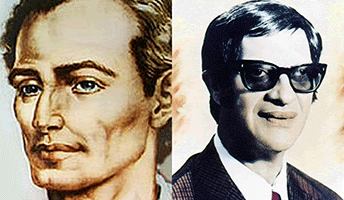
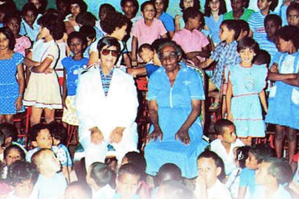

“Tenho comigo sua confortadora carta de 21 deste mês, trazida por nossa estimada irmã Laura, cuja presença e cuja palavra me proporcionaram imenso reconforto pela segurança evangélica de seu nobre espírito.  

Muito me alegraram as notícias das belas realizações do Instituto Espírita de Educação, que os estimados companheiros estão sustentando com tanto valor. Entendo que sem educação, todo o nosso esforço será sempre aquele das iniciativas, por vezes admiráveis, das palavras e dos gestos exteriores respeitáveis e nobres na obra do bem, que acabam comumente entre a ineficácia e o desencanto. Com a educação, porém, o serviço do bem assume as características de eternidade.

Rogo, pois, a Jesus, para que vocês continuem cada vez mais encorajados no grande empreendimento a que se encontram empenhados. Pensei muito no que me conta a sua bondade, acerca do Externato Hilário Ribeiro, fundado para representar a missão de escola modelo do instituto. Guardo a certeza de que vocês saberão mantê-la no elevado nível para que foi criada e, ainda ontem, ouvindo o nosso abnegado Emmanuel, disse-me ele que vocês permanecem sob esclarecida assistência espiritual na realização em andamento. Que o Senhor lhes multiplique as energias na grande edificação.

Diante, contudo, de sua manifestação clara e sincera para comigo e na condição de servo e aprendiz dos companheiros de São Paulo, que me habituei a querer e a admirar profundamente, medito no que poderá suceder, amanhã, se a escola do Instituto omitir, deliberadamente, o ensino da Doutrina Espírita à infância. Nossos Benfeitores Espirituais costumam dizer-me que o Evangelho do Senhor é o tesouro das bênçãos divinas que nos investirá na posse do Céu em nós mesmos e que a Doutrina Espírita é a chave que Jesus nos envia para penetrar-lhe a glória e a riqueza entrando na luz da vida eterna.

Se negarmos aos pequeninos, filhos de espíritas ou não, numa _escola modelo espírita_ essa chave do Senhor que é a Doutrina Espírita, não será o caso de estarmos em simples acomodação social, prosseguindo nos velhos moldes do verniz para a inteligência com o descaso do coração?         

Falamos habitualmente que formaremos alicerces evangélicos no espírito da fraternidade cristã dentro da escola, mas não socorreremos a alma da criança com o conhecimento justo. Claro que não me refiro a cursos minuciosos para os meninos, mas a noções de nossa Redentora Doutrina como sejam a sobrevivência além da morte, a comunicação espiritual e a reencarnação que, a meu ver, assimilados na infância, fortalecem a criatura para todos os dias da existência.

Tenho a escola como sendo minha mãe. E aquilo que verte do coração maternal é luz para todos os filhinhos. Assim sendo, com todo o meu respeito a vocês, creio que a Doutrina Espírita, em noções simples e leves, deve ser ensinada a todas as crianças e aquelas que não desejarem recolher esse alimento de luz naturalmente devem ser livres para se retirarem sem qualquer constrangimento.

Não emito esta opinião por fanatismo religioso. Tenho a felicidade de possuir afeições nos vários setores da fé, inclusive, de contar com a amizade de padres católicos e pastores protestantes, a quem respeito e estimo com muito amor, veneração e sinceridade.

Entretanto, eu faltaria com a minha consciência se não conversasse com o querido amigo, sobre o assunto, com a lealdade que lhe devo, reconhecendo embora que os amigos do Instituto, atentos às circunstâncias que ignoro, saberão conduzir a escola com a benção de Jesus para os mais altos destinos.

Perdoe-me, assim, a opinião despretenciosa, sim?

A todos os nossos companheiros, as minhas lembranças. Um abraço à toda a nossa querida família da U.S.E.. E, com as afetuosas saudações de que a nossa irmã Laura é mensageira, segue para o prezado amigo um grande abraço do seu irmão e servidor muito reconhecido de sempre. Chico Xavier  (_Anais do Instituto Espírita de Educação_)