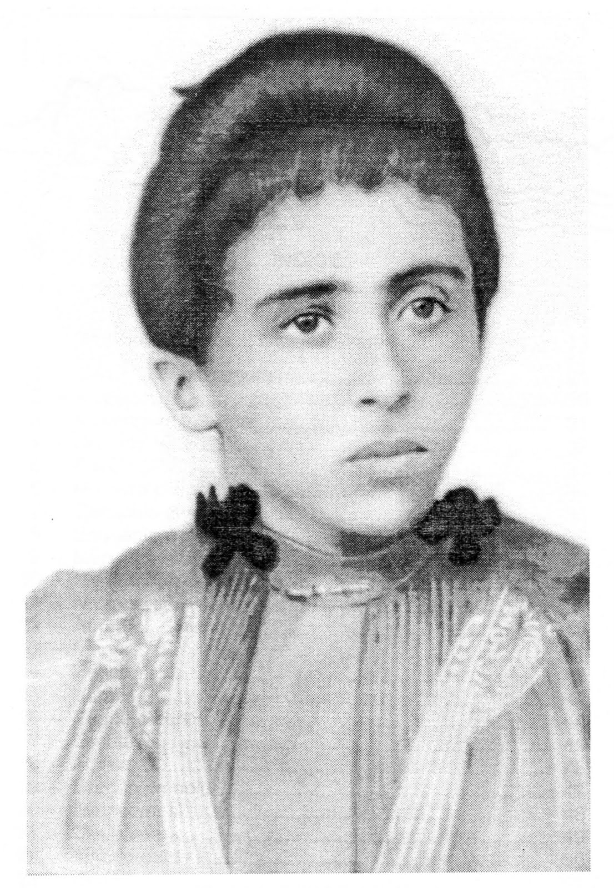
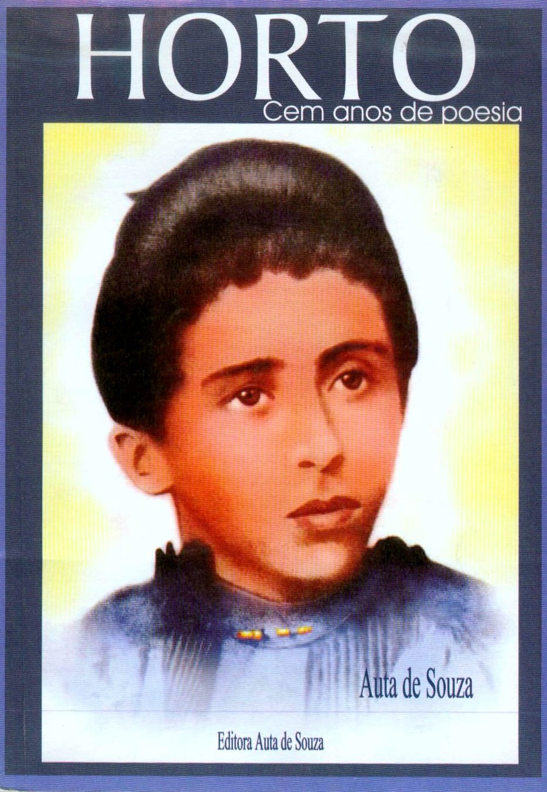

Auta de Souza nasceu no Estado do Rio Grande do Norte, na pequena cidade de Macaíba, em 12 de Setembro de 1876. Quarto filho do casal Elói Castriciano de Souza e Henriqueta Leopoldina Rodrigues de Souza, Auta teve como irmãos mais velhos Henrique Castriciano, Irineu e o Júnior, e, como caçula, o João Câncio.

Desde a infância Auta estudou, segundo Clóvis Tavares, ” As grandes lições do sofrimento humano”. Sua mãe desencarnou antes que a “cotovia mística das rimas” completasse três anos de idade; o pai seguiu a companheira em 1881, quando Auta tinha, portanto, cinco anos. Os avós maternos de Auta recolhem-na e aos irmãozinhos, levando-os para Recife, para o ” Velho sobrado do Arraial”. A perda dos pais foi, em parte, suprida pela dedicação da avozinha Dindinha – D. Silvina de Paula Rodrigues.

Aos sete anos já sabia ler e escrever, graças a um professor amigo e aos oito anos de idade “lia para as crianças pobres, para humildes mulheres do povo ou velhos escravos as páginas simples e ingênuas da História de Carlos Magno”.

**O triste desencarne do irmão**

Na inesquecível noite de 15 de fevereiro de 1887 – Auta tinha dez anos – outra tragédia vem trazer nova e dura provação à “mais espiritual das poetisas brasileiras”: o mano Irineu, o companheiro de todas as horas, é envolvido pelas chamas de uma lamparina de querosene, que explodiu. O menino resistiu ainda dezoito horas, mas foi, finalmente, juntar-se aos pais, no Além.

Essa sucessão de golpes dolorosos marcou profundamente sua alma sensível de mulher, caracterizada por uma pureza cristalina, uma fé ardente e um profundo sentimento de compaixão pelos humildes, cuja miséria tanto a comovia.

O sofrimento veio burilar a sua inata sensibilidade, que transbordou em versos comovidos e ternos, ora ardentes, ora tristes, lavrados à sombra da enfermidade, no cenário desolador do sertão de sua terra. Aos doze anos inicia seus estudos oficiais, no Colégio São Vicente de Paulo. Aí aprende o idioma francês, o que lhe permite ler os mestres da literatura francesa no original. Durante dois anos, estuda, recita, verseja, ajuda as irmãs do colégio, e, principalmente, aprimora sua fé, na leitura constante do Evangelho.

**A enfermidade a acompanha**

Aos 14 anos inicia “novos e doloridos passos do seu calvário”. É a tuberculose que começa a ação devastadora. Desesperançada pelos médicos do Recife, vovó Dindinha retorna com os netos para Macaíba.

A grandeza de espírito de Auta mais uma vez se revela: mesmo molestada pela doença implacável, Auta escreve e ensina às crianças as primeiras noções de religião. A enfermidade, todavia, não detém a sua marcha. Torna-se necessário para D. Dindinha peregrinar pelo interior, à procura de clima seco: Angicos, Nova Cruz, Utinga, São Gonçalo, Serra da Raiz, etc., são visitadas. Mas a doença avançava, mais e mais…

**Retorno à pátria espiritual**

Porém, laureando-se na escola da dor, fez-se intérprete fiel das emoções de todos os que sofrem resignadamente. Por esse motivo, sua poesia recebeu a consagração do carinho popular. Foi na alma do povo que seus versos encontraram a mais profunda repercussão. Francisco Palma, num soneto, define-a como ” A COTOVIA MÍSTICA DAS RIMAS”. Em 07 de fevereiro de 1901, aos 24 anos de idade, Auta de Souza desencarna em Natal, capital do Rio Grande do Norte.

**Obra de Auta de Souza**

Escreveu um único volume de poemas,  “Horto”, publicado em 1900, pouco antes de sua morte, com prefácio de Olavo Bilac. A  primeira edição esgotou-se em dois meses, ocorrendo fato análogo com a segunda edição, em 1911. Até o presente, quatro edições do “Horto”, vieram a público – a terceira prefaciada por Alceu Amoroso Lima, em  1936, e a última, em 1970. Sua produção poética antes de se chamar “Horto”, tinha o nome de  “Dálias”. Todo o livro é impregnado do  sentimento cristão que sempre a inspirou. A mesma simplicidade, a mesma fé, a mesma  ternura que emanam dos versos escritos em  Espírito, pelas mãos de Francisco Cândido Xavier, podem ser identificados nos  poemas da autora encarnada.

Entre a lavra da  jovem enferma e a alma liberta, uma só diferença profundamente confortadora para  quantos buscam o confronto sem a exclusiva  preocupação de identificação do estilo – na existência física atormentada éa Ave Cativa, que canta seu anseio de  liberdade, o coração resignado que busca no Cristo o consolo das  bem-aventuranças prometidas aos aflitos da terra; além do túmulo é o pássaro liberto e feliz que, tornando ao ninho dos antigos infortúnios, vem trazer aos homens a mensagem de bondade e esperança, o apelo à Fé e à Caridade, indicando o rumo certo para a conquista da verdadeira vida.

www.ocentroespirita.com