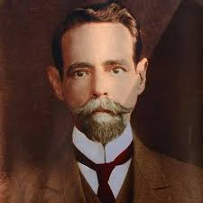

Caibar de Souza Shutel, encarnado em 22 de setembro de 1868 na cidade do Rio de Janeiro, filho do negociante Anthero de Souza Shutel e de D. Rita Tavares Schutel. Desencarnou na cidade de Matão, estado de São Paulo, no dia 30 de Janeiro de 1938.

Aos nove anos estava órfão de pai, e seis meses depois, de mãe. Seu avô Henrique Shutel, tomou o neto aos seus cuidados, matriculando o menino no Imperial Colégio de Pedro II, onde Caibar estudou até o segundo ano.

Não desejando continuar os estudos, abandonou a casa do avô, e se tornou independente, trabalhando como prático de farmácia.

Aos 17 anos de idade, Caibar Shutel já era um bom prático de farmácia e abandonou o Rio de Janeiro e rumou para o Estado de São Paulo, primeiramente na cidade de Piracicaba, e posteriormente para Araraquara e Matão.  
Em 1889 Caibar Shutel assume o cargo de primeiro Presidente da Câmara Municipal de Matão.

Caibar era o robe fincado no interior de São Paulo. A sua atividade irradiava-se por todo o Estado, onde pregava pela pena, pela palavra e, sobretudo, pelo exemplo. Nunca poupou esforços em beneficio da causa que esposara, antes, tudo Portela sacrificou, intemporal, a fortuna e a saúde.

Promovia conferências em teatros e nas praças públicas, em Matão e em cidades circunvizinhas, estando sempre disposto a defender a pureza doutrinária contra os ataques gratuitos dos seus detratores, quase sempre eivados de fanatismo e de intolerância.

Fundou a empresa editora O Clarim, com oficinas próprias, Caibar Shutel, além de publicar ali alguns livros de outros escritores espíritas, escreveu e aditou desde 1911, as seguintes obras, todas de sua autoria:

*   Espiritismo e protestantismo
*   Histeria e fenômenos Psíquicos
*   O Diabo e a Igreja
*   Médiuns e Mediunidade
*   Gênese da Alma
*   Os Fatos Espíritas e as Forças X
*   Parábolas e Ensinos de Jesus
*   O Espírito do Cristianismo
*   A Vida no Outro Mundo
*   Vida e Atos dos Apóstolos
*   Conferências Radiofônicas
*   Interpretação Sintética do Apocalipse
*   Cartas a Esmo
*   Espiritismo e Materialismo
*   O batismo
*   Preces Espíritas
*   Espiritismo para as crianças

Como jornalista, escreveu muito. Manteve, regularmente, uma seção de crônicas e reportagens no Correio Paulistano e na Platéia. Por vezes, ele sozinho redigia O Clarim, e, embora um tanto descuidado com a gramática, tinha, contudo, conceitos e reflexões dignas dos melhores escritores.

Além de ser um homem de fé, um orador convincente,num trabalhador infatigável, um seareiro dos mais destacados, era dinâmico e realizador. Sua casa foi transformada em manicômio de emergência, recolhendo ali pessoas obsidiadas que eram devidamente tratadas ou encaminhadas para nosocômios adequados.

Todos se sentiam bem em sua companhia. Os enfermos reanimavam-se, os pobres sentiam-se menos pobres, os desamparados podiam contar com um amigo, os vacilantes firmavam suas convicções.

Fazia as vezes serviços de médico e lá ia, já velho e cansado, pelos sertões a fora, levar gratuitamente remédios de alívio aos padecidos.

Caibar Shutel é conhecido nos meios espíritas como o Apóstolo de Matão, e o espiritismo teve nele zeloso e esforçado propagador e um dos mais ardentes idealistas.

Cercado de consideração e seus familiares e de numerosos espíritas, desencarnou no dia 30 de Janeiro de 1938.