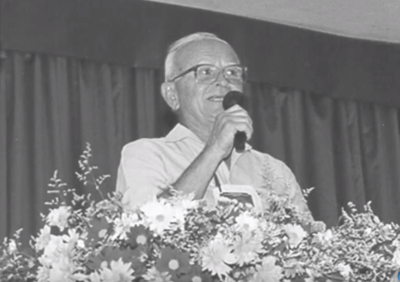
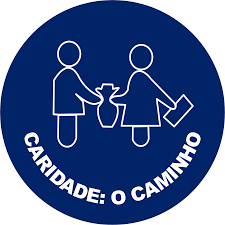

## NYMPHO DE PAULA CORREA Y LOS BUENOS FRUTOS DE LA CAMPAÑA

“Pero es llegado el tiempo de un reajustamiento de todos los valores humanos. Si las dolorosas expiaciones colectivas preludian la epoca de los ultimos dias “ais” del Apocalipsis, la espiritualidad tiene que penetrar las realizaciones del hombre fisico, conduciendolas para el bien de toda la humanidad

El Espiritismo, en su misión de Consolador, es el amparo del mundo en este siglo de declives de la historia; solo el puede, en su caracteristica de Cristianismo redivivo, salvar las religiones que se apagan entre los choques de las fuerza y de la ambicion, del egoismo y del dominio, apuntando al hombre sus verdaderos caminos. En su manantial de esclarecimientos, se puede beber la linfa cristalina de las verdades consoladoras del Cielo, preparandose las almas para la nueva era. (…).

Trabajemos por Jesus, mientras que nuestro taller este localizado en el desierto de las conciencias.

Todos somos los llamados a la gran labor y nuestro mas sublime deber es responder a los llamados del Elegido.” (Emmanuel, _A camino de la luz_, 19 ed., p. 213-215).

**Nympho de Paula Correa y la Campana**

“(…) motivos de fuerza mayor llevaron a Nympho Correa para San Pablo, Capital, en junio de 1952. En la Capital Bandeirante se volvio frecuentador de la Federación Espirita de San Pablo y del entonces pequeño Departamento de Asistencia Social de la Federación. Luego notó las dificultades enfrentadas por el Órgano Asistencial de la Federación Espirita de San Pablo. Notó también que los mensajes espiritas-cristianos continuaban restringidos al ambiente espirita, en vez de ser llevados a los hogares hambrientos de nuevos conocimientos para sus espíritus (…). El 3 de marzo de 1953, con la protección de los Espíritus Mayores, el corazón lleno” de alegría, sin siquiera saber que estaría plantando allí un gran árbol destinado a dar frutos de tanta belleza, a irradiarse en múltiples tareas, a cabo del futuro, se realizó la memorable primer Campaña de Fraternidad, en la histórica ciudad de San Pablo, en el barrio de Pinheiros, en frente del Cementerio de Aracá – justamente en frente al cementerio, como que simbolizando la unión entre la llamada “muerte”, con la vida eterna de todos nosotros, a gritar, “Unamos nuestros esfuerzos para que cuando el Señor llegue encuentre acabada la obra” – con doce caravaneros (…).” (Revista Auta de Souza, n.o 11, p. 31-32).

**Los buenos frutos de la Campañas**

**a) Divulgación**

“A éstos doce envió Jesús, y les ordeno?, diciendo: (…) es llegado el reino de los Cielos.” (Mateo, 10:5-7).

“Después de ésto el Señor designó otros setenta, y los envió delante de si?, de dos en dos, para que lo presidiesen en cada ciudad y lugar a donde el debía de ir. Y les decía: en verdad, la cosecha es abundante, mas los trabajadores son pocos; Rogad, pues al Señor de la cosecha que mande trabajadores para su cosecha”. (Lucas, 10:1-2).

“La tarea en la Divulgación de la Doctrina Espirita, explicando las enseñanzas de Nuestro Señor Jesús Cristo, debe merecer nuestro mayor entendimiento y nuestro mejor cariño. Es verdad que el pan material remueve el hambre agresiva del cuerpo, no obstante, ¿qué agente suprimirá el hambre del alma, adormecida, muchas veces, en las sombras de la inercia o en el fuego de la prueba, sino el esclarecimiento espirita susceptible de serenar las fuerzas sin gobierno del corazón?  
(…). divulguemos, sí, la instrucción y el consuelo, la paz y el aviso de la Doctrina Espirita en favor de los que yacen fronterizos a la delincuencia y la locura, a la enfermedad y a la muerte, sin razón de ser. En muchas circunstancias la criatura no espera sino una frase, un señalamiento, una elucidación o una bendición verbal de protegerse contra la caída en precipicios fatales. Trabajemos por la distribución organizada y metódica del conocimiento espirita cristiano con la misma devoción con que se procura establecer un servicio de agua y luz.” (Batuira, _Mas luz_, 5 ed., p. 130-131).

**b) La recaudación**

“(…) entonces Rey dirá a los de su derecha: Venid, benditos de mi Padre, heredad el reino preparado para vosotros desde la fundación del mundo. Porque tuve hambre, y me disteis de comer; tuve sed, y me disteis de beber; fui forastero, y me recogisteis; estuve desnudo, y me cubristeis; enfermo, y me visitasteis; en la cárcel, y vinisteis a mí. Entonces los justos le responderán diciendo: Señor, ¿cuándo te vimos hambriento, y te sustentamos, o sediento, y te dimos de beber? ¿Y cuándo te vimos forastero, y te recogimos, o desnudo, y te cubrimos? ¿O cuándo te vimos enfermo, o en la carcel, y vinimos a ti? Y respondiendo el Rey, les dirá: De cierto os digo que en cuanto lo hicisteis a uno de estos mis hermanos más pequeños, a mí lo hicisteis.” Jesús (Mateo 25:34-40).

“Yo me llamo la caridad, soy el camino principal que conduce a Dios; Seguidme, porque soy el objeto al que debéis todos aspirar. Esta mañana he hecho mi paseo habitual, y con el corazón lastimado vengo a  
deciros: ¡Oh! amigos míos, qué miserias, qué lágrimas y cuánto tenéis que hacer para sacarlas todas! (…).” (Allan Kardec, _El Evangelio según el Espiritismo,_ 131 ed., cap. 13, i?tem 13).

**c) Estímulo a la caridad**

“(…) dar oportunidad a tantas criaturas deseosas de practicar la caridad, de hacerla a través de los caravaneros de la Campaña.” (Editora Auta de Souza, Campaña de Fraternidad Auta de Souza – Bases y reglamento, 2 ed., p. 22).

“Estando Jesús sentado enfrente al gazofilácio, a observar de que modo el pueblo allí lanzaba su dinero, vio a muchas personas ricas lo dejaban en abundancia en el arca de las ofrendas. En eso, vió también a una viuda muy pobre que apenas dejó dos pequeñas monedas de diez centavos de valor cada una. Llamando entonces a sus discípulos les dijo:  
—En verdad os digo que esta viuda pobre echó más que todos, pues todos aquellos echaron para las ofrendas de Dios de lo que les sobra; pero ésta, de su pobreza echó todo el sustento que tenía.” Jesu?s (Lucas 21:1-4).

“Entonces, ¿reprobáis la limosna?

– No, lo vituperable no es la limosna en sí, sino con frecuencia la forma de darla. Porque el hombre de bien, que entiende la caridad de acuerdo con Jesús, se llega hasta el desdichado, sin esperar que éste le tienda la mano. (…)” (Allan Kardec, _El libro de los Espíritus_, 70 ed., p. 888 a).

**d) Niños**

“(…) aprovechar, también, el gran potencial de la niñez, enseñándola a ser el caravanero del futuro.” (Editora Auta de Souza, Campaña de Fraternidad Auta de Souza – Bases y reglamento, 2 ed., p. 22).

“Dejad venir a mi a los pequeñitos, no os impidan, porque de ellos es el reino de Dios.” Jesús (Mateo, 10:13)

“El corazón de los niños es solo a cultivar, plagado de dificultades. Preparemos el terreno a nuestra disposición, abonemos-lo y tiremos en él las semillas del Evangelio. Jesús hará el resto. (…).” Francisco Spinelli (Espíritus diversos, Crestomatía de la inmortalidad, p. 105).

**e) Casa Espirita**

De entre los inmensos beneficios que la Campaña de Fraternidad Auta de Souza ofrece a la Casa Espirita, se destaca la divulgación de la Doctrina Espirita, a través de millares de páginas de consuelo que distribuye de puerta en puerta, divulgando también todas sus actividades, aumentando así el número de frecuentadores.

“Sobre la propaganda que procuráis hacer, exclusivamente para llamar a vuestro seno mayor número de adeptos, diré – si las formas mas sencillas que se han encontrado son la cura de vuestros hermanos obsesos, son las visitas domiciliares y la expansión de los fluidos – ahí tienes un modesto trabajo para vuestra meditación y estudio.” (Allan Kardec, _La oración conforme el Evangelio según el Espiritismo_, 40 ed., p. 22)

Con la Campaña, la Casa pasa a tener un contacto con las familias de su región, puesto que los hogares son visitados periódicamente lo que despierta en las familias el interés en conocer la Casa Espirita así, crea un fuerte vínculo entre familia y Casa Espirita.

“Es preciso que nosotros, los espiritas, comprendamos que no podemos distanciarnos del pueblo, porque el Espiritismo vino para el pueblo y con él debe dialogar. Es indispensable que estudiemos la Doctrina Espirita junto con las masas, que amemos a todos los compañeros, pero sobre todo, a los mas humildes social e intelectualmente hablando y nos aproximemos a ellos con real espíritu de comprensión y fraternidad.” Francisco Cândido Xavier (Adelino Silveira, _Chico, de Francisco_, 3 ed., p. 83).

**f) Trabajadores**

Consecuencia natural de todos los aspectos anteriormente relacionados, trabajando de caravana simple y absorbente, ampliando la divulgación doctrinaria, practicando la desobsesión colectiva. Los trabajadores pasan a recibir orientación y formación doctrinaria, integrándose en el trabajo del bien y principalmente practicando la reforma íntima.

“Necesitaremos, en nuestro trabajo, de dar ejemplos para que los demás se sientan atraídos por nuestra vivencia y, en la medida que ellos aprenden con nuestra vivencia, quedamos con su colaboración, naciendo un saludable intercambio.” (Divaldo Franco, Diálogo con dirigentes y trabajadores espiritas, 2 ed., p. 38).

Mas allá de eso, la campaña ofrece la integración de todos los trabajadores. Sean niños, jóvenes o adultos, todos tienen oportunidad de dedicarse juntos a la tarea cristiana. La familia puede trabajar unida en la Campaña de Fraternidad Auta de Souza.

“Instruye al niño en el camino que debe seguir, y cuando fuere viejo no se desviará de el.” (Proverbios, 22:6).

“(…) beneficiar el trabajo del caravanero como servidor, en el ejercicio de la humildad y tolerancia (…), proporcionando a muchos corazones oportunidad de trabajo así como fuente de cura a los enfermos del alma.” (EDITORA AUTA DE SOUZA, _Campaña de Fraternidad Auta de Souza: bases y reglamento,_ 2 ed., p. 22).

“Aunque yo hablase las lenguas de los hombres y de los ángeles, y no tuviese amor, sería como el metal que resuena o como el platillo que campanillea. Y aunque tuviese el don de la profecía, y conociese todos los misterios y toda la ciencia, y aunque tuviese toda la fe, de manera tal que transportase los montes, y no tuviese amor, nada sería.” (Paulo, I Cor, 13:1-2).

**g) Espíritus**

Todos los aspectos relacionados con la Campaña naturalmente son mecanismos de reeducación de los espíritus encarnados (caravanero, donador, asistido), y de desencarnados; estos últimos son atendidos por la desobsesión colectiva generada por la Campaña de Fraternidad Auta de Souza, y transformados por los ejemplos de los encarnados.

“En ese propósito, es imposible igualmente olvidar que los hermanos en rebeldía y desespero, que nos oyen los llamados a la regeneración y al amor, no se transforman simplemente a la fuerza de nuestras palabras, mas, sobre todo, al toque moral de nuestras acciones, cuando nuestras acciones se patentizan de acuerdo con nuestras enseñanzas.” (André Luiz, Desobsesión, 9 de., p. 241-242).

Incentivando el proceso de la caridad, la Campaña estimula el pensamiento en el campo del bien, tanto en el caravanero como en el donador. El pensamiento en el campo del bien es eficaz instrumento de desobsesión para el trabajador, que ejercita la humildad al pedir, al donador, que ejerce la caridad al donar.

“Practicando el bien y poniendo en Dios toda vuestra confianza, repeleréis la influencia de los Espíritus inferiores y aniquilaréis el imperio que desean tener sobre vosotros.” (Allan Kardec, _El libro de los Espíritus_, 63 ed., preg. 469).