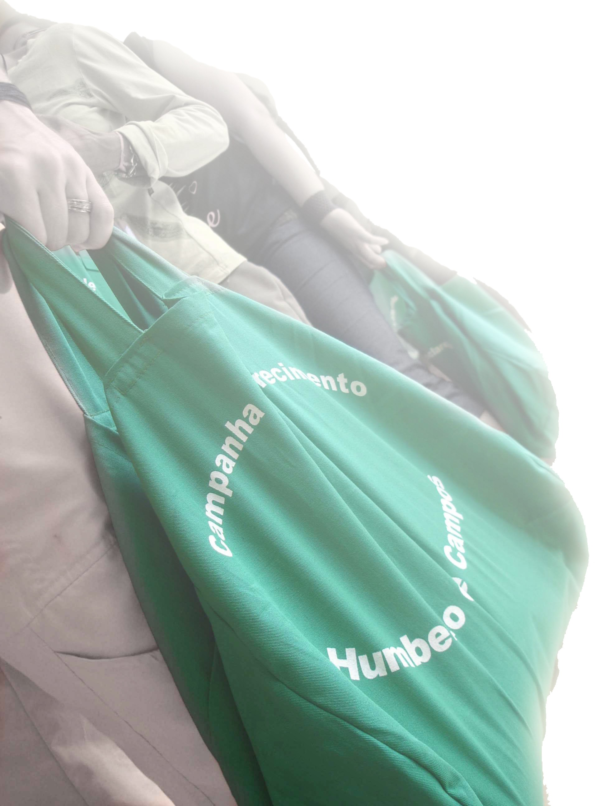

**Campanha de Esclarecimento Chico Xavier** 

“\[…\] Eis o Livro Espírita! Eis a Luz dos Céus à disposição do Homem! Eis o coração do Mestre Divino, palpitando no seio do Mundo!” Bezerra de Menezes (Reformador. FEB, Abril/1987. P.101)

**A importância do livro** “O livro é sempre o grande e maravilhoso amigo da humanidade. (…)” (Martins Peralva. O pensamento de Emmanuel. FEB. 6.ed., p.225.) 

Um livro que nos melhore,  
E nos ensine a pensar,  
É luz acessa e brilhando  
No amor do Eterno Lar.”  
Cassimiro Cunha. Dicionário da Alma. Espíritos Diversos. Psicografado por Francisco Cândido Xavier. FEB. 3.ed., p.233.)

“O livro edificante é sempre um orientador e um amigo. É a voz que ensina, modifica, renova e ajuda.”   Emmanuel. Dicionário da Alma. Espíritos Diversos. Psicografado por Francisco Cândido Xavier. FEB. 3.ed., p.234.)

 **O que é a Campanha de Esclarecimento Chico Xavier?**

 A Campanha de Esclarecimento Chico Xavier tem por finalidade a divulgação da Doutrina Espírita nos lares (de porta em porta), por meio de empréstimo de livros Espíritas de estimado cunho moral. Por outro lado, busca proporcionar ao caravaneiro a oportunidade do trabalho de difusão e consolo, esclarecimento e orientação, por intermédio do livro, e, portanto, exercitar a caridade. “O Livro Espírita, penetrando todos os lares, da choupana ao palacete, conduzirá o Espírito Imortal ao ‘conhecimento de si mesmo’, à sua integral e definitiva libertação.”  (Francisco Thiesen. Reformador, 1972. FEB. p.137.)

 **Por que realizar a Campanha de Esclarecimento Chico Xavier?** 

“Hoje, o Consolador prometido traz ao mundo messes de esperanças, e o instrumento escolhido é o livro!  
Pelas mãos abençoadas de Allan Kardec, a Humanidade recebeu a mensagem divina para sua libertação e evolução espiritual.  
Livros e livros chegaram à Terra, como chuvas de bênçãos, enriquecendo o coração humano com as palavras de advertência, orientação e amor.  
Ensinos que se transformam em roteiros, caminhos que se enriquecem de almas emocionadas com a grande dádiva.  
A Humanidade terrena encontrará a sua estrada e verá surgir a paz e a concórdia num hino de amor e gratidão.  
Estudar, aprender, aplicar, praticar, vivenciar os ensinos é tornar-se partícipe dessa Divina Luz, vinda do Criador e orientada pelo Espírito de Verdade.  
\[…\] Eis o Livro Espírita!  
Eis a Luz dos Céus à disposição do Homem!  
Eis o coração do Mestre Divino, palpitando no seio do Mundo!”.  
(Bezerra de Menezes. Reformador, 1987. FEB. p.101.)

**Roteiro de Funcionamento:**

15 min                      

Alegria cristã: músicas espíritas que promovam alegria, fraternidade e harmonia. (começar 15′ antes do horário determinado para o início)                                                         

5 min

Leitura de “O Evangelho segundo o Espiritismo” e prece de abertura

10 min

Leitura de uma mensagem ou trecho de obra psicografada por Chico Xavier e comentários

15 min

Leitura de trecho do Manual Prático e RegulamentoDivisão das duplas e entrega do materialAvisos e recomendaçõesMúsica e prece

75 min

Deslocamento e realização da atividade

10 min

Avaliação

5 min  

Encerramento e prece 

**No setor de Trabalho:** 

**1ª Etapa: Oferta de Livro**

Ofertar o Livro Espírita, como fonte de esclarecimento e consolo, preenchendo devidamente a Ficha de Empréstimo de livros, esclarecendo ao leitor sobre os cuidados que devemos ter com o livro, bem como explicando a data de retorno para devolução do livro emprestado, que ocorrerá 14 dias da data do empréstimo. Na ocasião entregaremos uma carta explicativa sobre a Campanha de Esclarecimento Chico Xavier. Em qualquer circunstância, sempre deixar uma mensagem espírita ao final da visita. Reafirmamos a importância de ofertarmos livros pré-selecionados.

 **2ª Etapa: Recolhimento do Livro** 

O caravaneiro, após 14 dias, retornará ao lar para recolher o livro emprestado, ocasião em que deixará outra mensagem espírita. Como a Ficha de Empréstimo é individualizada por livro, a divisão do recolhimento pelos caravaneiros se faz de forma simples, priorizando a distribuição pelos endereços, e de forma proporcional às duplas de caravaneiros. Pode ocorrer que seja solicitada a renovação do empréstimo devido à não conclusão da leitura e, neste caso, o caravaneiro comunicará a nova data em que se dará o recolhimento, após 14 dias.

Conheça o Manual da Campanha de Esclarecimento Chico Xavier para maiores informações assim como os anexos das fichas de empréstimo e Carta explicativa no site [www.editoraautadesouza.com.br](http://www.editoraautadesouza.com.br/)