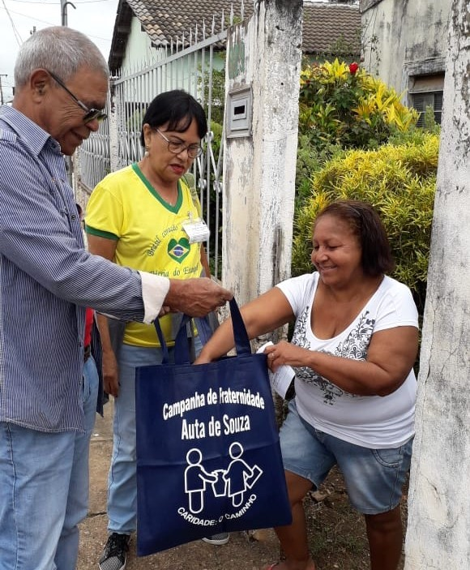
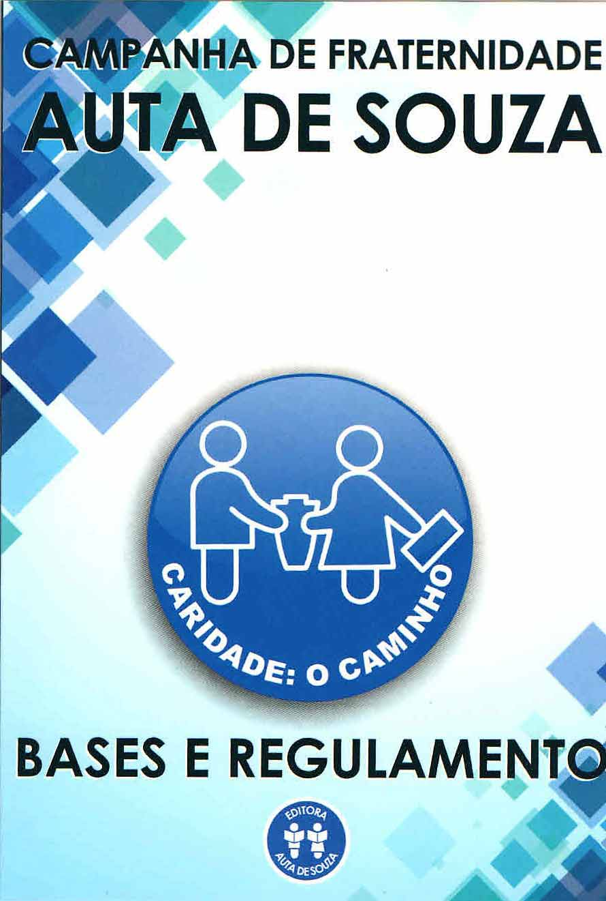
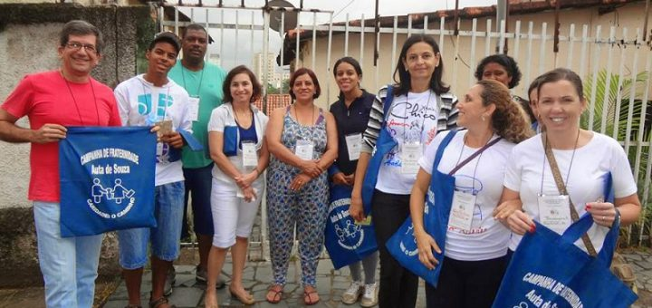

**O que é a Campanha de Fraternidade Auta de Souza?** 

A Campanha de Fraternidade é um dos instrumentos de que se valem os Centros Espíritas para a realização da assistência social e a propagação do Evangelho de Jesus. É ela um componente de um todo, para um objetivo único – a prática da caridade material, moral e espiritual – via pela qual chegaremos todos, um dia, até Deus. 

**A Campanha de Fraternidade Auta de Souza é uma campanha de rua** que se destina a levar a sublimidade dos ensinos de Jesus, através da Doutrina Espírita, aos lares visitados, de porta em porta, sob a forma de uma palavra de conforto e de bom ânimo, de um ensinamento ou de uma amorosa vibração através de mensagens transmitidas pelos Espíritos responsáveis pela Evangelização do Brasil, e, bem assim, angariar donativos para as famílias carentes de ajuda em alimentos, roupas, agasalhos, etc. “Vem e Ajuda”… é o divino convite que ecoa em nossos corações, porém o mesmo deve estar sempre presente como uma chama viva e de fé e amor ao semelhante, porque, se não tivermos amor, embora dando todos os haveres inclusive as roupas do corpo, não teremos caridade. 

**Objetivos:**

**Divulgar a Doutrina Espírita**

 “Divulgar a Doutrina Espírita nos lares, de porta em porta, através da difusão de mensagens de Espíritos reconhecidos evangelizadores \[…\].” (Campanha de Fraternidade Auta de Souza: Bases e regulamentos. 2.ed. P. 22.) 

**Arrecadar Donativos**

 “\[…\] Arrecadar donativos em alimentos, roupas, etc., a serem distribuídos às famílias carentes, assistidas pelas Campanhas e Departamento de Assistência Social dos Centros Espíritas, Casas Tansitórias, etc., a que pertencer.” (Campanha de Fraternidade Auta de Souza: Bases e regulamentos. 2. ed. P. 22). 

**Praticar e Oportunizar a Prática da Caridade** 

“Outrossim, dar oportunidade a tantas criaturas desejosas de praticar a caridade, de fazê-la através dos caravaneiros da Campanha.” (Campanha de Fraternidade Auta de Souza: Bases e regulamentos. 2. ed. P. 22.) “A caridade partida do coração, ainda que exteriorizada numa simples migalha de luz, que, irradiando-se, possibilita seja vislumbrada num átimo toda a excelsitude do amor de Jesus, que se derrama como manancial de bênçãos sobre aquele que dá.” (Campanha de Fraternidade Auta de Souza: Bases e regulamentos. 2.ed. P. 20.) 

**Histórico** 

A Campanha do Quilo “Nos idos de 1950, eu residia em Campo Grande, Estado de Mato Grosso, onde integrava as fileiras da Mocidade do Centro Espírita Discípulos de Jesus. Naquela época transferiu-se para aquela cidade o nosso confrade Oli de Castro, que musicou o hino da Alegria Cristã, vindo da cidade de Recife, onde trabalhava na Campanha do Quilo. Em Campo Grande o nosso irmão Oli convocou a Mocidade para organização da dita Campanha e, dentro de alguns dias, eis que nas ruas de Campo Grande, viam-se os trabalhadores visitando os lares.” Nympho Corrêa (Campanha de Fraternidade Auta de Souza: Bases e regulamentos. 2. ed. P.18.) A Idealização da Campanha de Fraternidade “Em junho de 1952, por força maior, fui obrigado a transferir minha residência para a Capital de São Paulo e lá chegando tornei-me um freqüentador assíduo da Federação Espírita, especialmente de seu então pequeno Departamento de Assistência Social, achando-se em sua direção o nosso prezado companheiro de jornada, Sr. José Gonçalves Pereira. À vista das dificuldades que os irmãos do Departamento enfrentavam para dar assistência às poucas famílias que na época eram assistidas e sentindo também a necessidade de serem abertas novas frentes de trabalho, uma vez que os Espíritas continuavam transmitindo suas mensagens em ambiente fechado ao invés de levá-las ao encontro das almas necessitadas e ávidas de novos conhecimentos, isto é, levar às residências a mensagem de amor, de felicidade e de beleza que há muito a Revelação Espírita nos vêm proporcionando, através de nosso muito querido médium Francisco Cândido Xavier, e bem assim dar a oportunidade aos lares de prestarem a caridade, dando-nos a sua sobra, é que concluí que só uma campanha de rua viria suprir aquelas necessidades. Assim então, deliberei organizar a campanha do quilo, mais bem estruturada e melhor organizada e padronizada, a fim de que crescesse e se fortificasse não só em São Paulo, mas em todo o Brasil. Em 3 de fevereiro de 1953, às 20:00 hs, em uma das dependências da Federação Espírita, à Rua Maria Paula, 158, reuni alguns amigos e expus a minha idéia de criação da campanha, a qual seria denominada de Campanha de Fraternidade; sendo estudada carinhosamente pelos companheiros, foi aprovada e marcado seu início para daí a um mês, ou seja, em 3 de março de 1953.” Nympho Corrêa (Campanha de Fraternidade Auta de Souza: Bases e regulamentos. 2.ed. P.18-19.) 

**A Campanha de Fraternidade passa a levar o nome de Auta de Souza** 

“Após vencidas as primeiras lutas chegavam de Pedro Leopoldo, por intermédio de nosso muito querido Francisco Cândido Xavier, os primeiros incentivos do Alto, partido de um coração amoroso, cheio de boa vontade, o de Auta de Souza, em mensagens encorajadoras, concitando os caravaneiros a se unificarem no trabalho perseverante de levar aos lares a palavra amiga, a mensagem esclarecedora referente à Boa Nova de Jesus, no ‘Ide pois, dois a dois e pregai o meu Evangelho’ e também nos assistindo, nos inspirando e nos amparando nas lutas em prol da continuidade dos trabalhos. Daí surgiu a idéia de dar seu querido nome à Campanha, passando, assim, a se denominar ‘Campanha de Fraternidade Auta de Souza’. Das muitas mensagens que ela nos encaminhou, destaco as primeiras que são: Vem e Ajuda, Agora, Escuta, Bendita Sejas, Divide, Migalha, Oração de Hoje, Pensa, Sublime Encontro, Aos Caravaneiros do Bem.” Nympho Corrêa (Campanha de Fraternidade Auta de Souza: Bases e regulamentos. 2.ed. P.19.)

**O que proporciona na Casa Espírita** 

 _**01. Propicia um Trabalho Simples e Envolvente**_

 Um trabalho de caravana absorve os mais diferentes tipos de trabalhadores: da criança ao idoso. A Campanha de Fraternidade Auta de Souza é um trabalho de caravana. Eis porque é simples e envolvente, proporcionando labor edificante à toda a família.

 **_02\. Aglutina Novos Trabalhadores_**

 Conseqüência natural de todos os aspectos anteriormente relacionados: trabalho de caravana simples e envolvente ampliando a divulgação doutrinária, praticando a desobsessão coletiva e trazendo famílias e novos freqüentadores ao Centro. Estes passam a receber orientação e formação doutrinária, integrando-se na Casa Espírita como trabalhadores.

 _**03\. Proporciona a Participação da Criança, do Jovem e do Adulto**_ 

A Campanha de Fraternidade Auta de Souza é uma das poucas atividades que envolvem trabalho e estudo na Casa Espírita, permitindo a participação conjunta de crianças, jovens e adultos. A família pode trabalhar unida.

 _**04. Contribui na Divulgação da Doutrina Espírita**_

 A Campanha de Fraternidade Auta de Souza divulga de porta em porta a Doutrina Espírita, através das milhares de páginas de consolo que distribui. A Casa Espírita, através da Campanha de Fraternidade Auta de Souza, divulga todas as suas atividades, aumentando assim o número de freqüentadores. Todos os trabalhadores que participam dessa caravana estão inseridos no processo de divulgação da Doutrina Espírita.

 _**05\. Forma Novos Dirigentes**_ 

Quando formamos novos trabalhadores, estamos naturalmente estimulando a formação de novos dirigentes. O trabalho de caravana incentiva o surgimento de novas lideranças, nas funções de coordenadores e orientadores de grupo, revelando novos e futuros dirigentes da Casa Espírita.

 **_06. Gera Organização Administrativa_**

Com o desenvolvimento das atividades e aumento do número de trabalhadores, a Casa Espírita precisa contar com uma melhor organização administrativa, no que é auxiliada pelos novos dirigentes e líderes que surgirão.

_**07\. Cria ou Amplia os Trabalhos Assistenciais**_ 

Ao estimular o processo da caridade, indo em busca do doador e de quem irá receber a doação, a Campanha de Fraternidade Auta de Souza inaugura o trabalho assistencial na Casa Espírita, se esta ainda não o possui. Ao formar novos trabalhadores, como conseqüência do trabalho da Campanha de Fraternidade Auta de Souza, o Centro Espírita naturalmente amplia as suas atividades assistenciais.

_**08\. Proporciona a Presença das Famílias no Centro e vice-versa**_

 A coleta de alimentos na Campanha de Fraternidade Auta de Souza e a sua conseqüente distribuição, conduz necessariamente as famílias a buscarem o alimento na Casa Espírita ou a Casa Espírita a se dirigir até o local onde estão os assistidos.

**_09\. Cria Vínculos entre a Casa Espírita e a Família_**

 Com a implantação da Campanha de Fraternidade Auta de Souza, a Casa Espírita passa a ter um contato com as famílias de sua região, visto que os lares são visitados periodicamente, o que desperta nas famílias o interesse em conhecer a Casa Espírita, criando assim um forte vínculo entre ambas.

**_10\. Desenvolve os Aspectos Pedagógicos_**

 A presença das famílias no Centro, além das pessoas estimuladas pela divulgação da Campanha de Fraternidade Auta de Souza, leva a Casa Espírita a se preocupar com a formação e conteúdo doutrinário oferecido aos novos frequentadores. Todas as vezes que uma Casa Espírita se preocupa com a educação das pessoas que a frequentam, preocupa-se com o aspecto pedagógico. Consequentemente, novas palestras e novos cursos, melhores e mais organizados são implantados. 

**_11\. Proporciona o Processo de Educação dos Espíritos_**

 Todos os aspectos relacionados com a Campanha de Fraternidade Auta de Souza naturalmente são mecanismos de reeducação de espíritos encarnados (caravaneiro, doador, assistido), como de desencarnados; estes últimos, são atendidos pela desobsessão coletiva gerada pela Campanha de Fraternidade Auta de Souza, e transformados pelos exemplos dos encarnados. 

**_12\. Amplia os Espaços Físicos da Casa Espírita_**

 Com a implantação e/ou ampliação da atividade assistencial e conseqüente aumento de assistidos, frequentadores e trabalhadores, além da implantação de novos cursos e novas palestras, a Casa Espírita naturalmente necessitará ampliar seus espaços físicos. 

**_13\. É um Processo de Caridade: Doador x Receptor_**

 É um processo da caridade ocorre quando há beneficência. A Campanha de Fraternidade Auta de Souza estimula e desenvolve o processo da caridade ao pedir, sem ostentação pelos que sofrem, evitando que estes se embruteçam esmolando, nem se humilhem ao receber os alimentos. Com a Campanha de Fraternidade Auta de Souza estaremos ampliando o campo de ação da caridade, proporcionando também àquele que doa, a oportunidade de praticar o bem.

 **_14. Proporciona um Processo de Desobsessão_** 

Incentivando o processo da caridade, a Campanha de Fraternidade Auta de Souza estimula o pensamento no campo do bem, tanto no caravaneiro quanto no doador. O pensamento no campo do bem é eficaz instrumento de desobsessão para o trabalhador, que exercita a humildade ao pedir, e para o doador, que exerce a caridade ao doar.

## **Como Realizar**

**Sugestão do Horário de Funcionamento**

08:30 – 09:00: 1ª etapa – Preparação

09:00 – 10:00: 2ª etapa – Realização do trabalho na rua

10:00 – 11:00: 3ª etapa – Arrumação do material e avaliação

**Funcionamento das Etapas**

**1ª Etapa**  
Prece de Abertura;  
Identificação dos trabalhadores com crachá;  
Leitura das Bases e Regulamentos;  
Leitura de uma Poesia de Auta de Souza;  
Canção da Alegria Cristã.

**2ª Etapa**

Na realização do trabalho na rua, os trabalhadores realizam visitas domiciliares divulgando a mensagem consoladora da Doutrina Espírita e arrecadando donativos para os trabalhos assistenciais. Em uma semana é entregue uma mensagem Espírita juntamente com uma carta pedido. Na semana seguinte, voltamos aos mesmos lares, onde será entregue outra mensagem Espírita e recolhidos os donativos. Desta forma, a Campanha de Fraternidade Auta de Souza oferta aos lares duas mensagens Espíritas e oportuniza a prática da caridade a estes mesmos lares.

**3ª Etapa**

Nesta etapa todo o material arrecadado é organizado, contado, relacionado e posteriormente é entregue ao Departamento Assistencial.

**Canção da Alegria Cristã**

(Letra: Leopoldo Machado, Música: Oli de Castro)

Somos companheiros,

Amigos, irmãos

Que vivem alegres, pensando no bem.

A nossa alegria é de bons cristãos,

Não ofende a Jesus, nem fere a ninguém

A nossa alegria,

É bem do Evangelho,

Vibra e contagia

Da criança ao velho.

Mesmo entre perigos

Daremos as mãos,

Como bons amigos,

Como bons cristãos.

Sempre ombro a ombro,

Sempre lado a lado

Vamos trabalhar com muita alegria,

Pelo Espiritismo mais cristianizado,

Pela implantação da paz e harmonia.

Saiba mais no livro Campanha de Fraternidade Auta de Souza, da Editora Auta de Souza.

ADQUIRA AQUI: www.editoraautadesouza.com.br