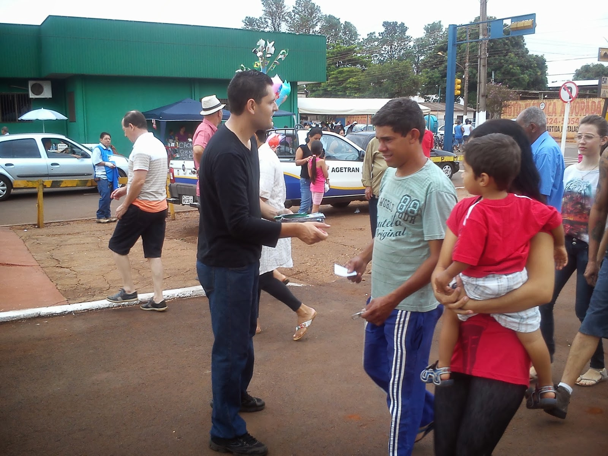

A Doutrina Espírita e o Dia dos Mortos

“\[…\] Aproveitar a oportunidade do sepultamento para orar, ou discorrer sem afetação, quando chamado a isso, sobre a imortalidade da alma e sobre o valor da existência humana. A morte exprime realidade quase totalmente incompreendida na Terra. \[…\]” (André Luiz. _Conduta Espírita_. Psicografia de Francisco Cândido Xavier. Lição 36.)

“\[…\] aí está o Espiritismo a dissipar toda incerteza com relação ao futuro, por meio de provas materiais que dá da sobrevivência da alma e da existência dos seres de além-túmulo. \[…\].” (Allan Kardec. _O Evangelho Segundo o Espiritismo_. Cap. XXVIII . Coletânea de preces espíritas. Item 62)

**Quando acontece?**

Ocorre no dia **2 de novembro**, Dia dos Finados, com a participação de trabalhadores espíritas, distribuídos em várias comissões, para levar o consolo e o esclarecimento sobre a imortalidade da alma. Nessa data, diversas atividades espíritas são realizadas nos cemitérios.

**Onde acontece?**

Nos cemitérios da cidade.

**Quais são os objetivos?**

1- Divulgar a Doutrina Espírita nos cemitérios, levando o esclarecimento e o consolo aos que perderam entes queridos.  
2- Esclarecer que após o desencarne, retornamos ao mundo espiritual.  
3- Elucidar que a morte do corpo físico não representa a separação eterna.  
4- Estimular a prece, como ação consoladora e terapêutica.

**Sugestão de atividades:**  
1- Divulgação e distribuição de mensagens nas proximidades e entradas dos cemitérios.  
2- Realização de palestras para adultos sobre a imortalidade da alma.  
3- Exposição de mensagens faladas de Chico Xavier.  
4- Apresentação de aulas infantis, também envolvendo o tema Imortalidade da Alma.  
5- Exposição de livros espíritas para venda e doação.  
6- Realização de cultos nos túmulos e velórios.  
7- Participação de violeiros, cantando músicas espíritas nos velórios, cultos e na Tenda, local de referência do grupo.

Para saber mais acesse www.ocentroespirita.com