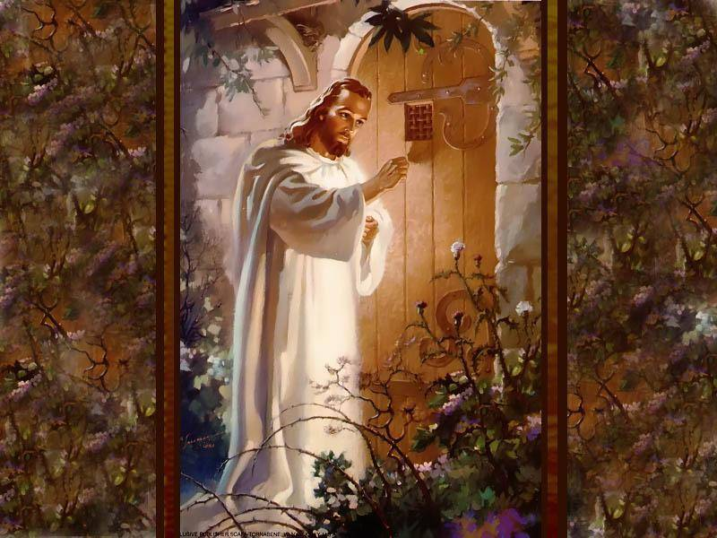

Disse Jesus: “Ide por todo o mundo, e pregai o Evangelho a toda criatura” (Marcos, 16: 15).

Imagine um trabalho na Doutrina Espírita em que, além de fazer a caridade e auxiliar o próximo, que nem sempre sabe onde buscar ajuda, você também divulga o Espiritismo! Assim é a Caravana Jesus no Lar. Uma atividade do Centro Espírita que sai às ruas levando a mensagem espírita e oferecendo o Culto do Evangelho nos lares, despertando a esperança e o consolo nos corações sofridos.

“Em vossos dias, o Espiritismo, que representa o Consolador prometido pelo Cristo aos séculos posteriores à sua vinda ao mundo, é uma extraordinária mensagem do Céu à Terra, e faz-se necessário aquilatar-lhe o valor.

Ainda existem multidões de Espíritos rebeldes, porém, a consciência terrena, em suas características gerais, está agora apta a receber, depois de tantos anos de lutas, o conhecimento espiritual que lhe fará desprezar os últimos resquícios da materialidade inconsciente, aprendendo a discernir os seus erros. Espalhando a boa nova da imortalidade a doutrina de amor abrirá novos horizontes à esperança dos homens, conduzindo-os à aquisição do tesouro espiritual, reservado por Deus a todas as suas criaturas.

Quando todos os homens compreenderem o sentido de suas magníficas lições, o vosso planeta terá atingido uma nova fase evolutiva e o Espiritismo terá concluído, entre vós, a sua sagrada e gloriosa missão.” (Emmanuel. _Emmanuel_. Psicografia de Francisco Cândido Xavier. Cap. XXXI)

**IMPORTÂNCIA DESSE TRABALHO**

“Lembra-te deles, os quase loucos de sofrimento, e trabalha para que a Doutrina Espírita lhes estenda socorro oportuno. Para isso, estudemos Allan Kardec, ao clarão da mensagem de Jesus Cristo, e, seja no exemplo ou na atitude, na ação ou na palavra, recordemos que o Espiritismo nos solicita uma espécie permanente de caridade – a caridade da sua própria divulgação.” (André Luiz. _Estude e viva_. Psicografia de Francisco Cândido Xavier. Cap.40)

**OBJETIVOS DA CARAVANA JESUS NO LAR**

*   “Divulgar a Doutrina Espírita nos lares, por intermédio do exemplo, da mensagem escrita e falada.
*   Propiciar tratamento desobssessivo aos lares visitados, bem como dos caravaneiros que a realizam.
*   Oportunizar meios de reajuste, auxílio e reforma íntima dos trabalhadores e também dos desencarnados necessitados.
*   Assistir os lares visitados, por meio da realização do culto do Evangelho do Lar.
*   Identificar casos de infortúnios ocultos nos lares visitados, e dar o devido encaminhamento para o setor especializado da casa espírita.
*   Convidar às palestras públicas, evangelização infantil, a divulgação, etc.” (Trabalhando na divulgação espírita p.127)

**MATERIAIS DE TRABALHO**

Os materiais de trabalho da Caravana Jesus no Lar são os seguintes:

a) MENSAGENS ESPÍRITAS

b) O EVANGELHO SEGUNDO O ESPIRITISMO

É indispensável para a realização do trabaho, realizado no instante da realização do Culto do Evangelho no Lar. Se possível, ter sempre disponível, alguns exemplares para serem doados às famílias que se mostrarem receptivas

c) CRACHÁS

d) PAPÉIS DE RASCUNHO PARA ANOTAR OS ENDEREÇOS DOS CULTOS MARCADOS

e) CANETAS

f) MAPAS DOS LOCAIS A SEREM VISITADOS

g) PASTA CONTENDO A FICHA DE FREQUÊNCIA DOS CARAVANEIROS E OS RELATÓRIOS DO TRABALHO

“Esta pasta deverá conter as fichas de controle do trabalho, estando todas as informações devidamente atualizadas, pronta para ser utilizada a qualquer tempo.

Ao iniciar o trabalho, o dirigente desta atividade deverá estar em posse desta pasta para melhor conduzir a Jesus no Lar planejada para o dia.” (Trabalhando na divulgação espírita, p.129)

**METODOLOGIA**

**1) PLANEJAMENTO**

“A obra do bem em que te encontras empenhado não pode prescindir de planejamento.” (Joanna de Ângelis. _Espírito e vida_. Psicografia de Divaldo P. Franco. Cap. 38)

“É imprescindível que se planeje as ações. Recomenda-se planejar a sequência das quadras que serão visitadas, os títulos e textos das mensagens que serão distribuídas, o tempo de duração do trabalho, etc., (tempo de distribuição, quantidade máxima de cultos a serem realizados, em função do tempo disponível).” (Trabalhando na divulgação espírita, p.129)

**2) INÍCIO DO TRABALHO**

“Proferir a prece inicial e a prece final nas reuniões doutrinárias, facilitando-se, dessa forma, a ligação com os Benfeitores da Vida Maior.

A prece entrelaça os Espíritos.” (André Luiz. Conduta espírita. Psicografia de Francisco Cândido Xavier. Cap. 26)

**3) ESTUDO PREPARATÓRIO**

Antes de sair para as visitas domiciliares, os caravaneiros deverão receber um estudo preparatório condizente com a natureza da atividade que eles realizam.

**4) DESLOCAMENTO PARA O LOCAL DE TRABALHO**

“Os Caravaneiros, ao se deslocarem para o local previamente estabelecido para realizar o trabalho do dia, não devem esquecer a orientação de André Luiz, na obra Sinal Verde, que a rua é um departamento importante da escola do mundo, onde cada criatura pode ensinar e aprender.

Recomenda-se que o trabalhador da Divulgação adote postura de disciplina e educação como diretrizes de sua conduta nas ruas.” (Trabalhando na divulgação espírita, p.132)

**5) COORDENAÇÃO DO TRABALHO NAS RUAS**

“O trabalho de visita aos lares deve ter um ou mais coordenadores, que deverão indicar as casas a serem abordadas, receber das duplas de caravaneiro a relação dos cultos já contactados, solucionar qualquer dúvida ou problema, repassar mensagens ou outro material que faltar, enfim, ser o elemento de orientação e harmonia entre a equipe e a atividade programada.” (Trabalhando na divulgação espírita, p.132)

**6) DISTRIBUIÇÃO DE MENSAGEM NOS LARES**

“A dupla de caravaneiros, ao bater numa porta, deve manter o pensamento sintonizado com o Alto, rogando a Deus que abençoe a família ora visitada. Nesse momento, lembrar que os bons espíritos que nos acompanham, poderão operar socorro que a providência divina assim determinar.

Ao ser atendido por alguém, dizer:

Nós somos da Caravana Jesus no Lar, pertencemos ao Centro Espírita tal…, e estamos fazendo um trabalho de distribuição de mensagens que falam sobre determinado assunto.” (Trabalhando na divulgação espírita, p.132)

**7) IDENTIFICAÇÃO DOS CULTOS NOS LARES**

“Após entregar as mensagens às pessoas que nos atenderem, oferecer o Culto do Evangelho no Lar, explicando que se trata de uma prece em benefício de sua família e com duração em torno de 15 a 20 minutos.

Se a resposta for positiva, anotar o endereço e o nome do contato numa ficha apropriada, dizendo que voltaremos daqui alguns instantes para o culto.” (Trabalhando na divulgação espírita, p.133)

“Quando a família ora, Jesus se demora na casa. Quando os corações se unem nos liames da Fé, o equilíbrio oferta bênçãos de consolo e a saúde derrama vinho de paz para todos.” (Joanna de Ângelis. _Messe de amor_. Psicografia de Divaldo Pereira Franco.)

**8) DIVISÃO DOS CARAVANEIROS PARA OS CULTOS**

“Ao encerrar o trabalho de districuição de mensagens, reunir os caravaneiros, fazendo o levantamento e divisão dos cultos que foram marcados com aqueles que possuírem condições de dirigí-los.” (Trabalhando na divulgação espírita, p.133)

**9) CULTO DO EVANGELHO NO LAR**

“Antes de iniciar o Culto do Evangelho no Lar, explicar as suas origens, objetivos, benefícios e a metodologia a ser empregada, bem como as ressalvas quanto às manifestações mediúnicas.” (Trabalhando na divulgação espírita, p.133)

**10) RETORNO PARA O CENTRO ESPÍRITA**

“Ao encerrar os cultos nos lares, os caravaneiros deverão retornar para o Centro Espírita com o mesmo entusiasmo e alegria do início, com a finalidade de procederem o encerramento do trabalho.” (Trabalhando na divulgação espírita, p.133)

**11) AVALIAÇÃO E PREENCHIMENTO DOS RELATÓRIOS**

“De volta ao Centro Espírita, os Caravaneiros deverão fazer a avaliação do trabalho, levantando os pontos positivos e aqueles que precisam ser melhorados.

Os dados coletados da avaliação deverão ser anotados nas fichas-relatório, para que sejam arquivados e sirvam de subsídios para o planejamento das atividades.” (Trabalhando na divulgação espírita, p.134)

“Todos estes trabalhos são preparatórios de outros mais edificantes que vos testemunhem não ser de todo improdutivo o vosso labor que, como sabeis, se desenvolve nos dois planos, no plano material e no plano espiritual.” (Francisco Thiesen. _No oásis de Ismael: ensinos e meditações_)

**12) PRECE DE ENCERRAMENTO**

FONTE: Trabalhando na divulgação espírita

[http://www.editoraautadesouza.com.br/index.asp?idproduto=63204](http://www.editoraautadesouza.com.br/index.asp?idproduto=63204)