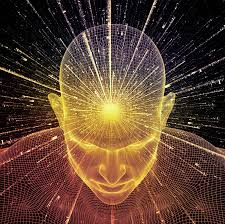

Na produção de corrente contínua em eletricidade, possuímos geradores e motores, capazes de criar força eletromotriz e fornecer corrente, no que respeita aos geradores, ou de ceder potência determinada, no que tange aos motores.

Nas máquinas destinadas a semelhantes serviços, encontramos os enrolamentos em tambor, que podem ser imbricados ou ondulados, com particularidades técnicas variadas.

Anotando a multiplicidade dos aparelhos dessa espécie, lembremo-nos de que os geradores, em sua maioria, são sempre autoexcitados.

**Gerador “Shunt”**

Observemos um gerador “shunt”, em que o fenômeno da corrente elétrica é mais acessível ao nosso exame.

Imaginando-se-lhe o interruptor aberto, quando o induzido começa a girar, repararemos que aí se plasma pequena força eletromotriz, em vista da formação de magnetismo residual.

Essa força, no entanto, não patrocina qualquer corrente circulante no campo.

Se fechamos, contudo, o interruptor, a força eletromotriz gerada produz uma corrente no campo que, por sua vez, determina a formação de uma força magnetomotriz de sentido idêntico, àquele em que se expressa o magnetismo residual, dilatando o fluxo, até que a força eletromotriz alcance o seu máximo valor, de conformidade com a resistência integral do campo. \[…\]

**Frustração da Corrente Elétrica**

Sempre que a corrente de um gerador não se alteie, a frustração é devida a causas diversas, das quais salientamos as mais importantes:

1) Ausência de magnetismo residual, em se tratando de aparelhos novos ou fora de serviço por longo tempo.  
2) Ligações invertidas no circuito do campo, de vez que, se precisamos do magnetismo de resíduo para que se produza ação adicional no circuito magnético, é indispensável que o campo “shunt” esteja em ligação com a armadura, de maneira que a corrente excitadora engendre a força eletromotriz que se adicione ao campo residual.  
3) Resistência excessiva do circuito do campo, que poderá advir de ligações inconvenientes ou de influência perniciosa dos detritos acumulados na máquina.

**Gerador do Cérebro**

Com alguma analogia, encontramos no cérebro um gerador auto-excitado, acrescido em sua contextura íntima de avançados implementos para a geração, excitação, transformação, indução, condução, exteriorização, captação, assimilação e desassimilação da energia mental, qual se um gerador comum desempenhasse, não apenas a função de criar força eletromotriz e consequentes potenciais magnéticos para fornecê-los em certa direção, mas também todo o acervo de recursos dos modernos emissores e receptores de radiotelefonia e televisão, acrescidos de valores ainda ignorados na Terra. \[…\]

É aí, nesse microcosmo prodigioso, que a matéria mental, ao impulso do Espírito, é manipulada e expressa, em movimento constante, produzindo correntes que se exteriorizam, no espaço e no tempo, conservando mais amplo poder na aura da personalidade em que se exprime, através de ação e reação permanentes, como acontece no gerador comum, em que o fluxo energético atinge valor máximo, segundo a resistência integral do campo, diminuindo de intensidade na curva de saturação. \[…\]

Nessas províncias-fulcros da individualidade, circulam as correntes mentais constituídas à base dos átomos de matéria da mesma grandeza, qual ocorre na matéria física, em que as correntes elétricas resultam dos átomos físicos excitados, formando, em sua passagem, o consequente resíduo magnético, pelo que depreendemos, sem dificuldade, a existência do eletromagnetismo tanto nos sistemas interatômicos da matéria física, como naqueles em que se evidencia a matéria mental.

**Corrente do Pensamento**

Sendo o pensamento força sutil e inexaurível do Espírito, podemos categorizá-lo, assim, à conta de corrente viva e exteriorizante, com faculdades de auto-excitação e autoplasticização inimagináveis.

À feição do gerador “shunt”, se a mente jaz desatenciosa, como que mantendo o cérebro em circuito aberto, forma-se, no mundo intracraniano, reduzida força mentocriativa que não determina qualquer corrente circulante no campo individual: mas, se a mente está concentrada, fazendo convergir sobre si mesma as próprias oscilações, a força mentocriativa gerada produz uma corrente no campo da personalidade que, a seu turno, provoca a formação de energia mental de sentido análogo àquele em que se exprime o magnetismo de resíduo, dilatando o fluxo até que a força aludida atinja o seu valor máximo, de acordo com a resistência do campo a que nos referimos. \[…\]

**Negação da Corrente Mental** 

Sempre que a corrente mental ou mentocriativa não possa expandir-se, tal negação se filia a causas diversas, das quais, como acontece na máquina “shunt”, assinalamos as mais expressivas:

1) Ausência de magnetismo residual, em se tratando de cérebros primitivos, isto é, de criaturas nos primeiros estágios do pensamento contínuo, no reino hominal, ou de pessoas por largo tempo entregues a profunda e reiterada ociosidade espiritual.  
2) Circuitos mentais invertidos, em razão de monoideísmo vicioso, na maioria das vezes agravado por influências obsessivas.  
3) Deficiência da aparelhagem orgânica, por motivo de enfermidade ou perturbações temporárias, oriundas do relaxamento da criatura, no trato com o próprio corpo.  
André Luiz. Mecanismos da Mediunidade. Psicografado por Francisco Cândido Xavier e Waldo Vieira. FEB. 4.ed., cap. 9.