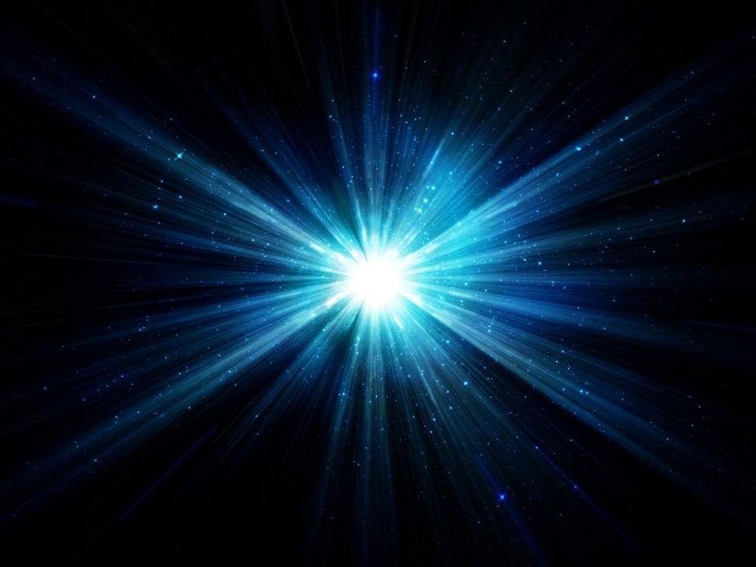

Não temos a menor pretensão de parecer que sabemos mais, ou melhor, seja o que for, mas é preciso reconhecer que, defrontando realidades de outro nível, não podemos limitar-nos a premissas e conceituações ainda condicionadoras da ciência oficial, que, por exemplo, só pode considerar, até agora, como fontes luminosas, os objetos visíveis. Vivendo em plano vibratório diferenciado,é natural tenhamos outra visão da realidade global, naturalmente muito limitada, porém significativamente mais ampla.

É, todavia, com grande interesse que acompanhamos o desenvolvimento da ciência terrestre, e, ainda agora, saudamos o advento da electronografia, dos cientistas Dumitrescu e Camarzan, louvando-Ihes o esforço para analisar os diversos campos elétricos e magnéticos do corpo humano. São realmente valiosos os progressos que têm sido obtidos pelos pesquisadores terrestres, sendo de nosso dever assinalar, com alegria, o êxito dos cientistas Valentina e Semyon Kírlian, da Universidade Alma Ata, que conseguiram fotografar as radiações luminosas a que os parapsicólogos atuais denominam bioplasma. Novos dados, de outros setores da Física, continuarão a abrir campos de interesse à aplicação humana e certamente não se limitarão à descoberta de “superátomos” pesados, como os que receberam, recentemente, os números atômicos 116, 124 e 126, descobertos pelos físicos Gentry e Cahill, da equipe do Professor Dirac, no Instituto de Pesquisas de Tallahassee, na Flórida.

Nosso desiderato é chamar a atenção para outros ângulos e conseqüências daquilo que o saber humano vai conquistando, na Terra, de sorte a auxiliar os companheiros em romagem na crosta planetária, no seu esforço para entender sempre melhor as realidades do espírito imortal.

Assim, se é certo que a Mecânica Quântica já assentou idéias nítidas sobre a dupla natureza ondulatória-corpuscular da luz, cujas ondas há muito se verificou serem transversais e não longitudinais; se também já está claro que é na variação alternada das intensidades dos vetores campo elétrico e campo magnético que consistem as vibrações luminosas, e que circuitos elétricos oscilantes emitem ondas eletromagnéticas invisíveis; se já se sabe, além disso, que a emissão e a absorção de energia se fazem pulsativamente, por múltiplos inteiros da quantidade fundamental a que Planck denominou de quantum e que Einstein rebatizou de fóton, quando se trata de luz; apesar de tudo isso, ainda é estranho ao conhecimento da Física oficial que, além das faixas de freqüências das ondas conhecidas por radiações ultravioleta, radiações X, radiações gama e radiações cósmicas, pulsam no Universo as radiações mentais, as angélicas, as crísticas e, sobretudo, as radiações divinas. No entanto, são estas últimas as criadoras, alimentadoras, impulsionadoras e equilibradoras de tudo quanto existe.

Para o homem terrestre comum, luz são as ondas eletromagnéticas visíveis, cujo comprimento varia entre 8000 A e 4000 À, dependendo do observador. Para os técnicos, são todas as radiações eletromagnéticas conhecidas, visíveis ou não ao olho humano, desde as infravermelhas até as cósmicas. Para nós, estudantes desencarnados de modesta hierarquia, são todas as oscilações eletromagnéticas que vão das aquém-infravermelhas até as além-cósmicas.

Quando a Física constata que só nos meios homogêneos, e nunca nos anisótropos, a luz se propaga em linha reta em todos os sentidos; quando ressalta que, se o índice de refração do meio variar continuamente, o raio luminoso pode encurvar-se; nós acrescentamos que, mesmo quando o espírito guarda, nos tecidos da alma, barreiras de interceptação infensas à luz do bem, a divina claridade não deixa de abençoar-lhe o mundo íntimo, porque a Sabedoria Celeste dispôs que a interceptação de alguns raios de um feixe luminoso não impede que os demais prossigam livremente o seu trajeto. Isto posto, entendemos que somente quando o espírito terrestre atinge o grande equilíbrio evolutivo, sua aura consegue constituir-se em meio isótropo, onde a luz espiritual pode propagar-se, com a mesma velocidade, em todas as direções.

Não ficamos, porém, nessas assertivas, pois importa considerar que, sem que sua livre adesão o coloque em condições de beneficiar–se com a luz espiritual com que a Divina Bondade permanentemente o atinge, nenhum espírito se furta às próprias trevas. Ao encontrar a superfície de separação de dois meios, o raio luminoso pode refratar-se, mas pode também ocorrer a reflexão total, e, neste último caso, nem sequer passa de um meio para outro.

Chegamos, desse modo, a uma conclusão de sentido moral, que é o que acima de tudo nos importa, pois o conhecimento puro e simples, descomprometido com os augustos propósitos do Senhor, para nada de bom aproveita. Essencialmente, a Lei de Deus, que dirige a Vida em todos os planos do Universo, é uma só e puramente Amor.

Irmão Áureo, **Universo e Vida**. Psicografia de Hernani T. Santana,  Cap. V, Tópico 5.