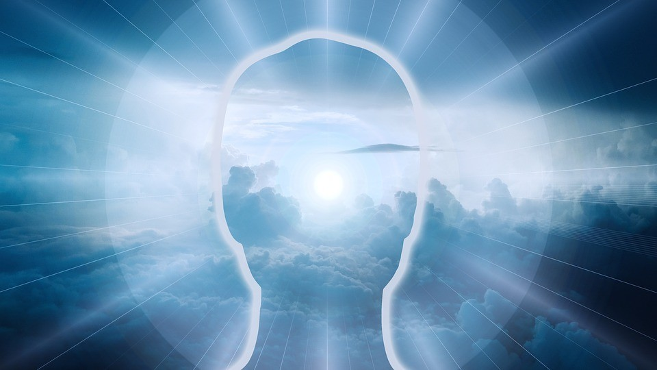

Todos sabemos que é principalmente das queimas respiratórias intracelulares que o corpo humano obtém a energia necessária ao seu funcionamento.

Como aparelho vivo, o organismo somático do homem é realmente uma máquina de combustão, onde a penetração de oxigênio em moléculas de carbono libera a força íntima de pressão destas últimas, na formação de gás carbônico, produzindo, desse modo, energia calorífica.

Entretanto, cada uma das trinta bilhões de células do corpo humano é não somente uma usina viva, que funciona sob o impulso de oscilações eletromagnéticas de 0,002 mm de comprimento de onda, mas, por igual, um centro emissor, permanentemente ativo, de poderosos raios ultravioleta.

Os processos de manutenção da biossíntese do ser humano podem ser fundamentalmente endotérmicos, mas é a mente espiritual que comanda a vida fisiopsicossomática, de modo mais ou menos consciente, conforme a posição evolutiva de cada Espírito.

A mente espiritual não se alimenta, realmente, em exatos termos de vida própria, senão de energias cósmicas, de natureza eminentemente divina, das quais haure recursos para a sua auto-sustentação. Esses recursos, ela os transforma na energia dinâmica, eletromagnética, que lança ao cosmo em que se manifesta e que controla através dos liames de energia espiritual que a mantém em contato com o citoplasma e que impressionam a intimidade das células com os reflexos da mente.

Quanto mais o Espírito evolve, tanto mais livre, efetiva e conscientemente governa a si mesmo e ao seu cosmo orgânico, cujo metabolismo é conduzido e controlado pelas forças vivas do seu pensamento e das suas emoções.

Quem de fato cresce, definha, adoece e se cura é sempre o Espírito. Em sua multimilenária trajetória no tempo e no espaço, ele aprendeu, aprende e aprenderá, por via de incessantes experimentações, a manter e enriquecer a própria vida.

O cristal cresce por acúmulo, em sua superfície, de substâncias idênticas à de que se constitui; mas isso não se dá com os seres vivos. Mesmo no caso de células nervosas, de características especialíssimas, que crescem sem se dividirem, o fenômeno é outro, pois seu crescimento se verifica de modo estruturalmente uniforme e não apenas superficial.

De regra, não é o aumento de volume das células, e sim a sua multiplicação numérica, que determina o crescimento dos organismos. A diferença entre um organismo recém-nascido e um organismo adulto não é somente de tamanho, mas sobretudo de complexidade.

Assim também com o Espírito. Quanto mais evoluído, sábio e moralizado, mais complexa e poderosa a sua estrutura orgânica perispiritual, capaz de viver e agir em domínios cada vez mais amplos de tempo e espaço.

Se a conquista progressiva do conhecimento nos faz compreender sempre melhor a modéstia da nossa atual condição evolutiva e a extensão do quanto ainda ignoramos, compelindo-nos à humildade diante da sabedoria e do poder de Deus, dá-nos também uma crescente noção de autorespeito, em face da excelsa nobreza da Vida.

Áureo. _Universo e Vida_. Psicografado por Hernani T. Sant’Anna,  12. ed., pag. 47,48