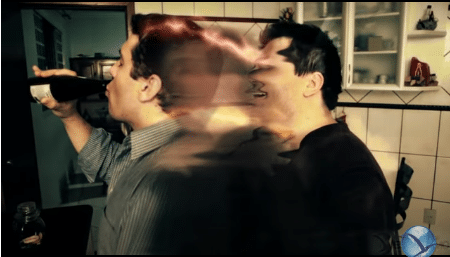

Nem sempre a obsessão se instala de chofre. Quando tal ocorre, o processo de fixação tem procedência em larga faixa de tempo, conseguida imperceptivelmente.  
Mentes comungam com mentes que se lhes assemelham.  
Espíritos sintonizam com espíritos que lhes são afins.  
Pessoas sincronizam com pessoas em que se comprazem  
Quando se cultiva azedume e se dá guarida a suspeitas, ocorrem colheitas de desespero como de infelicidade.  
Justo recorrer-se a terapêutica preventiva, quanto possível, e, percebendo-se instaladas as matrizes obsessivas, mister desdobrarem-se sérios esforços, pois o problema urge na sua gravidade, exigindo procedimento de largo porte e imediata decisão.  
Enfermidade perigosa, a obsessão gera desgovernos lastimáveis e dores lancinantes, difíceis de ser catalogadas ou descritos…  
\[…\]Não dês guarida, desse modo, às impressões nefandas no recesso do teu espírito.  
Reage com todas as forças à maledicência, à inveja, ao ciúme, à ambição, às paixões, em suma, perturbadoras.  
Policia a língua nos momentos infelizes a fim de que não te arrependas tardiamente.  
(Joanna de Ângelis. _Celeiro de Bênçãos_. Psicografado por Divaldo Pereira Franco. Leal Livraria Espírita. Cap.50.)