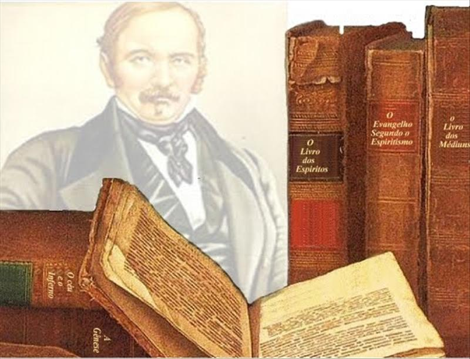
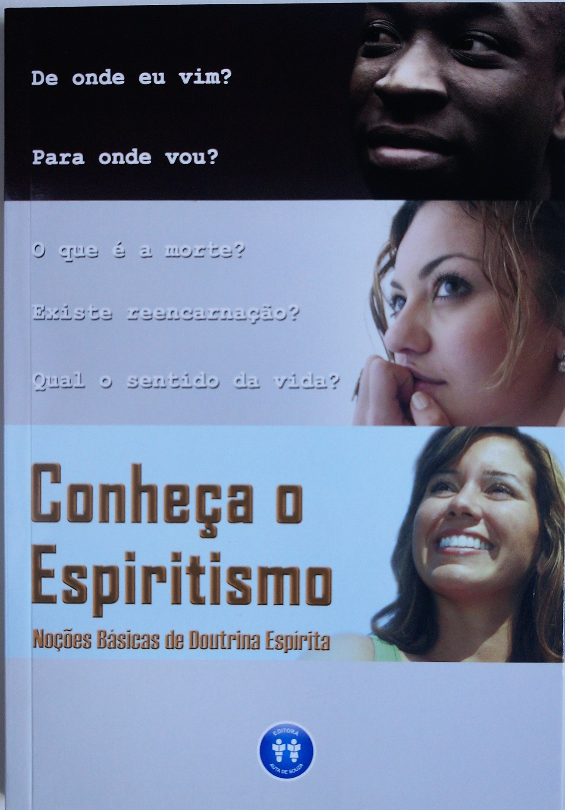
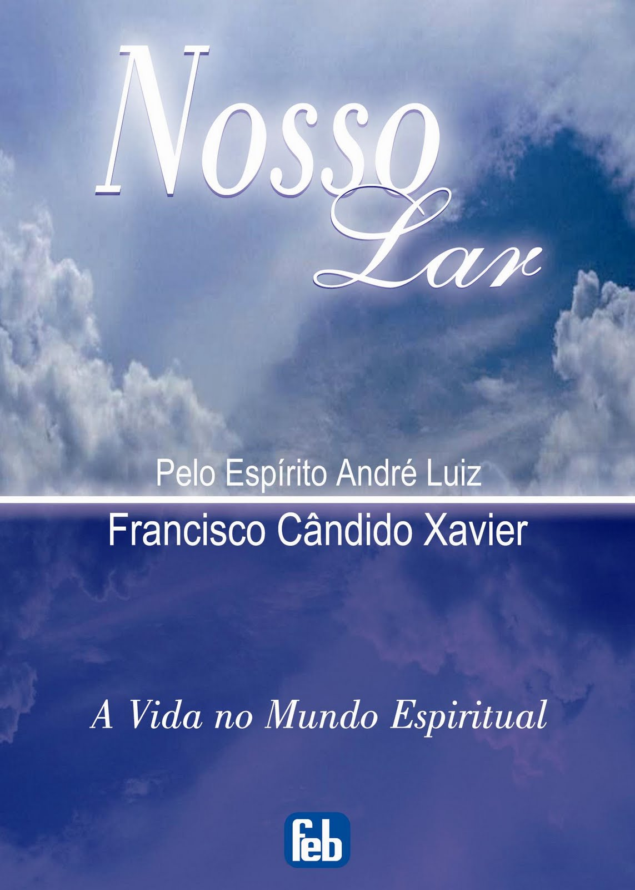
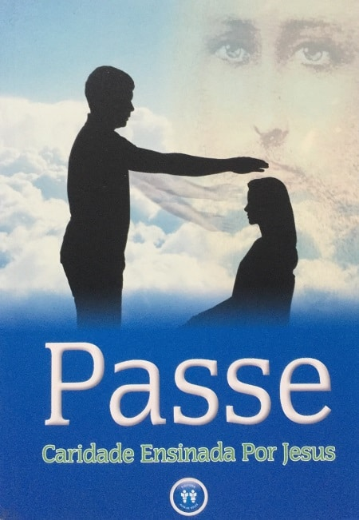
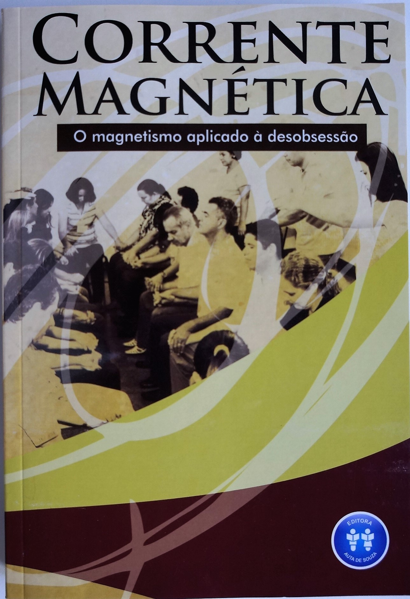

**Como multiplicar os trabalhadores na Casa Espírita**  
“ Indispensável, porém, cogitar da formação daqueles que se nos farão continuadores nos círculos de serviço.  
De que maneira laurear profissionais dignos e competentes nos estabelecimentos de ensino superior, sem a escola funcionando na base da cultura?  
Nas atividades espirituais, há que se observar igualmente o clima de sequência, se quisermos obter colaboradores corretos e eficientes.” (Emmanuel. Mediunidade e sintonia. Psicografado por Francisco Cândido Xavier. FEB. p.90.)

**Qual orientação de Kardec sobre** **Cursos de Espiritismo**  
“Um curso regular de Espiritismo seria professado com o fim de desenvolver os princípios da Ciência e de difundir o gosto pelos estudos sérios. Esse curso teria a vantagem de fundar a unidade de princípios, de fazer adeptos esclarecidos, capazes de espalhar as ideias espíritas e de desenvolver grande número de médiuns. Considero esse curso como de natureza a exercer capital influência sobre o futuro do Espiritismo e sobre suas consequências.” (Allan Kardec. Obras Póstumas. FEB. 16.ed. p.342.)

**A Escola de Estudos Espíritas**  
A Escola de Estudos Espíritas é responsável pela formação doutrinária dos trabalhadores da Casa Espírita. Integra uma série de cursos sistematizados e possui um currículo subdividido em Ciclos Introdutório e Ciclo de Especialização.

**Ciclo Introdutório**  
Este Ciclo representa uma proposta de estudo sistematizado e regular da Doutrina Espírita em que o neófito adquire conhecimentos teóricos e de práticas assistenciais que o habilita a integrar-se, posteriormente, no Ciclo de Especialização. É composto de quatro cursos, de duração semestral.

 **CURSOS DO CICLO INTRODUTÓRIO**

**1 – CONHEÇA O ESPIRITISMO** –  **NOÇÕES BÁSICAS DA DOUTRINA ESPÍRITA** – Um curso sistematizado e regular destinado  àqueles que desejam conhecer o Espiritismo, suas verdades e sua aplicação prática. Deus, Jesus, Allan Kardec e Doutrina Espírita, espírito, perispírito e corpo,  
reencarnação, mediunidade, obsessão, pluralidade dos mundos habitados constituem, dentre outros, palpitantes assuntos para o despertamento e iluminação da alma.

**2 – NOSSO LAR**  –  O curso Nosso Lar constitui um estudo do livro Nosso Lar,  
do espírito André Luiz e psicografia de Francisco Cândido Xavier, editado pela Federação Espírita Brasileira. Esse curso objetiva estudar a experiência vivida por André Luiz no plano espiritual.

**3 – PASSE, CARIDADE ENSINADA POR JESUS** – Constituindo importante estudo dos mecanismos de ação, dos tipos e das técnicas dessa eficiente terapêutica exemplificada por Jesus, esse curso pretende formar passistas esclarecidos, capazes de atuar no auxílio magnético na Casa Espírita. 

**4 – CORRENTE MAGNÉTICA – O MAGNETISMO APLICADO À DESOBSESSÃO –** Trata-se de um estudo dirigido e seqüenciado do livro Desobsessão por Corrente Magnética: pesquisa bibliográfica, relatos, interpretações e manual de aplicação, publicado pela Editora Auta de Souza. Objetiva identificar a fundamentação doutrinária desse eficiente método desobsessivo, sua utilidade e aplicação no tratamento e prevenção das doenças obsessivas.

Além dos livros que dão título aos cursos, são utilizados mais dois livros, da Editora Auta de Souza, que irão complementar a aplicação das aulas:

Caderno de Exercícios dos cursos Nosso Lar e Corrente Magnética e Manual de Aplicação do Ciclo Introdutório.

**CICLO DE ESPECIALIZAÇÃO**

O Ciclo de Especialização visa a preparação do trabalhador para atuar em determinado campo do conhecimento humano e espiritual e na prática assistencial dos diversos Institutos do Centro Espírita. É composto pelas Escolas de Formação de Trabalhadores dos Institutos.

Metodologia do Ciclo Introdutório

Os estudos do Ciclos Introdutório, visando à formação doutrinária dos trabalhadores, são ministrados sob a forma de cursos teórico-práticos, de duração semestral, com início das aulas em fevereiro e agosto e término em junho e dezembro.

“\[…\]somos chamados, na Doutrina Espírita, a estudar instruindo-nos, e, pela mesma razão, advertiu-nos Jesus de que apenas o conhecimento da verdade nos fará livres.” Albino Teixeira. Espíritos diversos. Caminho Espírita. IDE. 2.ed., p.144.)

**Estudo em grupo**

As aulas são realizadas com a valorização do estudo em grupo, conforme nos orienta o espírito de Emmanuel:  
“Tanto para os jovens como para os adultos o estudo em grupo é o mais eficiente até porque nós não podemos esquecer que na base do Cristianismo, o próprio Jesus desistiu de agir sozinho, procurando agir em grupo.” (Emmanuel. A terra e o semeador. Psicografado por Francisco Cândido Xavier. FEB. 6.ed., p.80.)

**Reforma íntima**

O Programa de Apoio à Reforma Íntima trata-se de uma proposta de estímulo a todos aqueles que desejam iniciar um projeto pessoal de progresso, elevação e melhoria. Que aspiram por reforma moral e que anseiam por tornar sua vida melhor. Esta proposta dividi-se em duas partes distintas:

**1º) Reforma íntima no dia-a-dia** (vivência individual aplicada no dia-a-dia da pessoa)  
a) Uso da Agenda Reforma Íntima  
b) Leitura diária: sustentáculo doutrinário

**2º) Reforma Íntima na Casa Espírita** (Proposta metodológica a ser vivenciada na Casa Espírita pelos seus trabalhadores e frequentadores).  
A metodologia de Reforma Íntima a ser vivenciada na Casa Espírita pelos seus trabalhadores da Casa Espírita, deverá ser aplicada no horário dos cursos sistematizados da Casa Espírita, que é a atividade que congrega todos os alunos e trabalhadores em torno do estudo e da reflexão.

Toda aplicação deste programa está dividida em três ações distintas:

1) Momento Individual e diário com o apoio da Agenda Reforma Íntima  
2) Leituras edificantes realizadas ao longo da semana, sendo que para cada curso da Escola de Estudos Espíritas foi indicado um livro específico  
3) 30 minutos de exercício de Reforma Íntima no horário da Escola de Estudos Espíritas

**HORÁRIO GERAL DA REFORMA ÍNTIMA DURANTE OS CURSOS NA CASA ESPÍRITA** Tempo: 30 minutos 

Atividade

Tempo

Local

horário

LIVRE CONVERSA

10 minutos

Sala de aula

 

ACOMPANHAMENTO DA LEITURA DO LIVRO DO SEMESTRE

10 minutos

Sala de aula

 

PREENCHIMENTO DA AGENDA DA REFORMA ÍNTIMA E REFLEXÃO

10 minutos

Sala de aula

 

 Obs: Toda fundamentação do Programa da Reforma íntima encontra-se no livro Reforma Íntima – Como tornar sua vida melhor, da Editora Auta de Souza.  

Caderno de exercícios

Cada curso do Ciclo Introdutório é acompanhado de um Caderno de Exercícios, destinado à fixação do conteúdo doutrinário ministrado nas aulas.  
“Renovar as matérias tratadas nos programas de evangelização, segundo orientações atualizadas.  
O Espiritismo progride sempre.” (André Luiz. Conduta espírita. Psicografado por Francisco Cândido Xavier. FEB. 15.ed., p.141.)

**FUNCIONAMENTO DO CICLO INTRODUTÓRIO**

1.  **Duração das aulas e dos cursos**

As aulas são semanais, com duração de 150 minutos, sendo que 30 minutos desse tempo são destinados ao Programa de Apoio à Reforma Íntima, em sala de aula. Os cursos são constituídos por 21 ou 22 aulas curriculares, organizadas da seguinte forma:  
01 aula inaugural;  
14 aulas teóricas;  
03 aulas especiais;  
02 aulas de práticas assistenciais (para os cursos Noções Básicas de Doutrina Espírita e Nosso Lar); ou 03 aulas de práticas assistenciais (para os cursos Passe e Desobsessão por Corrente Magnética).  
01 aula de avaliação e encerramento.  
“Para cada médium urge o dever de estudar para discernir, e trabalhar para merecer.” (Emmanuel e André Luiz. Estude e viva. Psicografado por Francisco Cândido Xavier. FEB. 6.ed., p.210.)

2.  **Aulas teóricas**

São aquelas que se destinam ao conhecimento doutrinário, visando o aprimoramento individual e à reforma íntima.  
“\[…\] ministrar conhecimentos práticos em torno da vida prática, ideias tão sólidas quanto possíveis, quanto à realidade da vida em si.” (Emmanuel. A terra e o semeador. Psicografado por Francisco Cândido Xavier. FEB. 6.ed., p.80.)

3.  **Aulas especiais**

São aquelas que atendem às confraternizações, comemorações, encontros espíritas, tais como: aniversário do Centro Espírita, dia das mães, Encontros Fraternos, etc.  
“Insistamos na confraternização permanente de nossas energias, a fim de que o trabalho de equipe possa oferecer ao próximo todo o rendimento de que sejamos capazes na edificação do bem.” (Batuíra. Mais luz. Psicografado por Francisco Cândido Xavier. GEEM. 4.ed., p.42.)

4.  **Aula inaugural**

É aquela destinada à apresentação do curso e dos alunos, e deverá ser muito bem preparada, pois refletirá na sua continuidade. Nessa aula, os instrutores destacarão a importância do estudo, as normas e a disciplina do curso.

5.  **Aula de encerramento e avaliação**

É aquela que finaliza o curso, avaliando a participação e o aproveitamento dos alunos, bem como a sua promoção para os cursos seguintes.

6.  **Aulas de práticas assistenciais**

São aquelas consagradas ao exercício da caridade, sendo realizadas em horário ou dia diferenciado do das aulas teóricas, com uma programação específica vinculada à prática. Estão assim organizadas:

  
Curso Noções Básicas de Doutrina Espírita:  
1ª – Campanha de Fraternidade Auta de Souza e  
2ª – Livre (planejamento a critério do instrutor).

Curso Nosso Lar:  
1ª – Posto de Assistência e  
2ª – Livre (planejamento a critério do instrutor)

Curso Passe:  
1ª – Culto do Evangelho no Lar  
2ª – Campanha do Esclarecimento Chico Xavier e  
3ª – Livre (planejamento a critério do instrutor).

Curso Corrente Magnética:  
1ª – Visita a Hospital ou Instituições Sociais  
2ª – Caravana Jesus no Lar  
3ª – Livre (planejamento a critério do instrutor).  
“Havia, porém, um terceiro curso, o qual se resumia no ensaio da aplicação, na vida prática, dos valores adquiridos durante os estudos e observações dos cursos anteriormente mencionados. Em vez, porém, de nos instruírem para uma “prática profissional”, como se diria na linguagem terrena, esse terceiro aprendizado, orientado para a prática da observância das Leis da Providência, que havia séculos, infringíamos, tinha por mentor o lente Souria-Omar e desenvolvia-se, geralmente, fora do santuário, isto é, do recinto da Escola, de preferência na crosta da Terra e nos domínios inferiores do nosso Instituto.” (Camilo Cândido Botelho. Memórias de um suicida. Psicografado por Yvonne A. Pereira. FEB. 18.ed., p.453.)

7.  **Tarefa semanal**

Ler os textos da aula e responder às questões correspondentes no Caderno de Exercícios.  
“Estudar sempre e incessantemente a fim de amar com enobrecimento e liberdade.” (Joanna de Ângelis. Celeiro de bênçãos. Psicografado por Divaldo Pereira Franco. Livraria Espírita Alvorada Editora. p. 33.)

8.  **Frequência às aulas e critério de promoção**

A presença às aulas será anotada, para efeito de avaliação e acompanhamento no curso, no Formulário de Frequência. Serão promovidos para o curso subsequente os alunos que alcançaram frequência regular nas 19 aulas teóricas (máximo de 3 faltas) e nenhuma ausência nas aulas de práticas assistenciais sendo que, nestas, o aluno poderá repor a aula a que, justificadamente, não compareceu.  
“A um sinal de Irmão Sóstenes, iniciou-se a chamada dos pacientes. Nossos nomes, registrados no volumoso livro de matrícula onde os assináramos à chegada, ressoavam, um a um, proferido pela voz possante de um adjunto que, ao lado da tribuna de honra, como que secretariava a reunião. E, ouvindo que nos chamavam, respondíamos timidamente, quais colegiais bisonhos\[…\].”  
Camilo Cândido Botelho. Memórias de um suicida. Psicografado por Yvonne A. Pereira. FEB.18.ed., p.420.)

Falta-trabalho

Considera-se falta-trabalho, desde que previamente autorizada pela direção da Casa Espírita, a ausência do aluno motivada pela participação em Encontros Fraternos, rotas de divulgação ou outros eventos programados pela instituição.

9.  **Equipe de instrutores**

Para cada curso será designado um 1º e um 2º instrutor, ambos tendo as seguintes atribuições:  
1 – Realizar planejamento prévio das aulas, utilizando formulário próprio.  
2 – Fazer a chamada dos alunos em todas as aulas, incluindo as de práticas assistenciais, utilizando o Formulário de frequência, logo após a prece inicial.  
3 – Avaliar semanalmente as aulas, utilizando o Formulário de avaliação de plano de aula.  
4 – Fazer avaliação geral do curso, ao final do semestre.  
5 – Registrar no campo próprio do formulário de frequência os resultados de cada aluno.  
6 – Participar das reuniões mensais de instrutores.

10.  **Matrícula dos alunos**

A matrícula dos alunos novatos poderá ser realizada ao longo de todo o ano, devendo ser intensificada nos meses de janeiro, fevereiro e julho, períodos que antecedem o início dos cursos.  
“\[…\] Nossa identidade, portanto, era antes fotografada: as imagens emitidas por nossos pensamentos, no ato das respostas às perguntas formuladas, seriam captadas por processos que na ocasião escapavam à nossa compreensão. \[…\].  
(Camilo Cândido Botelho. Memórias de um suicida. Psicografado por Yvonne A. Pereira. FEB.18.ed., p.57-58.)

11.  **Horário**

A porta será fechada no horário combinado para o início das aulas, não sendo permitida a entrada após o mesmo.  
“Tanto quanto possível, em qualquer obrigação a cumprir, esteja presente pelo menos dez minutos antes, no lugar do compromisso a que você deve atender.” (André Luiz. Sinal verde. Psicografado por Francisco Cândido Xavier. FEB. 2.ed., p.91.)

**O CICLO DE ESPECIALIZAÇÃO DE ESTUDOS ESPÍRITAS**

É o ciclo de estudos que sucede ao Ciclo Introdutório. Visa a formação e especialização de trabalhadores para atuarem nos diversos Institutos da Casa Espírita. É composto pelas Escolas para Formação de Trabalhadores de cada Instituto: Instituto da Criança; Instituto do Jovem; Instituto do Esclarecimento e Família; Instituto da Caridade; Instituto da Divulgação e Instituto da Mediunidade.

Para iniciar A ESCOLA DE ESTUDOS ESPÍRITAS na sua Casa Espírita adquira o livro Conheça o Espiritismo – Noções Básicas de Doutrina Espírita da Editora Auta de Souza e tenha um bom estudo!  
www.editoraautadesouza.com.br