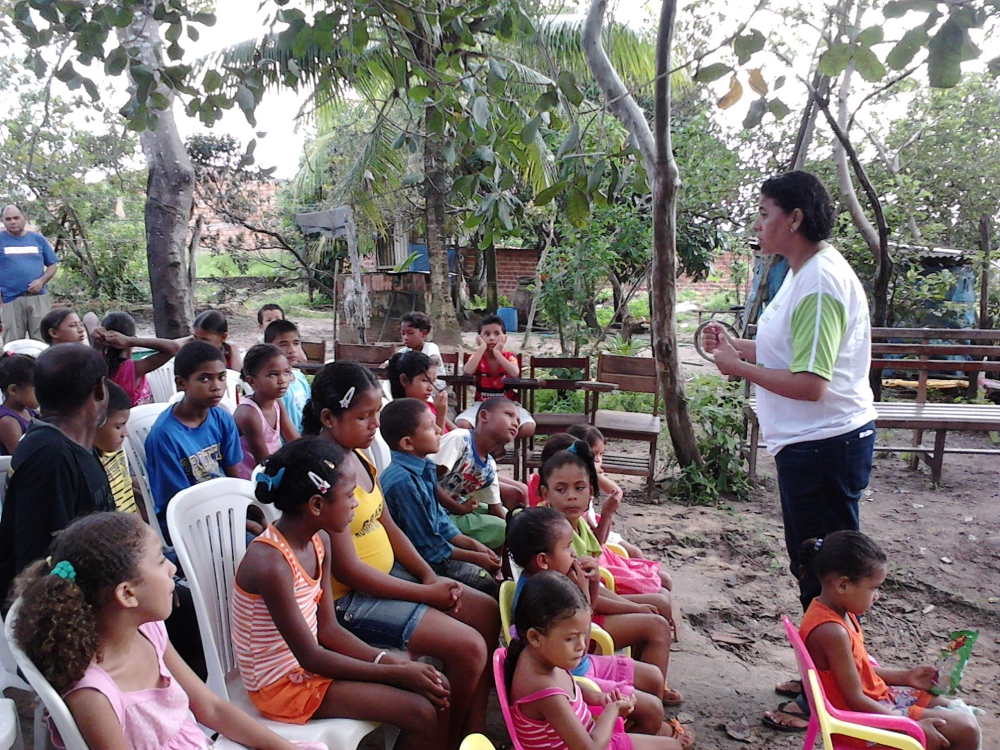
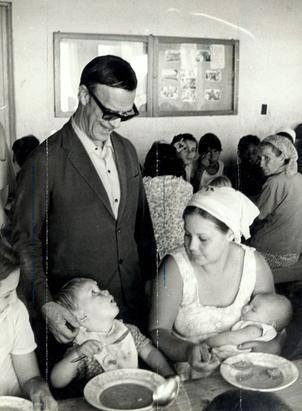

**O que é ?**

     O Posto de Assistência Espírita é um trabalho assistencial desenvolvido em comunidades carentes. Essa atividade oportuniza a troca de experiências, possibilitando o crescimento dos trabalhadores, a assistência e a promoção das famílias carentes de amor e luz e o despertamento do auxílio mútuo entre as mesmas.

    **Onde implantar?**

As atividades do Posto podem ser realizadas em escolas, nos lares das famílias, nas ruas ou em áreas doadas ou adquiridas para tal finalidade.

“Em todos os lugares e situações da vida, a caridade será sempre a fonte divina das bênçãos do Senhor.  
Quem dá o pão ao faminto e água ao sedento, remédio ao enfermo e luz ao ignorante, está colaborando na edificação do Reino Divino, em qualquer setor da existência ou da fé religiosa a que foi chamado.  
A voz compassiva e fraternal que ilumina o espírito é irmã das mãos que alimentam o corpo. Assistência, medicação e ensinamento constituem modalidades santas da caridade generosa que executa os programas do bem.”  
Emmanuel. _Vinha de luz_. Psicografado por Francisco Cândido Xavier. FEB.11.ed., p.23.)

Objetivos do Posto de Assistência Espírita

*   Divulgar a Doutrina Espírita
*   Promover a comunidade onde o mesmo se localiza
*   Identificar infortúnios ocultos
*   Evangelizar crianças, jovens e adultos
*   Preparar para uma Nova Era
*   Formar adeptos esclarecidos
*   Desenvolver o auxílio mútuo entre a comunidade

## **Benefícios Gerados pelo Posto de Assistência Espírita**

**Para a Casa Espírita**

*   Oportunidade da caridade para os trabalhadores
*   Integração entre o jovem e o adulto
*   Abertura de novas frentes de trabalho
*   Reeducação de Espíritos
*   Desobsessão de trabalhadores
*   Divulgação da Doutrina Espírita
*   Formação de dirigentes
*   Implantação de novos cursos e palestras
*   Defesa vibratória

**Para a Comunidade**

*   Divulgação da Doutrina Espírita
*   Desenvolvimento do auxílio mútuo
*   Atendimento à família
*   Abertura de novas frentes de trabalho
*   Reeducação dos Espíritos
*   Abrangência maior da assistência moral, espiritual e material
*   Formação de novos dirigentes
*   Formação de adeptos esclarecidos
*   Evangelização cristã às crianças, jovens e adultos
*   Despertamento para a importância do trabalho, etc

Todas as atividades obedecem a uma estrutura administrativa. São coordenadas por um dirigente geral e divididas em comissões de trabalho.

**Comissão de Evangelização Infantil**

Com objetivo de evangelizar crianças até 11 anos de idade e formar evangelizadores, esta comissão atua desde a recepção das crianças, nos cursos da Escola de Evangelização Espírita Infantil, na laborterapia, no posto de higiene, no momento do coração e na visita aos lares das crianças.

**Comissão de Mocidade**

Esta comissão tem suas atividades voltadas para a evangelização de jovens acima de 12 anos.

**Comissão do Esclarecimento e Família**

Responsabiliza-se pela evangelização dos adultos assistidos pelo Posto de Assistência.

**Comissão da Caridade**

Dedica-se a socorrer, amparar e promover o assistido através da caravana Francisco de Assis, da sopa fraterna Bezerra de Menezes, através das oficinas móveis, do trabalho com gestantes, através do trabalho comunitário com os pais e da triagem assistencial.

**Comissão da Divulgação**

Trabalha junto à comunidade local, divulgando as atividades desenvolvidas no Posto de Assistência, levando a mensagem espírita a todos os lares.

**Comissão da Alegria Cristã**

Busca a harmonização e união de trabalhadores e pessoas assistidas, cultivando um clima de constante alegria e fraternidade.

**Comissão da Campanha de Fraternidade Auta de Souza**

Ocupa-se com a divulgação da Doutrina Espírita nos lares, além da arrecadação de donativos a serem distribuídos para as famílias cadastradas pela Comissão da Caridade.

**Comissão de Mediunidade**

É responsável pelo tratamento espiritual de crianças, jovens e adultos no Posto de Assistência, através das atividades de triagem, fluidificação da água e passe, além do encaminhamento para tratamento espiritual em uma Casa Espírita.

O Posto de Assistência pode funcionar em qualquer horário e em qualquer dia. Devido a facilidade para aglutinação de trabalhadores o Posto normalmente funciona aos domingos à tarde.

Para saber mais sobre este assunto conheça o livro POSTO DE ASSISTÊNCIA ESPÍRITA, da editora Auta de Souza no site [www.editoraautadesouza.com](http://www.editoraautadesouza.com.br/)