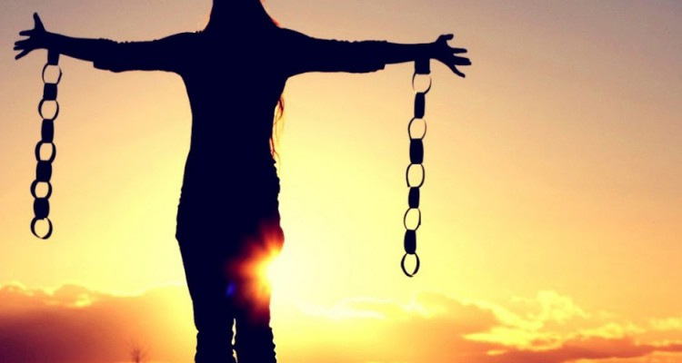

“Profundamente vinculados ao espírito, os hábitos decorrem do uso correto ou não que se imprimem às funções desta ou daquela natureza.  
Por isso, sejam quais forem as chamadas liberações morais que te facultem o abuso, resguarda-te no equilíbrio.  
Respeita, assim, nos limites que a vida te coloca ao alcance da evolução, a oportunidade redentora de que não te pode furtar.  
Equilíbrio em qualquer circunstância como sinal de vitória sobre as paixões e de renovação na luta.”  
(Joanna de Ângelis. _Convites da Vida_. Psicografado por Divaldo Pereira Franco. Cap.17.)