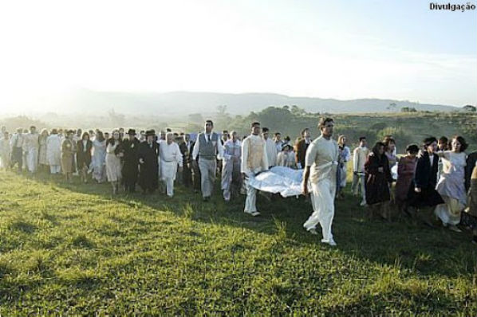

“Na provação coletiva verifica-se a convocação dos Espíritos encarnados, participantes do mesmo débito, com referência ao passado delituoso e obscuro.O mecanismo da justiça, na lei das compensações, funciona então espontaneamente, através dos prepostos do Cristo, que convocam os comparsas na dívida do pretérito para os resgates em comum, razão por que, muitas vezes, intitulais “doloroso acaso” às circunstâncias que reúnem as criaturas mais díspares no mesmo acidente, que lhes ocasiona a morte do corpo físico ou as mais variadas mutilações, no quadro dos seus compromissos individuais.” (Emmanuel. O Consolador. Psicografado por Francisco Cândido Francisco. FEB. Pergunta 250)