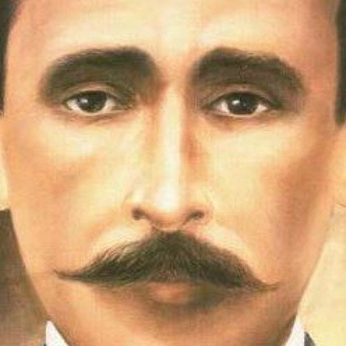
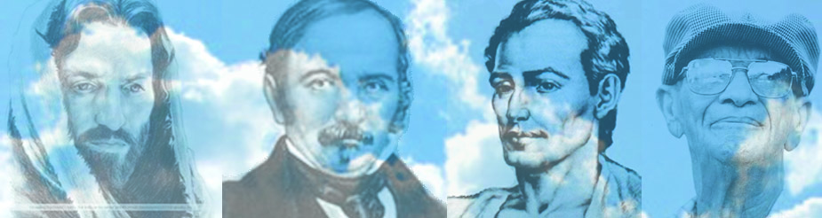

_Todo aquele que me confessar e me reconhecer diante das pessoas, também o reconhecerei e o confessarei diante de meu Pai  que está nos Céus; – e todo aquele que me renegar diante das pessoas, igualmente o renegarei diante de meu Pai  que está nos Céus_. (S. Mateus,10:32,33).  
_Se alguém se envergonhar de mim  e de minhas palavras, o Filho do Homem se envergonhará também dele, quando vier em sua glória e na de seu Pai e dos santos anjos._ (S. Lucas, 9:26).  
 

  
“A coragem de opinião sempre foi estimada entre as pessoas, pois há mérito em enfrentar perigos, perseguições, contradições e até os simples sarcasmos, aos quais se expõem, quase sempre, aqueles que não temem proclamar abertamente ideias que não são as todos. Aqui, como em tudo, o mérito é proporcional às circunstâncias e à importância do resultado. Sempre há fraqueza em recuar diante das consequências opinião própria e em renegá-la; há casos em que isso constitui extrema covardia, equiparada a fugir no momento do combate.

Jesus combate essa covardia, do ponto de vista especial da sua doutrina, esclarecendo que, se alguém se envergonhar de suas palavras, Ele igualemente  dele; que renegará quem o renegou; que aquele que o confessar diante das pessoas, Ele o reconhecerá perante seu Pai que está no Céus; em outros termos: _os que temerem se confessar discípulos da verdade são indignos de serem admitidos no reino da verdade._ Perderão os benefícios da sua fé, porque é uma fé egoísta que guardam para si mesmos, ocultando-a com medo para que não lhes traga prejuízo neste mundo, enquanto que, depositando a verdade acima dos seus interesses materiais, aqueles que a proclamam abertamente, trabalham pelo seu futuro e pelo dos outros, ao mesmo tempo.    
  
Assim será com adeptos do Espiritismo; porquanto a doutrina que professam nada mais é que desenvolvimento e aplicação da doutrina do Evangelho, é a eles também que se endereçam as palavras do Cristo. Eles semeiam na Terra o que colherão na vida espiritual; lá colherão os frutos da sua coragem ou da sua fraqueza.”  
(Allan Kardec, _O Evangelho Segundo o Espiritismo_, Editora Auta de Souza, 2.ed., p. 286-287)      

#### A RESPONSABILIDADE DO ESPÍRITA

“Se, então, em sua previdente sabedoria, a Providência só gradualmente revela as verdades, sempre as torna evidente à proporção que a humanidadeestá madura para recebê-las, mantendo-as reservadas e não sob o alqueire. r Todavia, as pessoas que as adquirem, escondem-nas, quase sempre, do povo com o objetivo de dominá-lo; são esses que, verdadeiramente, depositam a luz debaixo do alqueire. (Allan Kardec, _O Evangelho Segundo o Espiritismo_, Editora Auta de Souza, 2.ed., p. 282)  
  
“Espíritas! Amai-vos! Eis o primeiro ensinamento. Instruí-vos! Eis o segundo. Todas as verdades de encontram no Cristianismo; os erros que nele se enraizaram são de origem humana; eis que além-túmulo, que supunheis fosse o nada, vozes vos clamam: “Irmãos! nada perece! Jesus Cristo é o vencedor do mal. Sede os vencedores da impiedade.” (Allan Kardec, _O Evangelho Segundo o Espiritismo_, 2.ed., p.103)

#### O CONSOLADOR PROMETIDO

“_Se me amais, guardai os meus mandamentos; e eu rogarei a meu Pai e ele vos enviará outro consolador, a fim de que fiquei eternamente convosco: – O Espírito de Verdade, que o mundo não pode receber, porque o não vê e absolutamente o não conhece. Mas, quanto a vós, conhecê-lo-eis, porque ficará convosco e estará em vós. – Porém, o Consolador, que é o Santo Espírito, que meu Pai enviará em meu nome, vos ensinará todas as coisas e vos fará  recordar tudo o que vos tenho dito._ (S. João, cap. XIV, vv. 15 a 17 e 26.)  
  
Jesus promete outro consolador: O Espírito de Verdade, que o mundo ainda não conhece, por não estar maduro para o  compreender, consolador que o Pai enviará para ensinar todas as coisas e para relembrar o que o Cristo há dito. Se, portanto, o Espírito de Verdade tinha de vir mais tarde ensinar todas as coisas, é que o Cristo não dissera tudo; se ele vem relembrar o que o Cristo disse, é que o que este disse foi esquecido ou mal compreendido. “ (Allan Kardec, _O Evangelho Segundo o Espiritismo_, 99.ed., p. 134)

#### **O OBJETIVO DO ENSINO CONFESSIONAL ESPÍRITA**

“A idéia clara e precisa que se faça da vida futura proporciona inabalável fé no porvir, fé que acarreta enormes conseqüências sobre a moralização dos homens, porque muda completamente _o ponto de vista sob o qual encaram eles a vida  terrena_. Para quem se coloca, pelo pensamento, na vida espiritual, que é indefinida, a vida corpórea se torna simples passagem, breve estada num país ingrato. As vicissitudes e tribulações dessa vida não passam de incidentes que ele suporta com paciência, por sabê-las de curta duração, devendo seguir-se-lhes um estado mais ditoso. A morte nada mais estará de aterrador; deixa de ser a porta que se abre para o nada e torna-se a que dá para a libertação, pela qual entra o exilado numa mansão de bem-aventurados e de paz. Sabendo temporária e não definitiva a sua estada no lugar onde se encontra, menos atenção presta às preocupações da vida, resultando-lhe daí uma calma de espírito que tira àquela muito do seu amargor.  
  
Pelo simples fato de duvidar da vida futura, o homem dirige todos o seus pensamentos para a vida terrestre. Sem nenhuma certeza quanto ao porvir, dá tudo ao presente. Nenhum bem divisando mais precioso do que os da Terra, torna-se qual a criança que nada mais vê além de seus brinquedos. E não há o que não faça para conseguir os únicos bens que se lhe afiguram reais. A perda do menor deles lhe ocasiona causticante pesar; um engano, uma decepção, uma ambição insatisfeita, uma injustiça de que seja vítima o orgulho ou a vaidade feridos são outros tantos tormentos, que lhe transformam a existência numa perene angústia, infligindo-se ele, desse modo, a si próprio, verdadeira tortura de todos os instantes. Colocando o ponto de vista, de onde considera a vida corpórea, no lugar mesmo em que aí se encontra, vastas proporções assume tudo o que o rodeia. O  mal que o atinja, como o bem que toque aos outros, grande importância adquire aos seus olhos. Aquele que se acha no interior de uma cidade, tudo lhe parece grande; assim os homens que ocupem as altas posições, como os monumentos. Suba ele, porém, a uma montanha, e logo bem pequenos lhe parecerão homens e coisas.  
  
É  o que sucede ao que encara a vida terrestre do ponto de vista da vida futura; a Humanidade, tanto quanto as estrelas do firmamento, perde-se na imensidade. Percebe então que grandes e pequenos estão confundidos, como formigas sobre um montículo de terra; que proletários e potentados são da mesma estatura, e lamenta que essas criaturas efêmeras a tantas canseiras se entreguem para conquistar um lugar que tão pouco as elevará e que por tão pouco tempo conservarão. Daí se segue que a importância dada ao bens terrenos está sempre em razão inversa da fé na vida futura.  
  
Se toda a gente pensasse dessa maneira, dir-se-ia, tudo na Terra periclitaria, porquanto ninguém mais se iria ocupar com as coisas terrenas. Não; o homem, instintivamente, procura o seu bem-estar e, embora certo de que só por pouco tempo permanecerá no lugar em que se encontra, cuida de estar aí o melhor ou o menos mal que lhe seja possível. Ninguém há que, dando com um espinho debaixo de sua mão, não a retire, para se não picar. Ora, o desejo do bem-estar força o homem a tudo melhorar, impelido que é pelo instinto do progresso e da conservação, que está nas leis da Natureza. Ele, pois, trabalha por necessidade, por gosto e por dever, obedecendo, desse modo, aos desígnio da Providência que, para tal fim, o pôs na Terra. Simplesmente, aquele que se preocupa com o futuro não liga o presente mais do que relativa importância e facilmente se consola dos seu insucessos, pensando no destino que o guarda.  
  
Deus, conseguintemente, não condena os gozos terrenos; condena, sim, o abuso desses gozos em detrimento das coisas da alma. Contra tais abusos é que se premunem os que a si próprios aplicam estas palavras de Jesus: _Meu reino não é deste mundo._  
  
Aquele que se identifica com a vida futura assemelha-se ao rico que perde sem emoção uma pequena soma. Aquele cujos pensamentos se concentram na vida terrestre assemelham-se ao pobre que perde tudo o que possui e se desespera.  
  
O Espiritismo dilata o pensamento e lhe rasga horizontes novos. Em vez dessa visão, acanhada e mesquinha, que o concentra na vida atual, que faz do instante que vivemos na Terra único e frágil eixo do porvir eterno, ele, o Espiritismo, mostra que essa vida não passa de um elo no harmonioso e magnífico conjunto da obra do Criador. Mostra a solidariedade que conjuga todas as existências de um mesmo ser, todos os seres de um mesmo mundo e os seres de todos os mundos. Faculta assim uma base e uma razão de ser à fraternidade universal, enquanto a doutrina da criação da alma por ocasião do nascimento de cada corpo torna estranhos uns aos outros todos os seres. Essa solidariedade entre as partes de um mesmo todo explica o que inexplicável se apresenta, desde que se considere apenas um ponto. Esse conjunto, ao tempo do Cristo, os homens não o teriam podido compreender, motivo por que Ele reservou para outros tempos o fazê-lo conhecido.” (Allan Kardec, _O Evangelho Segundo o Espiritismo_, 99.ed., p. 70-72)