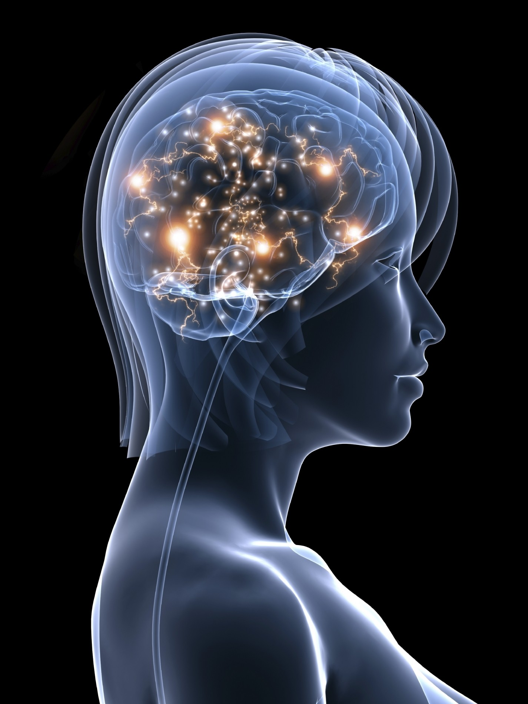

No homem a corrente mental assume feição mais elevada e complexa.

No cérebro humano, gabinete da alma erguida a estágios mais nobres na senda evolutiva, ela não se exprime tão só à maneira de impulso necessário à sustentaçãodos circuitos orgânicos, com base na nutrição e reprodução. É pensamento contínuo, fluxo energético incessante, revestido de poder criador inimaginável.

Nasce das profundezas da mente, em circunstâncias por agora inacessíveis ao nosso conhecimento, porque, em verdade, a criatura, pensando, cria sobre a Criação ou Pensamento Concreto do Criador.

E, após nascida, ei-la – a corrente mental – que se espraia sobre o cosmo celular em que se manifesta, mantendo a fábrica admirável das unidades orgânicas, através da inervação visceral e da inervação somática a se constituírem pelo arco reflexo espinhal, bem como pelos centros e vias de coordenação superiores.

E, assim, percorre o arco reflexo visceral, vibrando:

1) nas fibras aferentes, cuja tessitura celular permanece nos gânglios das raízes dorsais e dos nervos cranianos correspondentes;

2) nas fibras conectoras mielínicas que se originam na coluna intermédio-lateral;

3) nas fibras motoras originadas nos neurônios ganglionares e que terminam nos efetores ou fibras pós-ganglionares.

Acima do nível espinhal, vibra, ainda:

1) na integração pontobulbar em que se hierarquizam reflexos importantes, como sejam os da pressão arterial;

2) no conjunto talâmico e hipotalâmico. em que se mecanizam os reflexos do Espírito;

3) na composição cortical.

A corrente mental, segundo anotamos, vitaliza, particularmente, todos os centros da alma e, conseqüentemente, todos os núcleos endócrinos e junturas plexiformes da usina física, em cuja urdidura dispõe o Espírito de recursos para os serviços da emissão e recepção, ou exteriorização dos próprios pensamentos e assimilaçãodos pensamentos alheios.

(André Luiz. Mecanismos da Mediunidade. psicografia de Francisco Cândido Xavier. Cap. X.)