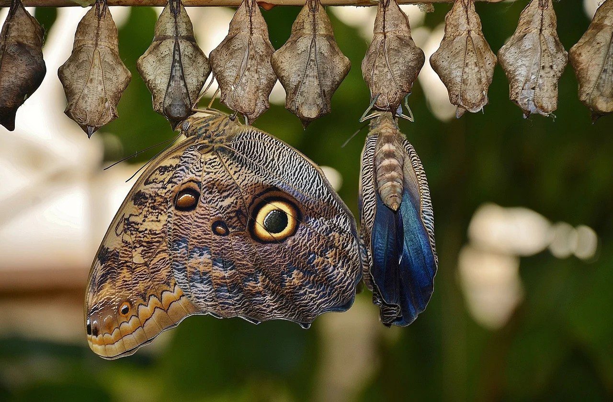

## Conceito

“Desencarnar é mudar de plano, como alguém que se transferisse de uma cidade para a outra, aí no mundo, sem que o fato lhe altere as enfermidades ou a virtudes com a simples modificação dos aspectos exteriores.” (Emmanuel. _O Consolador._ Perg. 174)

” A morte é uma simples mudança de estado, a destruição de uma forma frágil que já não proporciona à vida condições necessárias ao seu funcionamento e à sua evolução.” Léon Denis. _O problema do ser, do destino e da dor_. 8.ed., p. 125)

## Processo da desencarnação – separação da alma e do corpo

**“COMO SE OPERA A SEPARAÇÃO DA ALMA E DO CORPO?**

Rotos os laços que a retinham, ela se desprende.

**A SEPARAÇÃO SE DÁ INSTANTANEAMENTE POR BRUSCA TRANSIÇÃO? HAVERÁ ALGUMA LINHA DE DEMARCAÇÃO NITIDAMENTE TRAÇADA ENTRE A VIDA E A MORTE?**

Não; a alma se desprende gradualmente, não escapa como um pássaro cativo a que se restitua subitamente a liberdade. Aqueles dois estados se tocam e se confundem, de sorte que o Espírito se solta pouco a pouco dos laços que o prendiam. _Estes laços se desatam, não se quebram._

Durante a vida, o Espírito se acha preso ao corpo pelo seu envoltório semimaterial ou perispírito. A morte é a destruição do corpo somente,  
não a desse outro invólucro, que do corpo se separa quando cessa neste a vida orgânica. A observação demonstra que, no instante da morte, o  
desprendimento do perispírito não se completa subitamente; que, ao contrário, se opera gradualmente e com uma lentidão muito variável  
conforme os indivíduos. Em uns é bastante rápido, podendo dizer-se que o momento da morte é o da libertação, com apenas algumas horas  
de diferença. Em outros, naqueles sobretudo cuja vida foi toda material e sensual, o desprendimento é muito menos rápido, durando algumas  
vezes dias, semanas e até meses, o que não implica existir, no corpo, a menor vitalidade, nem a possibilidade de volver à vida, mas uma simples  
afinidade com o Espírito, afinidade que guarda sempre proporção com a preponderância que, durante a vida, o Espírito deu à matéria. É, com  
efeito, racional conceber-se que, quanto mais o Espírito se haja identificado com a matéria, tanto mais penoso lhe seja separar-se dela; ao passo  
que a atividade intelectual e moral, a elevação dos pensamentos operam um começo de desprendimento, mesmo durante a vida do corpo, de  
modo que, chegando a morte, ele é quase instantâneo. Tal o resultado dos estudos feitos em todos os indivíduos que se têm podido observar  
por ocasião da morte. Essas observações ainda provam que a afinidade,persistente entre a alma e o corpo, em certos indivíduos, é, às vezes,  
muito penosa, porquanto o Espírito pode experimentar o horror da decomposição. Este caso, porém, é excepcional e peculiar a certos gêneros  
de vida e a certos gêneros de morte. Verifica-se com alguns suicidas.” (Allan Kardec. _O Livro dos Espíritos._ Perg.155)

### **“Que sensação experimenta a alma no momento em que reconhece estar no mundo dos Espíritos?**

“Depende. Se praticaste o mal, impelido pelo desejo de o praticar, no primeiro momento te sentirás envergonhado de o haveres  
praticado. Com a alma do justo as coisas se passam de modo bem diferente. Ela se sente como que aliviada de grande peso, pois que  
não teme nenhum olhar perscrutador.” (Allan Kardec. O Livro dos Espíritos. Perg.159)

## Perturbação Espiritual

#### **“O conhecimento do Espiritismo exerce alguma influência sobre a duração, mais ou menos longa, da perturbação?**

Influência muito grande, por isso que o Espírito já antecipadamente compreendia a sua situação; mas a prática do bem e a  
consciência pura são o que maior influência exercem.” (Allan Kardec. _O Livro dos Espíritos._ Perg.165)

Quer saber mais? Estude o livro **_Conheça o Espiritismo_** [editoraautadesouza.com.br](http://www.editoraautadesouza.com.br/)