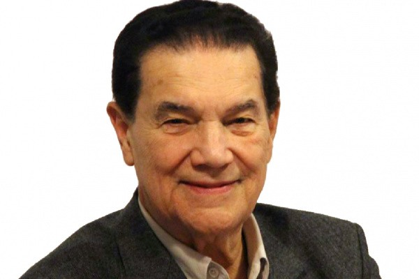
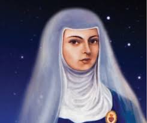

**A primeira Vidência de Divaldo**

Aos quatro anos de idade, Divaldo brincava na sala de casa, quando uma senhora desconhecida entrou e pediu que chamasse sua mãe. O menino chamou. A mãe, Ana, apareceu, mas, como não viu qualquer outra pessoa na sala, reclamou com o filho e voltou a se debruçar sobre o que fazia. Era década de 30 e, o cenário, Feira de Santana, na Bahia. Ao contrário da mãe, Divaldo Pereira Franco enxergava e ouvia com toda a clareza a visita.

“Diga a Ana que eu sou sua avó, Maria Senhorinha’’. À época, criança, ele não sabia o que era avó, nem que a partir dali embarcaria no mundo da mediunidade, “Tudo sempre foi muito natural para mim’’, diz, hoje, aos 83 anos.

Divaldo é um verdadeiro apóstolo do Espiritismo. Dos seus oitenta e três anos, sessenta e três foram devotados à causa Espírita e às crianças excluídas. Nasceu em 5 de maio de 1927, na cidade de Feira de Santana, Bahia, e desde a infância se comunica com os espíritos. Cursou a Escola Normal Rural de Feira de Santana, recebendo o diploma de professor primário, em 1943. Trabalhou como escriturário no antigo IPASE, em Salvador, aposentando-se em 1980.  
  
É reconhecido como um dos maiores médiuns e oradores Espíritas da atualidade e o maior divulgador da Doutrina Espírita por todo o Mundo.  
  
Seu currículo revela um exímio e devotado educador com mais de 600 filhos adotivos e mais de 200 netos e bisnetos, atendendo atualmente a cerca de 3.000 crianças, adolescentes e jovens de famílias de baixa renda, por dia, em regime de semi-internato e externato.  
  
Orador com mais de 13.000 conferências, em mais de 2.000 cidades em todo o Brasil e em 64 países dos 5 continentes, tendo concedido 1.500 entrevistas para rádio e TV, no Brasil e no Exterior. Recebeu mais de 600 homenagens, de instituições culturais, sociais, religiosas, políticas e governamentais.  
  
Como médium, publicou 250 livros, com mais de 8 milhões de exemplares, onde se apresentam 211 Autores Espirituais, muitos deles ocupando lugar de destaque na literatura, no pensamento e na religiosidade universais. Dessas obras, houve 92 versões para 16 idiomas (alemão, albanês, catalão, espanhol, esperanto, francês, holandês, húngaro, inglês, italiano, norueguês, polonês, tcheco, turco, russo, sueco e sistema Braille). Além de 17 escritos por outros autores, sobre sua vida e sua obra. A renda proveniente da venda dessas obras, bem como os direitos autorais foram doados, em Cartório, à Mansão do Caminho e outras entidades filantrópicas.  
  
Espírita convicto, fundou o Centro Espírita Caminho da Redenção em 7 de setembro de 1947. Dois anos depois, iniciou a sua tarefa de psicografia. Diversas mensagens foram escritas por seu intermédio. Sob a orientação dos Benfeitores Espirituais guardou o que escreveu, até que um dia recebeu a recomendação para queimar tudo o que escrevera até ali, pois não passava de simples exercício. Com a continuação, vieram novas mensagens assinadas por diversos Espíritos, dentre eles: Joanna de Ângelis, que durante muito tempo apresentava-se como Um Espírito Amigo, ocultando-se no anonimato à espera do instante oportuno para se identificar. Joanna revelou-se como sua orientadora espiritual, escrevendo inúmeras mensagens, num estilo agradável repassado de profunda sabedoria e infinito amor, que conforta as pessoas necessitadas dando diretriz espiritual.  
  
Em 1964, Divaldo, sob orientação de Joanna de Ângelis, selecionou várias mensagens de autoria da mentora e enfeixou-as no livro Messe de Amor, que se tornou o primeiro livro psicografado por Divaldo. Atualmente, o médium conta com 250 títulos publicados, incluindo os biográficos que retratam sua vida e obra.  
  
**Mansão do Caminho**  
Divaldo Pereira Franco é emérito educador. Fundou em 1952, na cidade de Salvador, Bahia, com Nilson de Souza Pereira, a Mansão do Caminho, instituição que acolheu e educou crianças sob o regime de Lares Substitutos. Em 20 Casas Lares, educou mais de 600 filhos, hoje emancipados, a maioria com família constituída. Na década de 60, iniciou a construção de escolas, oficinas profissionalizantes e atendimento médico.  
Hoje, a Mansão do Caminho é um admirável complexo educacional com 83.000m2 e 50 edificações que atende a 3.000 crianças e jovens de famílias de baixa renda, na Rua Jaime Vieira Lima, n° 1, Pau da Lima, um dos bairros periféricos mais carentes de Salvador. O complexo atende a diversas atividades sócio educacionais como: enxovais, Pré-Natal, Creche, escolas de ensino fundamental e médio, Informática, Cerâmica, Panificação, Bordado, Reciclagem de Papel, Centro Médico, Laboratório de Análises Clínicas, Atendimento Fraterno, Caravana Auta de Souza, Casa da Cordialidade e Bibliotecas.  
Mais de 35.000 crianças passaram, até hoje, pelos vários cursos e oficinas da Mansão do Caminho. A obra é basicamente mantida com a venda dos livros mediúnicos e das fitas gravadas nas palestras, seminários, entrevistas e mensagens por Divaldo.  
  
Fontes: http://www.divaldofranco.com/biografia.php  
http://www.partidaechegada.com/2010/04/divaldo-franco-fala-sobre-infancia.html

