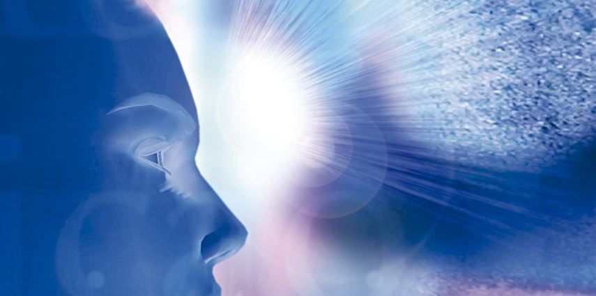

**Energia Mental**

A ciência oficial de nossos dias já conhece algo sobre as propriedades da matéria e da energia, quando elas são conversíveis entre si, o que importa dizer: da mesma natureza essencial. Existem, porém, aspectos elementares da estrutura da energia que permanecem desconhecidos da ciência terrestre. Esta lhe identifica variadas formas de manifestação, mas ainda ignora por completo suas formas não conversíveis em matéria, embora já comece a desvendar os segredos da antimatéria.

Inclui-se dentre os mais comuns e constantes tipos de energia não adensável – a energia mental propriamente dita, da qual o pensamento é a mais elevada expressão. No entanto, ela é capaz de agir sobre as diversas formas de energia reconversível, de impressioná-las e transformá-las, através de radiações de potência ainda não humanamente detectável, mas de alto e efetivo poder, traduzível em fenômenos eletromagnéticos inapreciáveis.

Essa é basicamente a energia que organiza o tecido perispiritual e, de resto, todos os campos vibratórios que envolvem o espírito humano e nos quais este se movimenta nas dimensões extrafísicas.

É também ela o fulcro de que se origina a energização das idéias, corporificando-as em formas-pensamentos, suscetíveis, como já sabem os pesquisadores do psiquismo, de serem temporárias, mas poderosamente vivificadas, dirigidas e até mesmo materializadas, através dê processos de densificação bem mais comumente utilizados do que vulgarmente se presume.

É, contudo, bem mais importante assinalarmos o fato de que essa energia mental retrata sempre, como imagens vivas, as emoções e os sentimentos do Espírito humano, encarnado ou desencarnado, condensando e expressando automaticamente, e com rigorosa exatidão, toda e qualquer emoção ou sentimento de qualquer ente espiritual, sob as mais nítidas e diferenciadas características de forma, cor, som, densidade, peso específico, velocidade, freqüência vibratória e capacidade de permanência.

Isso significa que as emoções e os sentimentos humanos impregnam e magnetizam o campo energético das vibrações do pensamento, por via de um processo de superenergização, no qual uma espécie de energia mais quintessenciada e poderosa ativa, colora e qualifica outra espécie de energia, sem com ela fundir-se ou confundir-se, e sem que haja entre elas a possibilidade de mútua conversão.

Jean-Jacques Rousseau percebeu isso intuitivamente, embora de modo evidentemente imperfeito, quando afirmou a precedência do sentimento sobre a razão. Foi, entretanto, o Divino Mestre quem revelou tal verdade de forma inconfundível, ao alicerçar todo o seu ensino e exemplificação no sentimento do Amor — resumo, como explicou, de “toda a Lei e de todos os Profetas”.

Os estudos de Darwin sobre a evolução das espécies abriram caminho a grandes avanços do conhecimento humano no campo da hierarquia das complexidades, que acompanham os processos de aprimoramento dos organismos. Sabe-se hoje que essa crescente complexidade é conseqüência de funções novas, nascidas de novas necessidades e geradoras de novos poderes. Ê também assim na ordem da evolução anímica, onde o Espírito, ao desenvolver a sua própria mente, amplia e diversifica sua estrutura, seu espaço e seu tempo individuais, crescendo para Deus, no seio do Universo Infinito.

Quanto mais o ser espiritual se sublima, mais recursos desenvolve, em formas cada vez mais altas e nobres de energia sutil, tanto mais poderosas e excelsas, quanto menos densas e mais diferenciadas das formas materializáveis de energia.

Eis por que o Espiritismo Evangélico sobrepõe o esforço de santificação, isto é, de sublimação moral dos sentimentos humanos, a todo e qualquer processo de evolução meramente intelectiva. É que o aprimoramento da inteligência, sob todas as formas, sendo embora imperativo inderrogável da Eterna Lei, é mais fácil de ser realizado, e de modo menos suscetível a erros e quedas, quando produzido sob o ascendente do sentimento enobrecido, que é a força diretriz de todas as energias e potencialidades do Espírito. 

Áureo. Universo e vida, psicografia de Hernani T. Santana.  5.ed., Cap. 5, item 1, p. 67 – 69