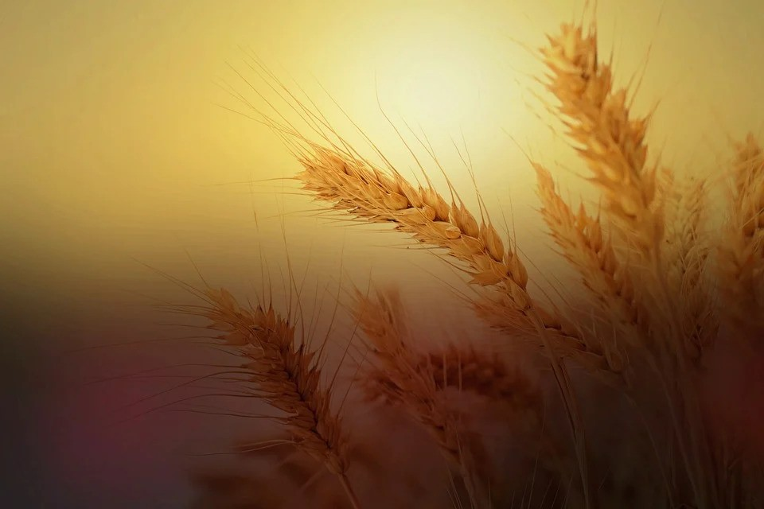

O perispírito de um encarnado não tem maiores problemas de alimentação, porque além dos princípios atmosféricos de que se beneficia, através dos condutos respiratórios do aparelho corporal, se nutre natural e automaticamente dos recursos vitais do patrimônio sanguíneo do corpo carnal, a que fortemente se radica.

O problema de alimentação do corpo espiritual surge com a desencarnação, porque então o psicossoma precisa nutrir-se por seus próprios meios, de maneira direta, o que nem sempre consegue fazer com facilidade, por insciência ou indisciplina da mente, ou em razão da grande densidade fluídica de sua própria tessitura estrutural.

De notar, neste capítulo, que no mundo chamado físico, ou material, tudo é como se fosse dúplice ou, melhor dizendo, como se tivesse duas faces ou aspectos, ou ainda, num modo de dizer talvez mais apropriado, como se existisse em duas dimensões vibratórias de um mesmo plano: — o da matéria propriamente dita e o da antimatéria. A bipolaridade é lei geral a manifestar-se naturalmente na universalidade dos fenômenos físicos ocorrentes em nosso orbe.

Já assinalamos, em página anterior, que a multiplicidade de aspectos e de níveis a serem considerados, no que tange ao problema da alimentação dos desencarnados terráqueos, impede analisemos a questão de qualquer ponto de vista bitolado e estreito. E como não pretendemos aqui senão registrar alguns apontamentos ligeiros, a respeito de um ou outro pormenor significativo das realidades sob nossa observação, dispensamo-nos de qualquer generalização acerca deste assunto.

Desejamos apenas alertar a atenção dos companheiros estudiosos para certos fatos, como o de ser a sensação de fome e certas compulsões viciosas alguns dos mais frequentes detonadores de atividades parasitárias obsessivas e até predatórias de muitos espíritos desencarnados, sobre os encarnados e sobre recém-desencarnados que lhes caem sob o jugo.

Geralmente, porém, não se trata de vampirismo unilateral puro e simples, mas de complexos fenômenos de simbiose, caracterizando situações que, em razão disso, impedem tratamentos sumários, exigindo ação paciente e cautelosa dos benfeitores espirituais, cujo senso de responsabilidade não se permite intempestividades arbitrárias e injustas.

Se a natureza não dá saltos e a evolução não se improvisa; se, além disso, todos os seres têm o mesmo fundamental direito à existência, e, pois, à alimentação de que carecem para mantê-la; então, não nos podemos esquecer de que é no equilíbrio dos contrários que a lei natural fundamenta a ordem que sustenta a vida.

Assim, cada ser dará compulsoriamente daquilo que tem, àquele outro que precisa, para, por sua vez, conseguir o de que necessita e daquele outro pode, em troca, obter.

Obsessivos comensais de lares que os sustentam transformam-se, em razão disso, em seus defensores naturais, atendendo assim a necessidades próprias. A associação de interesses é regra de conduta que a divina lei de amor impõe naturalmente em toda parte.

Disso se infere que, ainda aí, como em tudo mais, o bem sempre prevalece, de tal modo que todo mal nele se anula e dissolve. Imaginar coisa diversa implica supor o absurdo de uma limitação à completa e substancial vitória da vontade absoluta de Deus, que é, afinal, o Soberano Bem, onipresente e eternamente ativo.

Áureo. _Universo e vida_. Psicografia de Hernani T. Sant’Anna,  5.ed., pag.86-87

