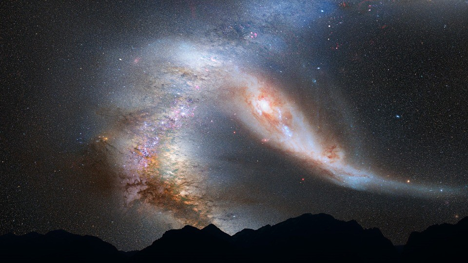
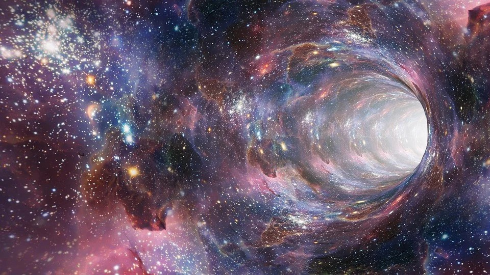

Assim como o fluido mentomagnético envolve e penetra o organismo fisiopsicossomático do ser humano, que modela e comanda em suas mais íntimas estruturas, o Universo inteiro vive mergulhado e penetrado pelo fluido cósmico e vivificador que dimana da Mente Paternal de Deus.

Como já foi dito, é no Eterno Pai que somos e vivemos. Ele é nossa vida e nossa luz, nossa essência e nossa destinação. DEle recebemos o dom do raciocínio e do movimento, da consciência e da vontade. Ele é a alma de nossa alma, a substância de nosso ser.

Existimos e evoluímos para conhece-Lo, amá-Lo e nEle nos realizarmos na plenitude do Espírito, que é felicidade e harmonia, amor e poder. Viajamos para Ele desde tempos imemoráveis, do cristal ao vírus, da alga ao cefalópode, da esponja à medusa, do verme ao batráquio, do lacertino ao mamífero, do pitecantropo ao homem.

Através das eras incontáveis e das inúmeras transformações evolutivas que experimentamos, Seu Divino Amor nos guia e sustenta, no carinho e na lucidez da Sua Justiça Misericordiosa e da Sua Ilimitada Bondade.

Infinito em Sua Solicitude, Ele não cessa de se mostrar a nós, Seus filhos, todos os dias, a todas as horas e em todas as situações, no sol da manhã e nas estrelas da noite, na imponência dos desertos e na placidez dos oásis, na doçura das fontes e na grandeza dos mares, no milagre dos nascimentos e no mistério das mortes.

É no celeiro inesgotável do Seu Hausto Divino que os Arcanjos retiram o plasma vivificante com que constróem as galáxias e formam as constelações, distendendo e multiplicando, pelos domínios do sem-fim, a esplêndida sinfonia da vida.

Esse Supremo Ser, Todo-Poderoso na Sua Eternidade e na Sua Glória Infinita, vive em nós, e nós vivemos nEle! Seu Hálito nos envolve e nos penetra sem cessar. Somos Seus filhos, aprendizes da ciência e da arte de buscá-Lo, de descobri-Lo e de revelá-Lo em nós mesmos, pelo nosso esforço de comunhão com Sua Divina Santidade, através do trabalho e do amor, na subida evolutiva que não pára.

Quanto mais aprendemos e crescemos, mais pequeninos nos sentimos na escala infinita dos seres, em face das excelsas grandezas que continuamente deparamos. Quando, porém, nos voltamos para o Senhor de Tudo e de Todos, e sentimos vibrar dentro de nós o Espírito Divino de nosso Criador e Pai, reintegramo-nos na graça e na esperança, na alegria e na felicidade de existir, cônscios de que, através do tempo-espaço de nossas limitações e de nossas dores, chegaremos um dia à intemporalidade ilimitada da perfeição, no Seio Paterno do Onipotente Amor de que provimos.

O fluido cósmico que liga a Criação ao Criador é fonte inexaurível, sempre ao alcance de todas as criaturas. É nele que a nossa mente espiritual busca e encontra a quintessência energética de que se sustenta, e é a partir dele que elabora a matéria mental que expede através do pensamento, sob a forma de fluido mentomagnético.

Somos, por isso, de Deus, como tudo é de Deus, porque nós, como tudo, dEle provimos e dEle nos sustentamos. Ao malbaratarmos os bens da vida, depredamos o que é do Pai Celeste, que, todavia, nos tolera e nos ensina pacientemente a usar a herança que Ele nos destinou ao nos criar, até que aprendamos, com os recursos do tempo e da experiência, a assumir e a exercer definitivamente o Principado Espiritual, no seu Reino Divino.  
(Áureo. _Universo e vida_, psicografia de Hernani T. Sant’Anna.  5.ed., Cap. 5, item 20.)

