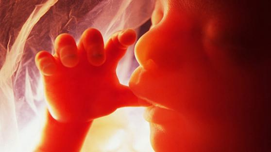
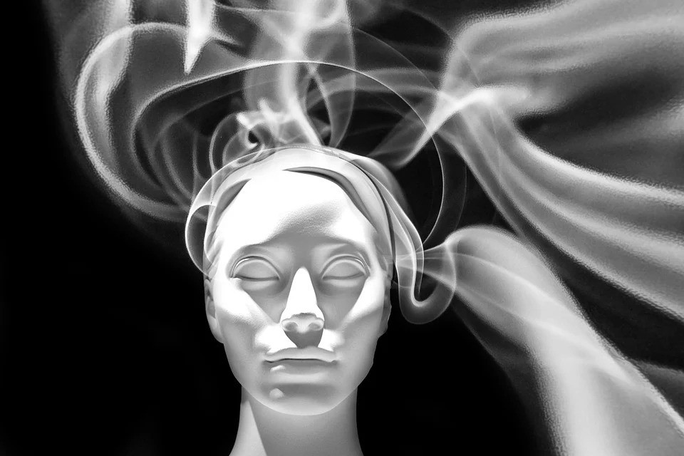

No processo da encarnação, ou reencarnação, a mente espiritual, envolta no seu soma perispirítico reduzido, i.e., miniaturizado, atrai magneticamente as substâncias celulares do ovo materno, ao qual se ajusta desde a sua formação, revestindo-se com ele para, de imediato, começar a imprimir-lhe as suas próprias características individuais, que vão sendo absorvidas pelo novo organismo carnal, à medida que este se desenvolve e se desdobra segundo as leis genésicas naturais.

Intimamente ligada, desse modo, a cada célula física, que se forma segundo o molde da célula perispiritual preexistente a que se acopla, a mente espiritual assume, de maneira mais ou menos consciente, em cada caso, mas sempre rigorosamente efetiva, o comando da nova personalidade humana, que assim se constitui de Espírito, perispírito e corpo material.

Importa aqui considerar que as características modulares que a mente imprime às células físicas que se formam são por ela transmitidas e fixadas através de uma força determinada, que é a energia mental, veiculada pelas ondas eletromagnéticas do pensamento. Quando o molde perispirítico preexiste exteriorizado, as vibrações mentais, atingindo-o em primeiro lugar, encontram maiores recursos para a ele ajustarem as novas células físicas.

Noutros casos, as vibrações mentais, atuando sobre moldes perispiríticos amorfoidizados por ovoidização, valem-se do processo fisiológico natural de desenvolvimento genético para reconstituir a tessitura da organização perispiritual, ao mesmo tempo que imprimem às novas células deste, e às do soma físico, as características de sua individualidade. Assim, as ondas eletromagnéticas do pensamento, carregadas das ídeo-emoções do Espírito, constituem o que se denomina fluido magnético, que é plasma fluídico vivo, de elevado poder de ação.

Daí em diante, e pela vida toda, refletem-se na mente espiritual todos os fenômenos da experiência humana do ser, cuja quimios-síntese final nela também se realiza. Justo é que nela se reflitam e se imprimam tais resultados, por ser ela mesmo quem comanda o ser, ou, melhor dizendo, por ser ela o próprio ser, que do mais se vale como de instrumentos indispensáveis à sua ação e manifestação, porém não mais do que instrumentos.

É das vibrações da mente espiritual que dependem a harmonia ou a desarmonia orgânicas da personalidade e, portanto, a saúde ou a doença do perispírito e do corpo material.

De acordo com o principio da repercussão, as células corporais respondem automaticamente às induções hipnóticas espontâneas que lhes são desfechadas pela mente, revigorando-se com elas ou sofrendo-lhes a agressão. Raios mentais desagregadores, de culpabilidade ou remorso, formam zonas mórbidas no cosmo orgânico, impondo distonia às células, que adoecem, provocando a eclosão de males que podem ir desde a toxiquemia até o câncer.

Tanto ou mais do que os prejuízos causados pelos excessos e acidentes físicos, muitas vezes de caráter transitório, as ondas mentais tumultuadas, se insistentemente repetidas, podem provocar lesões de longo curso, a repercutirem, no tempo, até por várias reencarnações recuperadoras.

Além disso, na recapitulação natural e inderrogável das experiências do Espírito, quando se trata de ônus cármicos em aberto, eclodem, com freqü.ncia, em determinadas faixas de idade, e em certas circunstâncias engendradas pelos mecanismos da expiação, forças desarmônicas queafligem a mente, desafiando-lhe a capacidade de autocontrole e auto-superação, sob pena de engolfar-se ela em caos de intensidade e duração imprevisíveis.

Não podemos, tampouco, esquecer os problemas de sintonia, decorrentes da lei universal das afinidades, que obriga os semelhantes a conviverem uns com os outros e a se influenciarem mutuamente. Como a onda mental opera em regime de circuito, incorpora inelutavelmente todos os princípios ativos que absorve, sejam de que natureza forem. Assim, tanto acontecem, entre as almas, maravilhosas fecundações de ideais e sentimentos nobres, como terríveis contágios mentais, algumas vezes até de natureza epidêmica, responsáveis por graves manifestações da patologia mento-física.

Tudo depende, por conseguinte, do modo como cada Espírito se conduz, no uso do fluido magnético que maneja. Com ele, pode-se ferir e prejudicar os outros, criar distúrbios e zonas de necrose, soezes encantamentos e fascinações escravizantes. Mas pode também manipular medicações balsâmicas, produzir prodígios de amor fecundo e estabelecer, através da prece e do trabalho benemerente, uma sublime ligação com o Céu.  
(Áureo. _Universo e vida_. Psicografia de Hernani T. Santana.  5.ed., Cap. 5, item 18.)