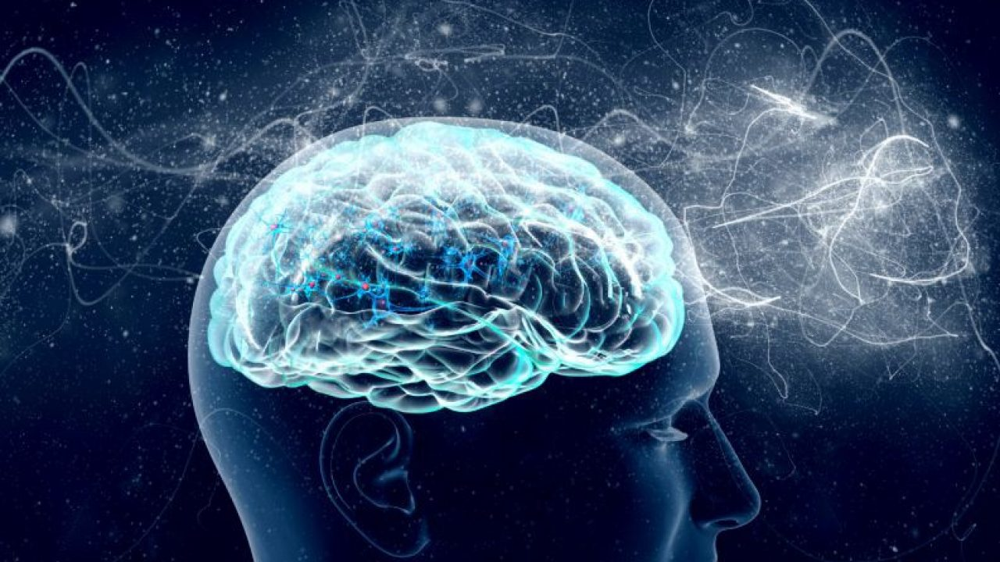

# Mente e sexo

  
  
“A mente e o sexo são as mais divinas características do ser humano. Fontes por excelência de ação criadora, atuam, basicamente, uma nas portentosas dimensões do espírito, e o outro nos imensuráveis domínios da forma!

A mente elabora o pensamento, norteia a razão, gera a técnica, comanda a vida. O sexo garante e renova a vivência das formas, em que as essências se revelam e se acrisolam, através de longuíssima fieira de planos evolutivos.

A mente evolve para a sabedoria, por meio de incessantes apurações do instinto. O sexo evoluciona para o amor, depurando a libido, no crisol das experiências sublimadoras.

A mente engendra magnificentes edificações da inteligência, na construção do saber. O sexo improvisa potentes eclosões de simpatia, na estruturação dos pródromos da fraternidade.

A mente desenvolve extraordinários valores do pensamento, no fulgor da ciência, da filosofia e das artes. O sexo canaliza a força dos impulsos, erigindo na maternidade e na paternidade sublimes altares ao sentimento enobrecido.

No seio augusto do tempo, a mente se angeliza e a forma se transluz. A mente, que se manifesta na matéria, se expressará, um dia, em plena luz. O sexo, que vibra na carne, radiará, um dia, o puro amor.

No regaço insondável dos milênios, a crisálida de consciência acende, humilde, o primeiro raio da coroa de glórias arcangélicas. Os genes cromossomáticos, que partem dos núcleos celulares e do citoplasma, iniciam, com modesta nota, a sinfonia cósmica da comunhão dos querubins.

Atritada pelos problemas e acicatada pelo trabalho, a mente freme na eclosão do conhecimento, para o esplendor da sapiência. Acrisolado pela dor, nos torniquetes da experiência, o sexo emerge, transformado, para as excelsas criações da beleza.  
Torna-se a mente em poder; torna-se o sexo em amor. O poder constrói os mundos; o amor os apura e diviniza.

A mente se fortalece e expande; o sexo se desdobra e auto-completa. Entretanto, só a mente é eterna; o sexo, que a reflete, acaba por ela absorvido.

Dia chega em que só a mente existe, na plenitude da vida, gloriosa de sabedoria e de amor, na comunhão divina. Então, o verme humilde, que se transformará, com o tempo, em homem problema, será, no império do Universo, um príncipe de luz.  
Áureo. _Universo e vida_. Psicografia de Hernani T. Santana,  5.ed., Cap. 5, item 8.