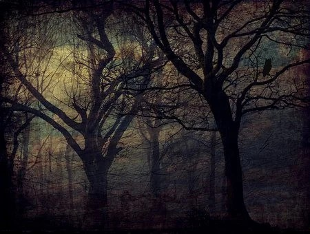

Espantam-se alguns companheiros de aprendizado com as demonstrações de força do chamado Poder das Trevas, capaz de organizar verdadeiros impérios, em zonas umbralinas e nas regiões subcrostais, de onde consegue atuar organizada e maleficamente sobre pessoas e instituições na Crosta da Terra.

O espanto, porém, é descabido, não só por motivos de boa lógica, mas, igualmente, por motivos de ordem técnica.

Por mais intelectualizados que possam ser os gênios do mal, e por mais sofisticados que sejam os seus recursos tecnológicos, não podem eles, nunca puderam e jamais poderão afrontar a sabedoria e o Poder do Cristo e de seus grandes mensageiros, que controlam, com absoluta segurança, todos os fenômenos ocorrentes no planeta e no sistema de que este é parte.

Tudo o que as Inteligências rebeladas podem fazer é rigorosamente condicionado aos limites de justiça e tolerância que o Governo da Vida estabelece, no interesse do sumo bem.

É fora de dúvida que os “Dragões” e seus agentes possuem ciência e tecnologia muito superiores às dos homens encarnados, e, sempre que podem, as utilizam. Entretanto, os Poderes Celestes sabem mais e podem mais do que eles.

A Treva pode organizar, e organiza, infernos de vasta e aterrorizadora expressão; contudo, sempre que semelhantes quistos ameaçam a estabilidade planetária, a intervenção superior lhes promove a desintegração.

Os “demônios”, que se arrogam os títulos de “juizes”, e que há muitíssimo tempo utilizam, em larga escala, processos e instrumentais de desintegração que nem a mais moderna ficção científica dos encarnados ainda sequer imagina, realmente conhecem muito mais do que os homens sobre a estrutura e a dinâmica dos átomos e das partículas elementares. Eles sabem consideravelmente mais do que os cientistas e pesquisadores terrenos, acerca de muito mais coisas do que massa, carga, spin, número bariônico, estranheza e vida média de lambdas, sigmas, csis, ômegas, etc., e conseguem verdadeiros “milagres” tecnológicos, a partir de seus conhecimentos práticos avançados sobre ressonâncias e recorrências, usando com mestria léptons, mésons e bárions, além de outras partículas, como o gráviton, que o engenho humano experimentalmente desconhece.

Apesar disso, os operadores celestes não somente varrem, com frequência, o lixo de saturação que infecta demasiado perigosamente certas regiões do Espaço, aniquilando-o através de interações de partículas com antipartículas atômicas, como se valem de outros recursos, infinitamente mais poderosos, rápidos e decisivos, para além de todas as forças eletromagnéticas e físicoquímicas ao alcance das Trevas.

Também a capacidade de destruição do homem encarnado permanece sob o rigoroso controle do Poder Celeste. A energia produzida pelas reações nucleares, que os belicistas da Crosta já conseguem utilizar, não vai além de um centésimo da massa total dos reagentes. Eles sabem que o encontro de um pósitron com um elétron de carga negativa resulta na total destruição de ambos, pela transformação de suas massas em dois fótons de altíssima energia. Entretanto, não conseguem pósitrons naturais para essas reações e não são capazes ainda de produzi-los senão à custa de um dispêndio energético praticamente insuportável.

Assim, as Trevas podem realmente assustar-nos e ferir-nos, sempre que nossos erros voluntários nos colocam ao alcance de sua maldade. Basta, porém, que nossa opacidade reflita um único raio do Amor Divino, para que nenhuma força maligna possa exercer sobre nós qualquer poder.

Áureo. _Universo e Vida_. Psicografado por Hernani T. Sant’Anna, 5.ed. Cap. 15