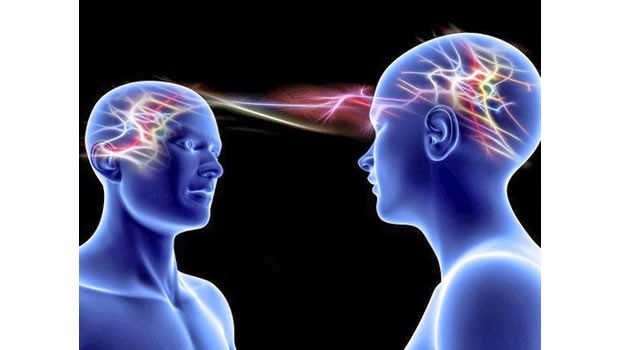
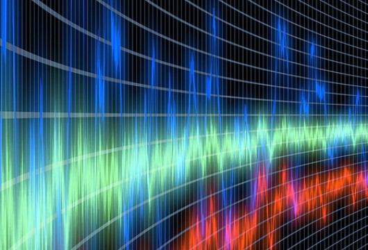

Na sua feição de aparelhagem eletromagnética, de extrema e delicada complexidade, o ser humano apresenta a singularidade de não poder jamais desligar-se ou ser desligado. Mesmo nas piores condições de monoideísmo, ou despido da roupagem perispirítica, após os dolorosos eventos da segunda morte da forma, e até nas mais ingratas condições de letargia mental, o espírito humano continua ativo e sintonizado com as noures a que se afina.

Sendo o pensamento contínuo uma conquista definitiva da alma, não pode esta, ainda que o queira, desligar-se do circuito através do qual se ajusta às forças vivas e conscientes do Universo. Entretanto, cada qual emitirá e receberá sensações na faixa de freqüência que lhe é própria, e da mesma qualidade que lhe marca o teor dos interesses.

Embora ondas de todos os comprimentos cruzem constantemente o ar que respiramos, nenhum aparelho receptor de freqüência modulada consegue captar as emissões de ondas curtas para as quais não foi programado. Contudo, uma vez que esteja funcionando, captará compulsoriamente os sons da frequência com que estiver sintonizado.

Em razão disso, cada um de nós conviverá sempre, em toda parte e a todo tempo, com aqueles com quem se afina, efetuando permanentemente, com os seus semelhantes, as trocas energéticas que, em face da lei, asseguram a manutenção de todas as vidas.

Atendendo às disposições da afinidade, esse imperativo substancia igualmente o primado da justiça iniludível que preside a todos os destinos, na imensa esteira da evolução. Qualquer mudança de sintonia, ou diferenciação de níveis de troca energética vital, sempre decorrerá necessariamente de alteração do potencial íntimo de cada espírito e da natureza de seus pensamentos e emoções.

As forças que nos jungem uns aos outros são, por isso mesmo, as que emitimos de nós e alimentamos em nosso próprio âmago.

Os compromissos que disso decorrem são mais do que evidentes, pois ninguém deixará, em momento algum, de integrar e engrossar alguma corrente de forças, atuante e dirigida para determinado objetivo. Cada qual de nós está, portanto, trabalhando sem cessar, de momento a momento, seja para o bem ou para o mal, na construção do amor ou do ódio, da alegria ou da desventura, da felicidade ou do desequilíbrio.

Claro que o problema da responsabilidade é sempre proporcional ao nível de consciência de cada um. Em sua grande maioria, os espíritos terráqueos não são, na atualidade, deliberadamente maus, embora estejam muito longe de ser conscientemente bons. Vogam, por isso, alternada e desordenadamente, entre os impulsos superiores e os inferiores, experimentando, na angústia de sua indefinição, todas as gamas de sensações de uma experiência multifária, que ainda se processa ao sabor dos improvisos, entre crises de animalidade e anseios de integração com o Céu. Fazendo e desfazendo, construindo e demolindo, plantando rosais e espinheiros, a alma humana comum é qual folha batida por todos os ventos e arrastada por todas as correntezas.

Quando, porém, um coração já ascendeu a planos mais altos e já se acostumou ao pão divino de ideais elevados e de sensações sublimadas, não sintonizará, sem terríveis padecimentos interiores, as faixas de emoções mais deprimentes da experiência humana. Independentemente das responsabilidades que assuma e dos males que semeie, e que terá de colher, essa consciência amargurada sentirá vibrar, nos seus mais tristes acentos, a nostalgia do paraíso perdido. E como ninguém atraiçoa impunemente a lei, nem a si mesmo, esse espírito infeliz corre ainda o risco enorme de, pelo seu maior poder de percepção e de sintonia, cair vitimado por processos demoníacos de hipnose obsessiva, sob o guante impiedoso do poder das Trevas.

É assim que se criam, frequentemente, doridos e complicados processos de resgate e recuperação de Espíritos substancialmente nobres, que se deixaram voluntariamente imergir em densos lagos de lama.

Essa a razão da advertência do Divino Mestre, que há dois mil anos repercute no mundo: “Aquele que comete pecado faz-se escravo do pecado.” Nem é por diverso motivo que o Cristo nos convida, compassivo, há vinte séculos, a sermos “filhos da Luz”.

Áureo. _Universo e vida_. Psicografia de Hernani T. Sant’Anna.  5.ed., Cap. 5, item 14.