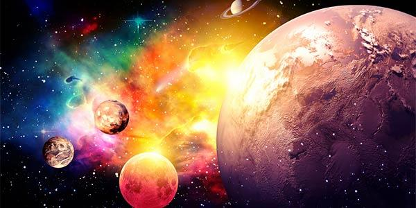

No imenso viveiro de forças em tensão, que é o espaço sideral, onde os sóis viajam à velocidade média de cem quilômetros por segundo, os Cristos de Deus, parteiros de mundos e pastores de humanidades, não só vigiam e governam as Vias-Lácteas, como organizam e protegem os ovos cósmicos de que nascem as galáxias. Microscópicos sóis de sistemas atômicos, que são estruturalmente similares aos sistemas solares e aos sistemas anímicos, os complexos núcleos dos átomos primordiais cercam-se de elétrons, cuja poderosa ação, chamada eletricidade, desencadeada pela extrema velocidade de seus movimentos orbitais, gera o que se denomina magnetismo.

Nessas equações de força e luz, eletricidade e magnetismo, o traço de união e de equilíbrio é sempre o Amor Divino, fonte suprema de que toda vida nasce e se alimenta.

O Universo é o Império Divino dos Raios e das Forças, onde tudo e todos se intercomunicam e se sustentam. As árvores, os animais, a terra, as águas e o ar, tudo, enfim, que circunda o ser humano, o atinge com as suas irradiações e é igualmente atingido pelas irradiações dele.

Se das profundezas da terra partem raios gama, de um décimo bilionésimo de milímetro, na direção do Sol, o coração que singulta no peito de um homem é um gerador de raios que opera na frequência de uma oscilação por segundo.

Estrelas gloriosas, semeadas por todos os quadrantes do Espaço, expedem, sem cessar, em todas as direções, uma aluvião de raios cósmicos, da fantástica pequenez de um trilionésimo de milímetro, tão penetrantes e poderosos que nenhuma barreira material pode detê-los.

Não fossem as radiações solares de luz alaranjada, de 0,0066mm de comprimento, as células vegetais não conseguiriam realizar a síntese de substâncias orgânicas, mediante a fixação do gás carbônico do ar; e sem esse trabalho fundamental, nenhum homem ou animal terrestre viveria, pois todos dependem, para sobreviver, dos alimentos primários que somente os vegetais são capazes de elaborar.

Trono do Cristo, o Sol controla e alimenta o nosso pequeno planeta, a 150 milhões de quilômetros de distância, que a sua luz percorre em cerca de oito minutos e meio. Para manter sua família planetária, ele gera aproximadamente 83.000 cavalos-vapor, i.e., mais de 61.000.000W de energia, em cada metro quadrado de sua superfície, que envia ao espaço ao seu redor, ao mesmo tempo que converte por volta de 616 milhões de toneladas de hidrogênio em hélio, por segundo.

É das 3.600.000 por metro quadrado, que o Sol fornece, que são absorvidas, pelas águas de nossos oceanos, rios e lagos, as calorias que se transformam nas nuvens que precipitam as chuvas.

Tudo isso é, porém, palidíssima imagem do grande sistema anímico de que os nossos Espíritos fazem parte, o grande sistema cujo Sol é Cristo-Jesus, de cujo amor e de cuja força vivemos, no Infinito Império Universal, cuja alma é Deus, o Pai Eterno.

Consolemo-nos de não ser, nesse sistema, os menos evolvidos, pois mesmo em termos estritamente físicos, a relação é a mesma entre um átomo e um corpo humano e entre este último e o Sol, já que, segundo cálculos razoáveis, o corpo humano é constituído por cerca de dez nonilhões de átomos, o mesmo número de homens que se imagina seriam precisos para povoar, se isso fosse possível, o espaço interno do Sol.

Foi por essa razão que disse, certa vez, ilustre cientista, que, nos domínios do Universo, está o homem “entre o átomo e as estrelas”.

Áureo. Universo e vida. Psicografia de Hernani T. Sant’Anna.  5.ed., Cap. 5, item 13.