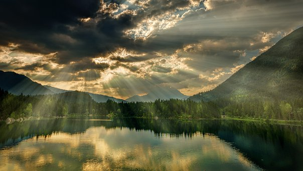

Qualquer estudante de Física sabe que a ação da luz pode impor diferenciações a variáveis ou a propriedades de substâncias e sistemas, determinando, por exemplo, variações de resistência elétrica, emissão de elétrons ou excitações de redes cristalinas.

Sabe também que os fótons têm massa em repouso nula, carga elétrica nula e spin unitário, mas que a energia de cada um é sempre igual ao produto da constante de Planck pela frequência do campo.

Também não ignora que, num meio material, a velocidade de um fóton pode ser menor do que a da radiação eletromagnética no vácuo, porque ele interage com as partículas do meio.

Igualmente, não constitui novidade que um cátodo fotossensível, excitado por uma radiação apropriada, emite elétrons que podem ser acelerados para um eletrodo, provocando a emissão de novos elétrons, ainda mais numerosos. E se novas acelerações ocorrerem, em seqü.ncia, para outros eletrodos, o número inicial de elétrons pode multiplicar-se por várias potências de dez.

Até aí, nenhuma novidade. Entretanto, neste outro lado do plano físico em que o homem desencarnado reside, isto é, no plano a que a morte do corpo nos conduz, e onde a matéria diferenciada e muito mais plástica se caracteriza por bem menor densidade, a influência da luz é, na mesma inversa proporção, muito maior.

Se no plano físico fótons podem decompor moléculas e, quando possuem energia superior a 5,18 ou 5,40 MeV, podem até provocar fissões nucleares, como a do urânio 233 e a do tório 230, aqui a gradação natural e automática, ou conscientemente provocada, determina com facilidade o teor eletromagnético de qualquer tipo de luz, a ponto de tornar uma claridade confortadora e reconstituinte, ou, ao contrário, insuportável por quem não tiver capacidade fisio-psico-moral para absorvê-la.

É em razão disso que os “filhos da Luz”, isto é, as consciências iluminadas pelo bem, são sempre mais poderosos do que os “filhos da treva”, ou seja, as consciências ensombrecidas pelo crime. Isto porque as vibrações do pensamento têm sempre efeitos luminosos, geram luz, e essa luz tem, naturalmente, frequência, intensidade, coloração, tonalidade, brilho e poder peculiares, de acordo com a sua natureza, força e elevação.

Poder-se-ia dizer que a hierarquia espiritual se assinala por naturais diferenças de luminosidade, a traduzir níveis e expressões variadas de elevação, grandeza, potência e saber.

Se considerarmos que as vibrações luminosas da aura espiritual se fazem acompanhar de sons e odores característicos, além de outras intraduzíveis expressões de dinamismo vital, poderemos tentar formular vaga idéia do que chamaríamos o mundo individual de um Espírito Superior, pois não temos, por enquanto, nenhuma possibilidade de imaginar a excelsa sublimidade da aura de um Espírito Angélico.

Se a crônica do mundo referiu-se à claridade da explosão de uma bomba atômica, dizendo que ela teve o fulgor de mil sóis, como se expressaria se pudesse suportar a gloriosa visão da Aura do Cristo?

Descendo, porém, à humildade da nossa condição, consideremos que tudo em nosso plano é relativo e que, dentro das limitações de nossa realidade, a luz do bem é força divina que o Poder do Alto nos convida constantemente a sublimar e expandir.

A sombra e a treva são criações mentais inferiores das mentes enfermiças, renováveis e conversíveis em luz confortadora, pela química dos pensamentos harmoniosos e dos sentimentos bons.

Áureo. _Universo e vida_. Psicografado por Hernani T. Sant’Anna. FEB. 5.ed, p.96