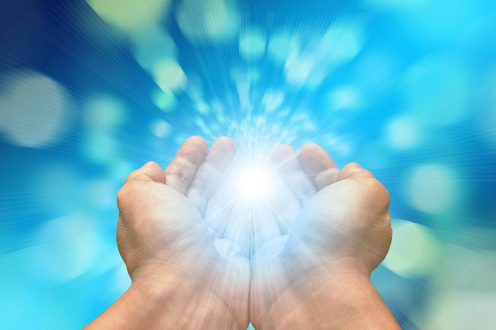

Exposto às radiações luminosas do Sol, o silício puro absorve fótons que removem os seus elétrons atômicos, os quais, liberados, produzem uma corrente elétrica. Esse processo de funcionamento das baterias solares faz lembrar, de algum modo, aspectos infinitamente superiores, mas até certo ponto tecnicamente assemelhados, da evolução.

Submetidos aos raios da experiência, os espíritos compostos, isto é, não puros, que se movem nas faixas da evolução terrestre, absorvem progressivamente quanta de luz, que vão removendo elementos da carga psíquica do ser, os quais, liberados, geram, através das correntes elétricas que produzem, campos magnéticos específicos.

Estruturando desse modo a própria aura, os espíritos criam a atmosfera psíquica que os envolve e penetra; atmosfera carregada de eletricidade e magnetismo, de raios, ondas e vibrações. Trata-se de efetivo e poderoso campo de forças, gerado por circuitos eletromagnéticos fechados, nos quais se fazem sentir os parâmetros de resistência, indutância e capacitância, asseguradores de compensação, equilíbrio e acúmulo de energias de sustentação.

É assim que o campo de forças da própria aura delimita o mundo individual de cada espírito; mas não somente o delimita, como também o caracteriza, porque possui peso específico determinado, densidade própria e condições peculiares de coloração, sonoridade, velocidade eletrônica e ritmo vibratório.

A mente espiritual é o seu fulcro, sua geratriz e seu núcleo de comando, através de todas as transformações que experimenta, inclusive as que decorrem das reciclagens biológicas provocadas pelos fenômenos da morte física, da reencarnação, da ovoidização, da regressão temporal e outros.

É, ainda, através de sua aura que o espírito assimila, armazena e exterioriza os princípios cósmicos de que fundamentalmente se alimenta, funcionando nisso como transformador por excelência de energia, para si e para os seus semelhantes, pois cada espírito respira e vive em faixas vibratórias comuns a todas as mentes a que se liga, no plano evolutivo que lhe é próprio.

Em verdade, cada espírito é qual complexa usina integrante de vasta rede de outras inúmeras usinas, cujo conjunto se auto–sustenta, como um sistema autônomo, a equilibrar-se no infinito mar da evolução.

Via das trocas incessantes que dinamicamente se processam nesses circuitos de energia viva, manifestam-se os fenômenos da afinidade e os da mediunidade espontânea, a produzirem estímulos de influenciação, fecundação ideológica e atração psíquica, responsáveis pela seqüência evolucionária dos sistemas anímicos, no seio da vida universal.

Ninguém, portanto, se prejudica a si mesmo sem lesar a todos quantos se lhe associam na grande economia da vida; e, do mesmo modo, todo aquele que se melhora, enriquece e ascende, beneficia direta e eficazmente a todos os seus companheiros de jornada espiritual.

O fenômeno do eco não se restringe à reflexão de um som; é também, na esfera dos pensamentos e dos sentimentos, repercussão de idéias e emoções, na geração infinita de recursos novos e de forças vivas, de efeitos certos, seja nas semeaduras de dor, seja nas plantações sublimes de alegria.

  
Áureo. _Universo e vida_. Psicografia de Hernani T. Santana, 5.ed., Cap. 5, item 2.