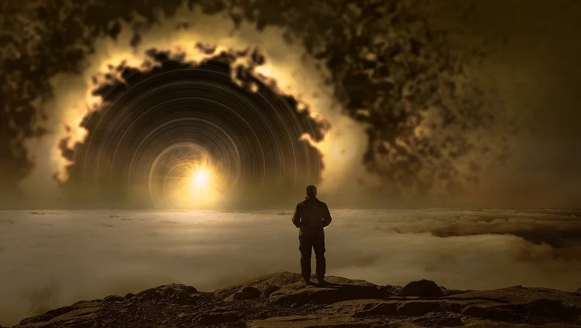

É certo que os valiosíssimos estudos de Fraunhofer e de Fresnel, a respeito da difração das ondas eletromagnéticas, jamais visaram a extrapolações filosóficas, tampouco o cálculo das “curvas de vibração” através da “espiral de Cornu”. Todavia, nada nos impede anotar, a respeito, uma ou outra particularidade, para dela extrairmos certos conceitos que nos interessam mais de perto.

Vejamos, por exemplo, o fato, aparentemente sem maiores implicações, de que, no próprio centro de sombra que algum pequeno objeto circular projeta sobre um anteparo, sempre se observa a existência dum minúsculo ponto iluminado.

O fenômeno desperta nos físicos terrenos um interesse meramente técnico, ligado aos processos naturais da difração da luz; nós, porém, vemos nele pálida imagem do que se verifica no reino das vibrações de natureza mais sutil, atingindo vastos setores da vida espiritual. 

 A Luz Divina também se “difrata”, ao encontrar a resistência duma mente que provisoriamente se lhe mostre refratária; mas, ainda assim, revela-se presente e ativa no próprio núcleo da sombra que tal ser projeta de si mesmo.

Essa verdade exemplifica por que jamais é vã qualquer emissão de luz espiritual sobre quem quer que seja, por mais empedernido no mal e aparentemente infenso ao bem esse alguém seja. O Amor é Luz Divina que não se perde jamais.

É claro que, em qualquer plano, os fenômenos têm a sua hierarquia. Quando se observa a difração de raios X, pelos átomos duma rede cristalina, percebe-se complexa superposição de efeitos de interação, que conduzem a espalhamento, e de efeitos de interferência provocados por trens de ondas.

Tudo isso, e muito mais, se observa, por igual, noutro nível, na física transcendente, a lembrar- nos de que a Lei da Vida é fundamentalmente a mesma em toda parte.

Consideremos agora este outro assunto, dentro da mesma ordem de idéias: — na técnica das práticas magnetistas, são comumente usados passes transversais e passes longitudinais, conforme o caso e o que se pretende, porque, dentre outras razões, as ondas transversais e as longitudinais diferem umas das outras pela relação entre a sua direção de propagação e a do movimento das partículas do meio em que se movem. Numa onda transversal, as duas direções são perpendiculares, enquanto numa onda longitudinal elas são coincidentes. As ondas transversais podem ser polarizadas; nunca, porém, as longitudinais.

Já as ondas que se propagam na água não são transversais, nem longitudinais, o que explica a facilidade com que aquela pode ser “fluidificada”, isto é, magnetizada, pois num meio líquido podem propagar-se ondas de pressão de grande intensidade e muito velozes.

Não fosse o despreparo moral em que a nossa Humanidade ainda se compraz, os Poderes de Cima já teriam desvelado, através de seus missionários, inumeráveis conhecimentos e recursos novos de técnica científica, capazes de outorgar maiores poderes de ação ao homem terrestre.

Enquanto, porém, as criaturas da Crosta, e de suas adjacências, não assimilarem, na prática, a Lei do Amor, os recursos ao seu dispor continuarão sendo basicamente apenas aqueles suscetíveis de agir sobre as formas físicas, e não sobre as estruturas mais profundas do espírito imortal.  
(Áureo. _Universo e vida_. Psicografia de Hernani T. Sant’Anna.  5.ed., Cap. 5, item 12.