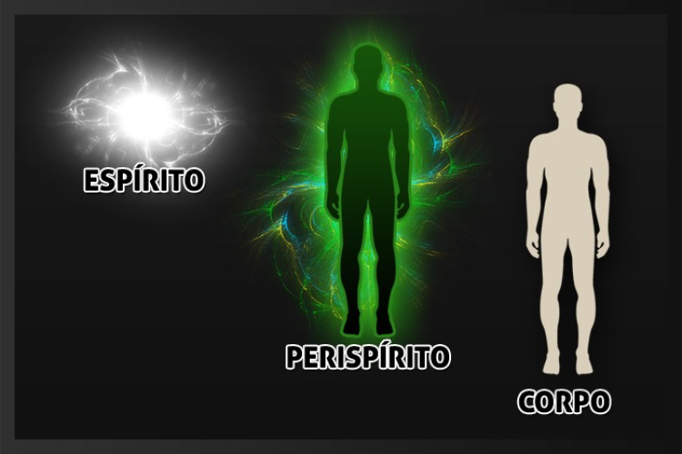

**ESPÍRITO, PERISPÍRITO E CORPO**

 O homem é, portanto, formado de três partes essenciais:  
1º — o corpo ou ser material, análogo ao dos animais e animado pelo mesmo princípio vital;  
2º — a alma, Espírito encarnado que tem no corpo a sua habitação;  
3º — o princípio intermediário, ou perispírito, substância semimaterial que serve de primeiro envoltório ao Espírito e liga a alma ao corpo. Tal, num fruto, o gérmen, o perisperma e a casca.  
(Allan Kardec. _O livro dos Espíritos_. FEB. Perg 135)

**ESPÍRITO**

_Que definição se pode dar dos Espíritos?_  
“Pode dizer-se que os Espíritos são os seres inteligentes da criação. Povoam o Universo, fora do mundo material.”

_Os Espíritos tiveram princípio, ou existem, como Deus, de toda a eternidade?_  
“Se não tivessem tido princípio, seriam iguais a Deus, quando, ao invés, são criação sua e se acham submetidos à sua vontade. Deus existe de toda a eternidade, é incontestável. Quanto, porém, ao modo por que nos criou e em que momento o fez, nada sabemos. Podes dizer que não tivemos princípio, se quiseres com isso significar que, sendo eterno, Deus há de ter sempre criado ininterruptamente. Mas, quando e como cada um de nós foi feito, repito-te, nenhum o sabe: aí é que está o mistério.” (Allan Kardec. _O livro dos Espíritos_. FEB. Perg 76 e 78)

**PERISPÍRITO**

_O Espírito, propriamente dito, nenhuma cobertura tem, ou, como pretendem alguns, está sempre envolto numa substância qualquer?_  
 “Envolve-o uma substância, vaporosa para os teus olhos, mas ainda bastante grosseira para nós; assaz vaporosa, entretanto, para poder elevar-se na atmosfera e transportar-se aonde queira.”  
Envolvendo o gérmen de um fruto, há o perisperma; do mesmo modo, uma substância que, por comparação, se pode chamar perispírito, serve de envoltório ao Espírito propriamente dito.  
(Allan Kardec. _O livro dos Espíritos_. FEB. Perg 93)

         _Há no homem alguma outra coisa além da alma e do corpo?_  
       “Há o laço que liga a alma ao corpo.”

 _De que natureza é esse laço?_  
 “Semimaterial, isto é, de natureza intermédia entre o Espírito e o corpo. É preciso que seja assim para que os dois se possam comunicar um com o outro. Por meio desse laço é que o Espírito atua sobre a matéria e reciprocamente.”  
(Allan Kardec. _O livro dos Espíritos_. FEB. Perg 135)

**Funções do perispírito**

“Reveste o Espírito, quando desencarnado, e serve de intermediário entre o Espírito e o corpo, durante a encarnação.  
Do corpo para o Espírito, transmite sensações; do Espírito para o corpo, conduz impressões.”  
(Martins Peralva. _O pensamento de Emmanuel._ P.36)

Quer saber mais? Estude o livro **_Conheça o Espiritismo_** [editoraautadesouza.com.br](http://www.editoraautadesouza.com.br/)