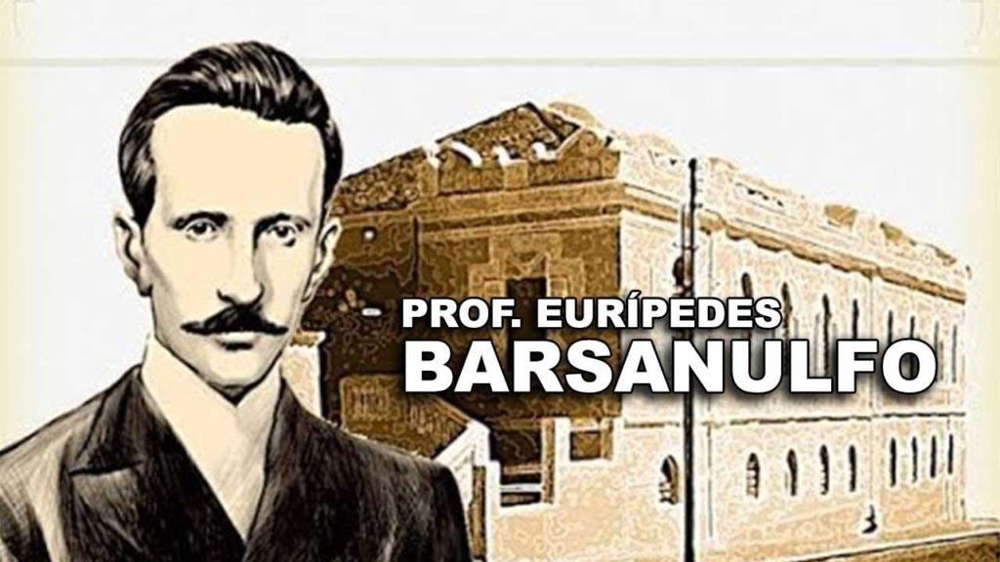

Quando ainda reencarnado, Eurípedes Barsa­nulfo foi portador de verdadeiro medianato, porquan­to conduziu as faculdades mediúnicas, de que era ins­trumento, dentro dos postulados enobrecedores da caridade e do amor, em uma vivência aureolada de exemplos de renúncia e de abnegação, havendo sido também educador emérito. Em razão dessas suas ad­miráveis faculdades, dedicou-se a atender os porta­dores de alienação mental, psiquiátrica e obsessiva, erguendo um Hospital na cidade em que nascera, para socorrê-los. Conseguiu, naquele tempo, resultados incomuns, favorecendo os enfermos com a reconquis­ta do equilíbrio. Não obstante a terapêutica acadê­mica vigente e que ele não podia aplicar, por não ser habilitado a exercer a Medicina nessa área, era a sua própria força moral que lograva o maior número de recuperações, face à bondade que expressava em re­lação aos pacientes desencarnados, assim como a mi­sericórdia de que se utilizava para atender os pade­centes dos graves transtornos psíquicos.

Ser interexistente, viveu como apóstolo da cari­dade, possuindo extraordinários potenciais curado­res e especial acuidade como receitista espiritual, dedicado ao socorro dos menos felizes.

Nunca se negou a socorrer quem quer que fos­se, mesmo àqueles que o perseguiam de forma incle­mente, e que, ao enfermarem, não encontrando re­cursos hábeis para o reequilíbrio, buscavam-no, dele recebendo o concurso superior para o prosseguimen­to da jornada evolutiva.

**A Vida no Plano Espiritual  
**  
Desencarnando jovem, vitimado pela epidemia da gripe espanhola, que assolou o mundo, prosseguiu como missionário de Jesus amparando milhares de vidas que se lhe vincularam, especialmente na região por onde deambulara na recente existência encerra­da.

O seu nome tornou-se bandeira de esperança, e com um grupo de cooperadores devotados ao Bem, alargou o campo de trabalho socorrista, ampliando as áreas de atendimento sob a inspiração do Psicote­rapeuta por excelência.(…)

Não se limitando a socorrer exclusivamente os viandantes do carro físico, acompanhou, também, após a desencarnação, muitos daqueles que lhe re­ceberam o concurso, neles constatando o estado de­plorável em que retornavam à Pátria, vencidos por perseguidores cruéis que os obsidiavam, ou vitima­dos por ideoplastias terríveis derivadas dos atos a que se entregaram, enlouquecendo de vergonha, de dor e de desespero após o portal do túmulo.

Formando verdadeiras legiões de alienados mentais, que se agrediam, uns aos outros, chafurdan­do em paisagens de sombra e angústia, constituídas por abismos de sofrimentos insuportáveis, condoeu-se particularmente, por identificar que muitos deles haviam recebido o patrimônio da mediunidade ilu­minada pelas lições libertadoras do Espiritismo, mas preferiram enveredar pelos dédalos da irresponsabi­lidade, utilizando-se da superior concessão para o deleite de si mesmos e das paixões mais vis que pas­saram a cultivar. Outros tantos corromperam a pala­vra iluminativa, de que se fizeram instrumentos, uti­lizando-a para atender aos interesses escusos, ou negociar favores terrestres com desprezo pela opor­tunidade de edificação de muitas vidas que lhes aguardavam o contributo. Diversos mercadejaram os dons espirituais, tombando sob o vampirismo propi­ciado por verdugos do passado, que se compraziam em empurrá-los para mais graves despautérios, com­prometendo-lhes a reencarnação.

**Hospital Esperança**

Diante da massa imensa de desesperados que haviam conhecido as diretrizes para a felicidade, mediante o serviço dignificante e restaurador dos ensinamentos de Jesus, mas que preferiram os jogos doentios dos prazeres exorbitantes, o missionário compadecido buscou o apoio dos Benfeitores de mais Alto, para que conduzissem a Jesus uma proposta sua, caracterizada pelo interesse de edificação de um Nosocômio espiritual, especializado em loucura, para aqueles que desequilíbrio apresentassem após a mor­te do corpo físico, e que também serviria de Escola viva, como igualmente de laboratório, para a prepa­ração das suas reencarnações futuras em estado me­nos doloroso e com possibilidades mais seguras de recuperação.

Após deferido o seu requerimento de beneficên­cia, suplicou ao nobre Espírito Agostinho de Hipona, que na Terra o houvera auxiliado e inspirado no mi­nistério abraçado, que se tornasse o intermediário das futuras necessidades da Instituição em surgimento junto ao Médico divino, a quem suplicava bênçãos em favor da obra.

Havendo o sábio cristão, autor das Confissões e de outros memoráveis trabalhos, aquiescido em in­termediar os apelos do trabalhador do Bem junto ao Senhor Jesus, foi permitida a edificação do refúgio e abrigo especial para os doentes da alma, que se en­contrassem sob tormentosas alucinações nos antros escusos da erraticidade inferior.”

Eurípedes providenciou a convocação de ad­miráveis psiquiatras e psicólogos desencarnados, que haviam na Terra cuidado das desafiadoras patologi­as obsessivas e auto-obsessivas, de forma que, pre­parada a equipe, foram tomados os cuidados própri­os para a edificação do Sanatório, situado nesta área distante do movimento da comunidade espiritual, a fim de que as bênçãos da Natureza contribuíssem também com elementos próprios para acalmar as suas torpes alucinações e ensejar-lhes renovação e paz.

Obedecendo a um plano cuidadoso, foram er­guidos diversos blocos, que deveriam atender a pa­tologias específicas, tais como delírios graves, pos­sessões de longo porte, consciências autopunitivas, desespero por conflitos íntimos, fixações mórbidas, hebetação mental, autismo conseqüente a arrepen­dimentos tardios, esquizofrenias tenebros as, obsessões compulsivas, etc.

Estas informações nos dão a dimensão perfeita da grandeza espiritual de Eurí­pedes Barsanulfo, cuja dedicação à vivência do evan­gelho, à luz do Espiritismo, dele fizera um verdadeiro apóstolo da Era Nova.

Dando prosseguimento ao seu ministério de amor ao Mestre através do próximo colhido pelo vendaval da alucinação, com um grupo de abnegados mensa­geiros da luz erguera, sem medir esforços, este Nosocômio para o socorro aos enfermos da alma e o estudo preventivo da loucura, assim como das tera­pias próprias, com especificidade na área dos trans­tornos obsessivos de natureza mediúnica atormen­tada.”

(Manoel P. Miranda ,Tormentos da Obsessão, psicografado por Divaldo Pereira Franco)