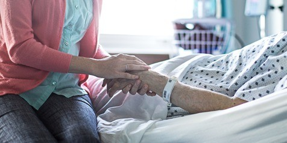

Em circunstância alguma, ou sob qualquer motivo, não cabe ao homem direito de escolher e deliberar sobre a vida ou a morte em relação ao seu próximo.\[…\]

Quem se poderá atribuir o direito de interromper-lhes a existência preciosa, santificadora?

As pessoas que se lhes vinculam na condição de pais, cônjuges, irmãos, amigos, também são-lhes partícipes dos drama do passado, responsáveis diretos ou inconscientes, que ora se reabilitam, devendo distender-lhes mãos generosas, auxílio fraterno, pelo menos migalhas de amor.

Ninguém se deverá permitir a interferência destrutiva ou liberativa por meio da eutanásia em tais processos redentores. Pessoas que se dizem penalizadas dos sofrimentos de familiares e que desejam os tenham logo cessados, quase sempre agem por egoísmo, pressurosos de libertarem-se do comprometimento e da responsabilidade de ajudá-los, sustentá-los, amá-los mais.

Não faltam terapêuticas médicas e cirúrgicas que podem amenizar a dor, perfeitamente compatíveis com a caridade e piedade cristãs.

A ninguém é dado precisar o tempo de vida ou sobrevida de um paciente. São tão escassos de exatidão os prognósticos humanos neste setor do conhecimento, quanto ocorre noutros!\[…\]

### O conhecimento da reencarnação projeta luz nos mais intrincados problemas da vida…

O conhecimento da reencarnação projeta luz nos mais intrincados problemas da vida, dirimindo os equívocos e as dúvidas em torno da saúde como da enfermidade, da desdita como da felicidade e contribuindo eficazmente para a perfeita assimilação dos postulados renovadores de que Jesus Cristo se fez vexilário por excelência e o Espiritismo, o _Consolador_ encarregado de demonstrá-lo nos tormentosos dias da atualidade.\[…\]

Cada minuto em qualquer vida é, portanto, precioso para o espírito em resgate abençoado. Quantas resoluções nobres, decisões felizes ou atitudes desditosas ocorrem num relance, de momento?

Penetrando-se, o homem, de responsabilidade e caridade, luarizado pela fé religiosa, fundada em fatos da imortalidade, da comunicabilidade e da reencarnação, abominará em definitivo a eutanásia, tudo envidando para cooperar com o seu irmão nos justos ressarcimentos que a Divina Justiça lhe outorga para a conquista da paz interior e da evolução. (Joanna de Ângelis, _Após a tempestade_, p. 68 a 71)