**A Importância da Evangelização Infantil**

_“É possível a renovação do mundo em que habitamos, além da reforma interior de cada um para o bem, sem darmos à criança de hoje o embasamento evangélico?_  
Sem a renovação espiritual da criatura para o bem, jamais chegaríamos ao nível superior que nos compete alcançar. Ajudar a criança, amparando-lhe o desenvolvimento, sob a luz do Cristo, é cooperar na construção da reforma santificante da humanidade, na direção do mundo redimido de amanhã.” (Emmanuel. _Encontros no Tempo_. Psicografado por Francisco Cândido Xavier. IDE. perg.42).

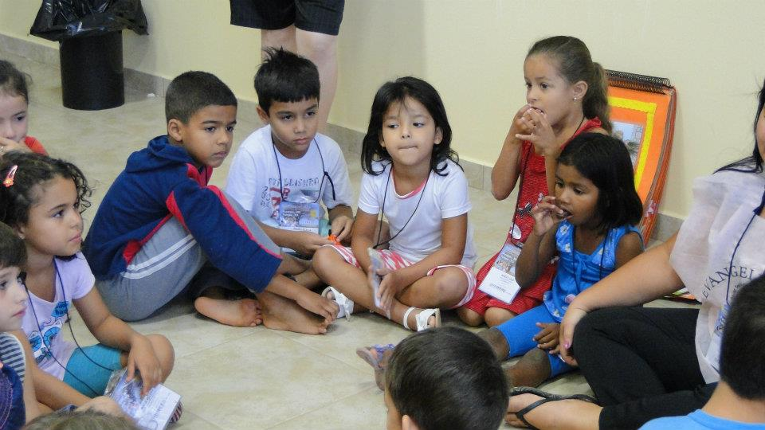

**Por que o período infantil é o mais importante para a tarefa educativa?**

“Encarnando, com o objetivo de se aperfeiçoar, o Espírito, durante esse período, é mais acessível às impressões que recebe, capazes de lhe auxiliarem o adiantamento, para o que devem contribuir os incumbidos de educá-lo.” (Allan Kardec. _O livro dos Espíritos._ Perg. 383.)

“A delicadeza da idade infantil os torna brandos, acessíveis aos conselhos da experiência e dos que devam fazê-los progredir. Nessa fase é que se lhes pode reformar os caracteres e reprimir os maus pendores.” \[…\]. (Allan Kardec. _O livro dos Espíritos_. Perg. 385.) 

**Por que a escola de evangelização espírita infantil antes dos 7 anos de idade?**

**“ O período infantil é o mais importante para a tarefa educativa?**

– O período infantil é o mais sério e o mais propício à assimilação dos princípios educativos. Até aos sete anos, o Espírito ainda se encontra em fase de adaptação para a nova existência que lhe compete no mundo. Nessa idade, ainda não existe uma integração perfeita entre ele e a matéria orgânica. Suas recordações do plano espiritual são, por isso, mais vivas, tornando-se mais suscetível de renovar o caráter e estabelecer novo caminho, na consolidação dos princípios de responsabilidade, \[…\]. Passada a época infantil, credora de toda vigilância e carinho por parte das energias paternais, os processos de educação moral, que formam o caráter, tornam-se mais difíceis com a integração do Espírito em seu mundo orgânico material,\[…\].”(Emmanuel. _O Consolador_. Psicografado por Francisco Cândido Xavier. perg. 109.)

**Qual orientação de Chico Xavier sobre o conteúdo espírita a ser estudado pela criança na Escola de Evangelização?** 

“Temos ouvido o espírito de Emmanuel há muitos anos com respeito a estes assuntos, \[…\]. Nós sempre nos desvelamos em nossas casas, no ensino da bondade, do perdão, das atitudes evangélicas em si, mas precisávamos descobrir um meio de comunicar à criança, algum ensina-mento em torno da Lei de Causa e Efeito, mostrando determinados tópicos dos mais expressivos para o mundo infantil, com respeito à reencarnação, um problema da imortalidade da alma. Muitas vezes, nós esquecemos de conduzir a criança para este tipo de lição, para este tipo de comentários, com receio de apressar na mente das crianças determinados pensamentos com relação a morte do corpo. Precisávamos estudar quais os meios de começar a oferecer à criança, bases para que ela se conheça no mundo em que está vivendo e naquele mundo social em que ela vai viver.”(Emmanuel. _A Terra e o semeador_. Psicografado por Francisco Cândido Xavier. IDE. 7. ed., perg. 101) 

 **O que é o Instituto da Criança?** O Instituto da Criança é uma unidade de trabalho, ensino e pesquisa, especializada no atendimento à infância. Laboratório de experiências fecundas onde se busca a compreensão do ser reencarnante em seu estágio infantil, se labora pela atualização contínua de conteúdos e procedimentos didáticos-pedagógicos, e representa a sintonia da teoria com a prática, a compreensão aliada à ação, o amor materializado em benefícios no campo do atendimento à criança no Centro Espírita.

  **Por que implantar esse Instituto na Casa Espírita?**

Ressaltamos a importância deste Instituto para que o Centro Espírita cumpra seu papel de Escola da Alma ensinando a viver, registrando algumas orientações onde a eloquência dos espíritos aponta a evangelização infantil como a resposta divina para que se perpetue nas mentes e nos corações a revelação Kardequiana, sob as bênçãos de Jesus Cristo, pelos tempos afora.

**Como pode ser organizado?**

Veja abaixo o organograma do Instituto da Criança:

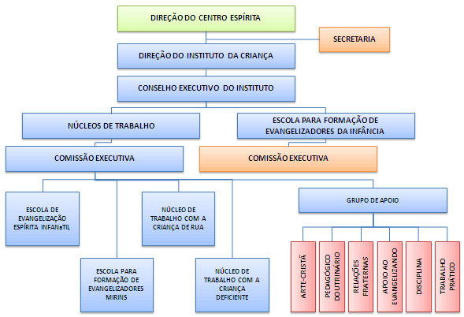

## **O Instituto da Criança**

 O Instituto da criança é dividido em 2 importantes escolas: a ESCOLA DE FORMAÇÃO DE EVANGELIZADORES e os NÚCLEOS DE TRABALHO, onde está a ESCOLA DE EVANGELIZAÇÃO INFANTIL.Os Núcleos de Trabalho constituem um setor especializado do Instituto da Criança, com caráter pedagógico-doutrinário, responsável por agregar trabalhadores formados no Ciclo de Especialização para atuar junto à infância e por executar as diversas atividades práticas do Instituto. São eles: 

**1 – Escola de Evangelização Espírita Infantil** –  A Escola de Evangelização Espírita Infantil é um Núcleo de Trabalho do Instituto da Criança, cuja tarefa é evangelizar a criança de 0 a 11 anos de idade. Esta metodologia tem como modelo as escolas de Evangelização Infantil do mundo espiritual, descritas nos livros: Mensagem do Pequeno Morto (Neio Lúcio), Escola do Além (Cláudia Galasse), Entre a Terra e o céu (André Luiz) e o livro Voltei (Irmão Jacó), todos psicografados por Francisco Cândido Xavier.

**Formação das Turmas:**

  
 Na Escola de Evangelização as crianças são agrupadas em Nível I – 0 a 5 anos e Nível II – 6 a 11 anos:

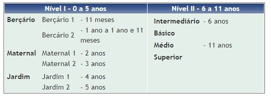

**Nível I – 0 a 5 anos:Turmas de Nível I:**

Na Escola de Evangelização as crianças são agrupadas em:

Nível I – 0 a 5 anos Nível II – 6 a 11 anos:

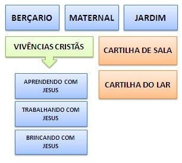

**Vivências Cristãs:**

**Aprendendo com Jesus:** É o momento em que o conteúdo será trabalhado de forma teórica e específica, de modo que as crianças possam vivenciar hábitos e atitudes cristãs. 

**Trabalhando com Jesus:**E o 2º momento e consiste em atividades práticas, associadas ao conteúdo do dia, e que foi trabalhado no Aprendendo com Jesus. 

**Brincando com Jesus:**É o 3º momento e visa desenvolver a conduta cristã por meio de brincadeiras, relacionadas com o conteúdo do Aprendendo com Jesus.

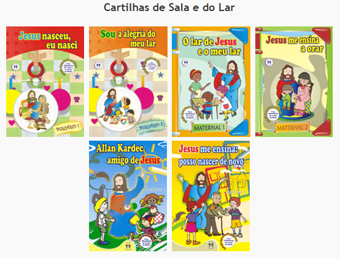

**Nível II – 6 a 11 anos:**

**Núcleo Comum:** A criança receberá conteúdos que visam à formação geral no campo evangélico-doutrinário baseados na Codificação Kardequiana e obras complementares.A criança estuda O livro dos Espíritos, O Evangelho Segundo o Espiritismo, etc.

**Parte Diversificada:** Consiste em cursos cujos conteúdos abordam dificuldades morais e problemas vivenciados pela criança, trabalhando-se as tendências inatas, familiares e as influências do meio em que vive. A criança faz cursos cujos temas são: Família, prevenção contra os vícios (fumo, drogas) etc. 

**Intermediário – 6 anos:**

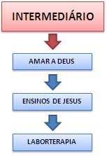

**Livros utilizados na Evangelização Infantil do Intermediário:**

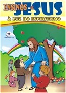

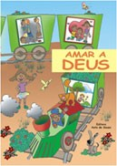

**BÁSICO DE 7 A 11 ANOS**

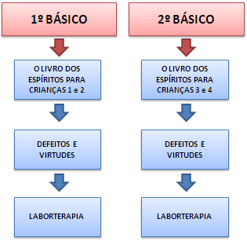

**Livros utilizados na Evangelização Infantil do 1º e 2º Básicos:**

O LIVRO DOS ESPÍRITOS PARA CRIANÇAS – 4 VOLUMES

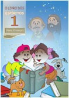

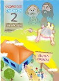

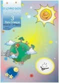

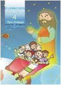

**MÉDIO E SUPERIOR**

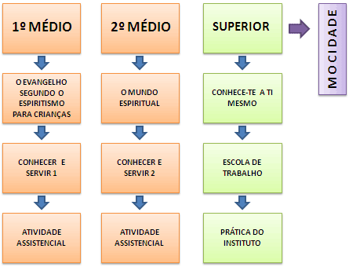

**TURMAS DE NÍVEL II**

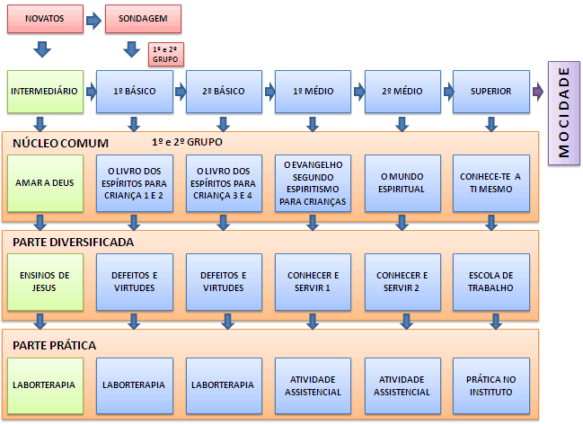

**Proposta para horário geral de funcionamento:**

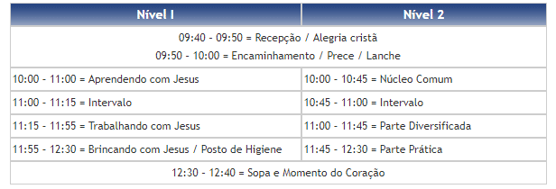

**2 – Escola para Formação do Bom Samaritano Infantil** 

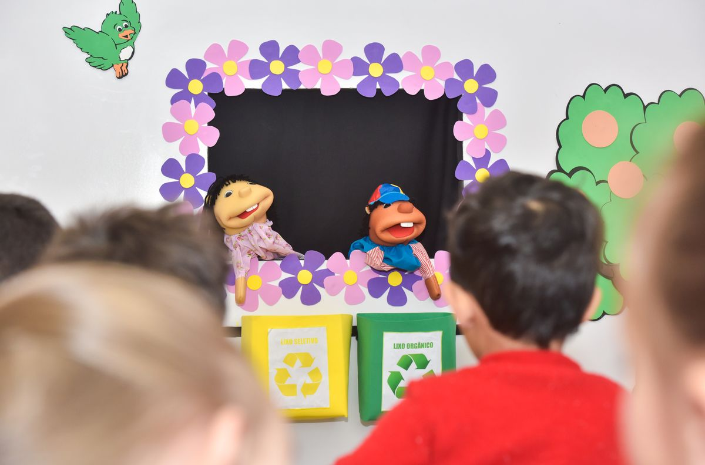

Este Núcleo de Trabalho destina-se à formação dos evangelizadores mirins na Casa Espírita, proporcionando-lhes a oportunidade de servir no campo do bem. Cabe ao Núcleo o acompanhamento das crianças em suas necessidades pessoais e familiares, promovendo formas de auxiliá-la sempre que necessário, o estímulo à participação em Encontros e Congressos Espíritas, difusão do gosto pelos estudos sérios e formação de trabalhadores especializados para as tarefas do Instituto. 

**3 – Núcleo de Trabalho com a Criança de Rua** 

Este Núcleo visa desenvolver atividades preventivas e de recuperação junto à criança de rua e à criança trabalhadora, promovendo sua reintegração ao lar, à Escola, ao Centro Espírita e à comunidade em geral. Também busca desenvolver atividades assistenciais junto ao lar da criança, como visitas, culto do Evangelho e acompanhamento familiar.  

**4 – Núcleo de Trabalho com a Criança Deficiente**  

Este Núcleo objetiva organizar o atendimento à criança deficiente, promovendo seu ajuste individual, social e espiritual, propiciando sua integração junto à Escola de Evangelização Espírita Infantil.  

**5 – Grupos de Apoio** 

Este grupo destina-se a dar apoio à execução das atividades práticas dos diversos Núcleos de Trabalho.

Para saber mais consulte o livro _Noções Básicas da Evangelização Infantil_ e todos os demais livros aqui apresentados no site da Editora Auta de Souza.

[www.editoraautadesouza.com.br](http://%20www.editoraautadesouza.com.br%20/)  

Acesse o site [www.ocentroespirita.com](http://www.ocentroespirita.com/centroespirita/) e baixe planos de aula, músicas infantis e muito mais!