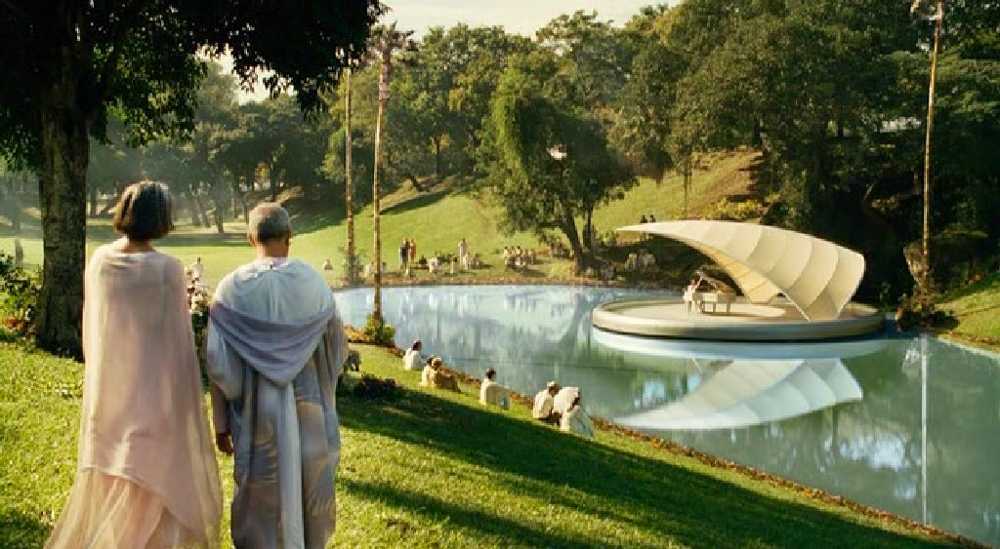

**Os espíritos desencarnados cuidam igualmente dos valores artísticos no plano invisível para os homens?**

“Temos de convir que todas as expressões de arte na Terra representam traços de espiritualidade, muitas vezes estranhos a vida do planeta.

Através dessa realidade, podereis reconhecer que a arte, em qualquer de suas formas puras, constitui objeto da atenção carinhosa dos invisíveis, com possibilidades outras que o artista do mundo está muito longe de imaginar.

No além, é com o seu concurso que se reformam os sentimentos mais impiedosos, predispondo as entidades infelizes às experiências expiatórias e purificadoras. E é crescendo nos seus domínios de perfeição e da beleza que a alma evolui para Deus, enriquecendo-se nas suas sublimadas maravilhas.”  
(Emmanuel. _O Consolador._ Psicografado por Francisco Cândido Xavier. perg. 168)