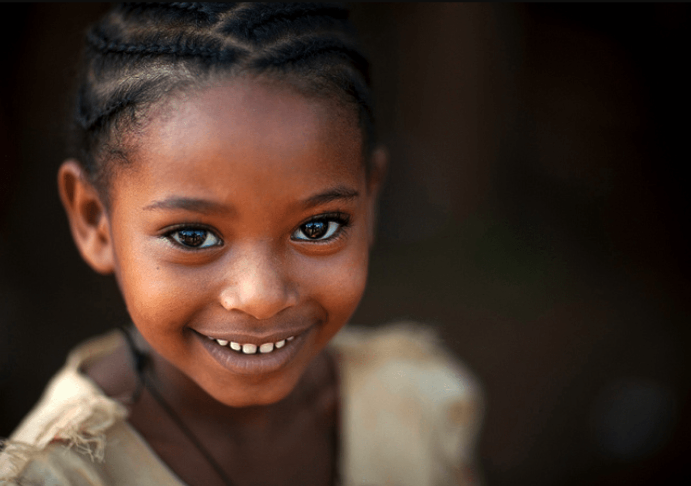

Tem sido estabelecido através da cultura dos tempos, que a infância é o período mais feliz da existência humana, exatamente pela falta de discernimento da criança, e em razão das suas aspirações que não passam de desejos do desconhecido, de necessidades imediatas, de ignorância da realidade.

Os seus divertimentos são legítimos, porque a eles se entrega em totalidade, sem qualquer esforço, graças à imaginação criadora que a transporta para esse mundo subjacente do crer naquilo que lhe parece.

Não estando a personalidade ainda formada, não há dissociação entre o que tem existência real e aquilo que somente se fundamenta na experiência mental.\[…\]Como a criança não sabe o que é felicidade, facilmente identifica-a no divertimento, aquilo que a agrada e a distrai, os jogos que lhe povoam a imaginação. É na infância que se fixam em profundidade os acontecimentos, aliás, desde antes, na vida intra-uterina, quando o ser faz-se participante do futuro grupo familiar no qual renascerá.

As impressões de aceitação como de rejeição se lhe insculpirão em profundidade, abençoando-o com o amor e a segurança ou dilacerando-lhe o sistema emocional, que passará a sofrer os efeitos inconscientes da animosidade de que foi objeto. 

Da mesma forma, os acontecimentos à sua volta, direcionados ou não à sua pessoa, exercerão preponderante influência na formação da sua personalidade, tornando-a jovial, extrovertida ou conflitada, depressiva, insegura, em razão do ambiente que lhe plasmou o comportamento. Essas marcas acompanhá-la-ão até a idade adulta, definindo-lhe a maneira de viver. Tornam-se feridas, quando de natureza perturbadora, que mesmo ao serem cicatrizadas, deixam sinais que somente uma terapia muito cuidadosa consegue anular. 

Por sua vez, o Espírito, em processo de reencarnação, acompanha mui facilmente os lances que precedem à futura experiência, e porque podendo movimentar-se com relativa liberdade antes do mergulho total no arquipélago celular, compreende as dificuldades que terá de enfrentar mais tarde, ao sentir-se desde então indesejado, maltratado, combatido. 

Certamente, essa ocorrência tem lugar com aqueles que se vêm impelidos ao renascimento para reparar pesados compromissos infelizes, retornando ao seio das suas anteriores vítimas que agora os rechaçam, o que é injustificável. A bênção de um filho constitui significativa conquista do ser humano, que se deve utilizar do ensejo para crescer e desenvolver os sentimentos superiores da abnegação e do amor. 

**Muitos conflitos da fase adulta tiveram sua origem na vida intra-uterina** 

 \[…\] Na raiz de muitos conflitos e desequilíbrios juvenis, adultos, e até mesmo ressumando na velhice, as distonias tiveram origem — efeito de causa transata — no período da gestação, posteriormente na infância, quando a figura da mãe dominadora e castradora, assim como do pai negligente, indiferente ou violento, frustrou os anseios de liberdade e de felicidade do ser. 

Todos nascem para ser livres e felizes. No entanto, pessoas emocionalmente enfermas, ante o próprio fracasso, transferem para os filhos aquilo que gostariam de conseguir, suas culpas e incapacidades, quando não descarregam todo o insucesso ou insegurança naqueles que vivem sob sua dependência. Esse infeliz recurso fere o cerne da criança, que se faz pusilânime, a fim de sobreviver ou leva-a a refugiar-se no ensimesmamento, na melancolia, sentindo-se vazia de afeto e objetivo de vida.

Com o tempo, essas feridas purulam, impelindo a atitudes exóticas, a comportamentos instáveis, às fugas para o fumo, a droga, o álcool ou as diversões violentas, mediante as quais extravasam o ressentimento acumulado, ou mergulham no anestésico perigoso da depressão com altos reflexos na conduta sexual, incompleta, insatisfeita, alienadora… 

**A Sociedade atendendo a Infância**

A sociedade terá que atender à infância através de mecanismos próprios, preenchendo os espaços deixados pela ausência do amor na família, na educação escolar, na convivência do grupo, nas oportunidades de desenvolvimento e de auto-afirmação de cada qual. Para tal mister, torna-se necessário o equilíbrio do adulto, do educador formal, que pode funcionar como psicoterapeuta, orientando melhor o aprendiz e reencaminhando-o para a compreensão dos valores existenciais e das finalidades da vida.

Inveja, mágoa, ciúme, instabilidade, ódio, pusilanimidade e outros hediondos sentimentos que afligem as crianças maltratadas, carentes, abandonadas mesmo nas casas onde moram, desde que não são lares verdadeiros, constituem os mecanismos de reação de todos quantos se sentem infelizes, mesmo que inconscientemente.

A compreensão dos direitos alheios e dos próprios deveres, o contributo da fraternidade, a segurança afetiva, a harmonia interior, a compaixão, a lealdade se instalarão no ser, cicatrizando as feridas, à medida que o meio ambiente se transforme para melhor e o afeto dos outros, sincero quão desinteressado, substitua a indiferença habitual.

\[…\]Toda vez, portanto, que alguém sinta incompletude, insegurança, seja visitado pelos sentimentos inquietadores da insegurança, do medo, da raiva e da inveja injustificáveis, exceção feita aos estados patológicos profundos, as feridas da infância estão ainda abertas ou reabrindo-se, e necessitando com urgência de cicatrização. (Joanna de Ângelis. Amor, imbatível amor. Cap.17)