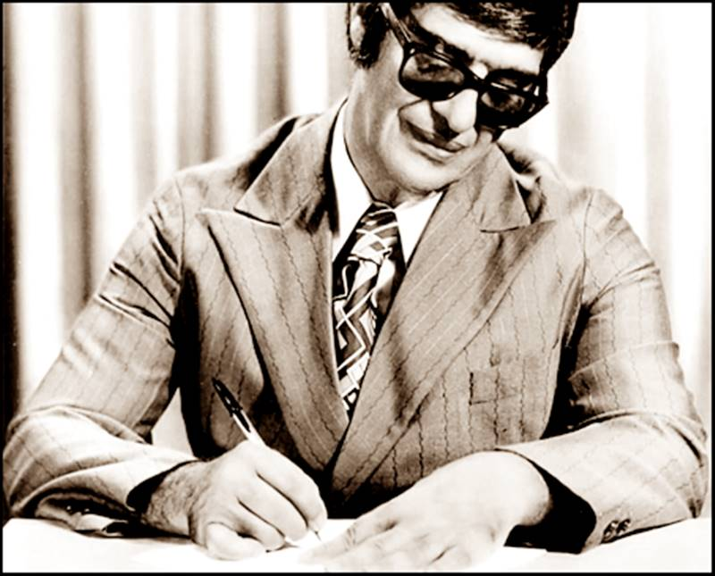

Chico Xavier nasceu no dia 2 de abril de 1910 na pequena cidade de Pedro Leopoldo, situada a 35 quilômetros de Belo Horizonte. Filho do vendedor de bilhetes de loterias João Cândido Xavier e da dona de casa Maria João de Deus, manifestou cedo sua extraordinária capacidade de entrar em contato com o outro mundo.

Aos cinco anos, ele fica órfão de mãe e o pai separa os seus nove filhos entre parentes e amigos. Chico passa a viver, então, com a madrinha Rita de Cássia e o padrinho José Felizardo Sobrinho. Permanece com o casal por dois anos. 

Durante o tempo que viveu com a madrinha, passa por dolorosas experiências. Acreditando que o afilhado tinha o diabo no corpo, já que ele lhe contava suas visões do outro mundo, a madrinha lhe ministrava surras com vara de marmelo e chega até a lhe enterrar garfos na barriga.

O menino Chico passa a ter visões da mãe no quintal da casa da madrinha, onde costumava se refugiar para rezar. Dona Maria João lhe anuncia que um anjo bom logo apareceria para ajudá-lo. Pouco tempo depois, o pai casa-se novamente. A nova esposa, Cidália Batista, exige que os filhos do primeiro casamento do marido venham a morar com ela, inclusive o pequeno Chico.

Em maio de 1927, uma das irmãs de Chico, Maria Xavier sofre grave desequilíbrio mental. Até então, toda a família seguia os preceitos da Igreja Católica, mas foi requisitado o auxílio espírita, já que o problema não conseguia ser solucionado através da medicina.

Depois da [aplicação](http://www.revistaautadesouza.com/revista/index.php?option=com_content&view=article&id=138:comemoremos-o-centenario-de-chico-xavier&catid=41:jcomments&Itemid=70#) de passes, a moça recupera-se. A partir de então o jovem Chico, passa a se aprofundar no conhecimento do espiritismo e o Livro dos Espíritos de Allan Kardec. Aprende, então, o que é mediunidade.

Ainda em 1927 ele ajuda na fundação do primeiro Centro Espírita de Pedro Leopoldo, num barracão onde morava um irmão de Chico, José Xavier, que assume a presidência. A primeira mensagem que Chico recebe é da mãe, Maria João de Deus.

No ano de 1931, Chico tem o seu primeiro contato com Emmanuel, seu orientador espiritual.

Em 1932, foi publicada a primeira obra psicografada por Chico: Parnaso de Além-Túmulo, que reuniu 14 nomes da literatura brasileira, uma coletânea de 56 poesias ditadas pelos espíritos de Augusto dos Anjos e Castro Alves, entre outros, que causou polêmica no meio literário.

Em 1935, passa a psicografar textos de Humberto de Campos, que havia desencarnado em 1934.

Em 4 de janeiro de 1959, o médium muda para Uberaba, graças a uma transferência que conseguiu da fazenda modelo, onde trabalhava.

Chico Xavier viveu seus últimos anos com uma pequena aposentadoria de escriturário do Ministério da Agricultura. Com o estado de saúde precário, já não podia mais andar, mas continuava a receber visitas, psicografar e até saia, as vezes, de cadeira de rodas, para fazer suas visitas a pessoas carentes.  
  
Foram mais de 400 livros psicografados por ele, que venderam mais de 20 milhões de exemplares.