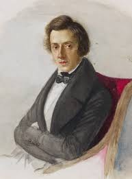

“\[…\] Geralmente, os Espíritos se apresentam aos médiuns voluntariamente, e gostam de contar-lhes o que sentem, o que fazem, como vivem, as primeiras impressões e desapontamentos que os surpreenderam, o que sofrem e o que pretendem, seja no intuito de instruírem os homens, ajudando-os no progresso a realizar, seja testemunhando a própria imortalidade ou visando a se tornarem lembrados dos seres queridos aqui deixados, amigos e admiradores, ou, ainda, fiéis aos labores de um resgate necessário à sua honra espiritual.

Alguns, como o próprio Chopin, gostam da Terra, visto que é sempre vivamente atraído para os planos terrestres por forças telepáticas poderosas.

Ele próprio afirma, em confabulações com que nos tem honrado, em ocasiões encantadoras para a nossa sensibilidade mediúnica, que aqui, no Brasil, existem, reencarnadas, personalidades que lhe foram muito caras no passado, e que, no momento, lhe é muito grato enviar notícias aos homens.

Interessa-se profundamente pela Doutrina dos Espíritos, pois confessa que, em suas existências passadas, não chegou a se dedicar fielmente a nenhum credo religioso, não obstante estivesse convencido da idéia de Deus, da imortalidade da alma e da eternidade e imutabilidade das leis divinas.

Sua religião tem sido, através dos milênios, as Artes, pois afirma ter vivido em várias épocas sobre a Terra, sempre como artista destacado.

Ele serviu mesmo, como gênio inesquecível, as Belas Artes, a Arquitetura, a Pintura e finalmente a Música, que parece ser o ponto culminante das Artes em nosso planeta, o ápice da sensibilidade que um gênio da Arte pode galgar no estado de encarnação.

Interessa-se igualmente, enternecido, pelo Esperanto, cuja perspectiva abrange numa visão futura deslumbradora, ainda porque se sensibiliza com o fato de haver sido polonês o gênio criador do brilhante idioma, Lázaro Zamenhof, seu compatriota, pois Frederico Chopin, apesar de ser entidade evoluída, conserva ainda certos preconceitos muito humanos, como, por exemplo, a reminiscência do seu amor pelo berço natal, a Polônia, sempre que paira pelas atmosferas terrenas, o que nos leva a confirmar o esclarecimento contido nas obras doutrinárias, de que um século seria, para um Espírito desencarnado, como algum pouco tempo para nós \[…\]”

Frederico Chopin

Do livro Devassando o Invisível, 12. ed. Rio de Janeiro: FEB, 200I. Cap. 3. – Informações da médium (Yvonne A. Pereira), colhidas em contatos mediúnicos com o genial compositor.