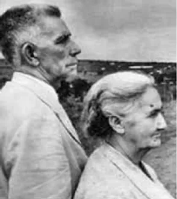

Jerônimo Cândido Gomide nasceu no dia 20 de Janeiro de 1889, um domingo, no município de Sacramento, Minas Gerais, filho de José Cândido Gomide e Jerônima Vitorina de Jesus.

Jerônimo Candinho, como era conhecido, teve uma infância tranquila. Aos 10 anos ingressou na Escola particular do Professor Miguel Valeriano, onde aprendeu a ler e a escrever, foi nesta escola em que Jerônimo aprendeu também as noções fundamentais de Aritmética.  
No terceiro ano do curso médio, no Colégio Allan Kardec, Jerônimo ajudava a lecionar: Geografia; Matemática; História do Brasil; Noções de Astronomia. Foi ajudando os professores que Candinho se preparou para ser um educador.

No Colégio Allan Kardec, Jerônimo era aluno do professor Eurípedes Barsanulfo, nas aulas de educação religiosa o livro estudado era o Evangelho Segundo e Espiritismo.

Em 1918, Eurípedes Barsanulfo, em uma conversa com Jerônimo fala que ele tem um grande compromisso, uma missão: “Um trabalho a desempenhar em lugar escolhido e que se acha longe daqui (…)”

“Logo senti que o professor Eurípedes estava me ajudando e me guiando. Eu tinha que pregar o espiritismo neste sertão sem porteira. Era a minha missão” Jerônimo Candinho

Em 1919 Jerônimo começa a divulgar o doutrina espírita e funda em Goiandira – Goias o colégio Eurípedes Barsanulfo, ensinando o alfabeto às pessoas da comunidade no período da noite e trabalhando em uma fazenda de manhã.

Jerônimo Candinho muda para a Fazenda do Pico, no município de Caldas Novas – Goias, e começa a fazer o tratamento de obsidiados, doentes, problemas familiares, etc

Em pouco tempo, uma multidão de pessoas procurava a fazenda do Pico a procura de tratamento.

“(…) Seu Jerônimo, não devia e nem podia deixar  o que havia iniciado, porque o trabalho de edificar uma cidade espírita em um centro geodésico se realizou dado a planificação dos espíritos sobre a orientação de Ismael. E isto deveria ser como já se define, um ponto de referência no “Brasil,Coração do Mundo, Pátria do Evangelho”(…)” Eurípedes Barsanulfo

Candinho muda para a Fazenda Palmela, no município de Santa Cruz de Goiás – Goiás. Esta fazenda foi o ponto de partida para a cidade de Palmelo-Goiás  
 Em uma mensagem Eurípedes Barsanulfo reafirmou o que tinha falado antes de sua desencarnação, nesta mensagem o benfeitor espiritual esclareceu muitas dúvidas e afirma que Jerônimo estava no lugar certo e pede para que ele continue nos lagos palmelinos até o seu desencarne.  
  
Jerônimo funda o Centro Espírita Luz da Verdade em 9 de fevereiro de 1929  
  
Em Julho de 1936 funda a primeira escola de Palmelo: O Grêmio Escolar são Vicente de Paulo.  
  
Jerônimo Candinho foi nomeado pela diretoria do Centro Espírita Luz ds Verdade em 30 de junho de 1937, Diretor-Professor da escola mista Gremio Escolar São Vicente de Paulo.  
  
No dia 11 de abril de 1939 foi fundado o Clube Literário Humberto de Campos  
  
“(…) Ilustres colegas de bancada: iniciamos, hoje, os nossos modestos trabalhos. A todos, os meus sinceros votos de paz e prosperidade. A todos os que neste recinto se grupam para ouvir ou trazer o seu óbulo de paz, a bem da comunidade, eu os saúdo em nome do progresso.  
  
Ajudados pela providência divina e pelo espírito daquele a quem escolhemos para padroeiro deste “club”, assevero que, grandes e sazonados frutos e perfumosas flores, colheremos, se assíduos, persistirmos neste templo de luz e verdade.  
  
Eis o que ora vos posso afirmar. (…) JERÔNIMO CÂNDIDO GOMIDE  
  
Em 1947 foi fundado o comitê feminino Eurípedes Barsanulfo. A presidente do comitê era a Senhora Francisca Borves Gomide (Dona Chiquinha)  
  
  
**Colégio Eurípedes Barsanulfo  
**  
 Fundado em 1962 e inaugurado em 3 de março de 1963 por Jerônimo Candinho

“(…) Dando a palavra aos médiuns videntes para que descrevessem o quadro espiritual, destacando-se uma monumental figura que representava a liberdade na pessoa de Tiradentes; sob a base do monumento foi visto também Pedro II imponentemente fardado de branco com as insígnias de marco irradiando luminosidade ladeando-o estavam Rui Barbosa, José do Patrocínio, Marechal Deodoro, Humberto de Campos e outros grandes vultos históricos, sobressaindo-se a presença do mestre Eurípedes Barsanulfo. (…)” Jerônimo Candinho

No dia 3 de agosto de 1954 foi fundada a tipografia e livraria Palmelo. Uma oficina tipográfica para edição de jornal, folhetos e boletins de interesse coletivo. Neste local eram ministradas também aulas de datilografia.

**  
Jerônimo Candinho – Político**

Foi vereador em Pires do Rio – Goias

Lutou pela emancipação política de Palmelo e foi o primeiro prefeito da cidade conhecida como “Cidade da Paz”

Diálogo entre Jerônimo Candinho e Juscelino Kubischeck:

“ – Você é um herói, Candinho!

– Herói é o senhor, que construiu Brasília, respondeu Candinho.

– Lá eu tive  ajuda dos candangos. Aqui você construiu com as unhas, (…)”

**Jerônimo Candinho e a Família** Casou-se com Francisca Borges, teve 10 filhos: Maria Madalena, Aloísio, Estela, Alfa, Neolina, Eurípedes, Antônio de Pádua, Laplace e Aroína. E 6 filhos adotivos:Berenice, Cícero, Maria, Olga, Sônia e Síria.