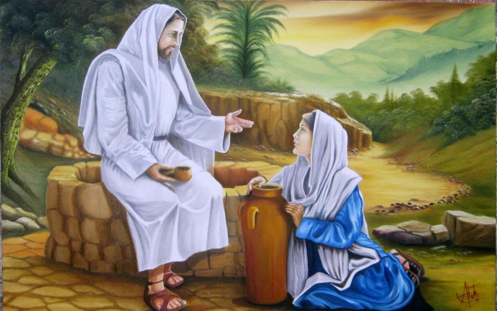

“Relâmpago fulgurante em noite escura, a palavra do Mestre cindia a noite demorada que tombava sobre Israel, desde há cinco séculos.

O eco da mensagem, doce e enérgica, se espraiava desde as planuras do Esdrelon até aos altiplanos do Hermon…

Aqueles que Lhe escutavam o verbo, renovavam-se e a nobre cantilena das Suas palavras prosseguia repercutindo no adito das almas, sendo transferida de boca a ouvido, assinalando o início da comunicação elevada pelo impregnar do amor.

Aqueles dias, naquelas circunstâncias, jamais se fariam repetir e o conteúdo das Suas palavras nunca mais seria ouvido da forma como foi enunciado e vivido… \[…\].

Sem que fosse percebida, uma mulher acercou-se de Jesus, e, após fazer-se notar por Ele, desculpou-se da imprudência de perturbá-Lo.

Sem mais delongas O interrogou:

– Sei que tu vens de Deus e posso perceber-Te a grandeza que me fascina e emociona… Tenho sede de amor e me encontro corroída pela vérmina da animalidade. Tenho amado e não logrei a honra de fruir o amor. A vida, desde há muitos anos, em que fui dilapidada nos meus sentimentos de mulher, nega-me o que venho procurando: a paz, que parece fugir de mim, onde quer que eu me encontre.

‘Que fazer, Senhor, para viver a felicidade?’

Havia na voz da estranha notas características de melancolia e de sofrimento demorado que as palavras não conseguiam exteriorizar.

O Mestre relanceou o olhar transparente pela paisagem aureolada de paz, e indagou-lhe por sua vez:

– Que vês em derredor? Examina a terra arrebentando-se em flores, frutos e verdor; o rio cantante, enriquecendo as margens de vida; o húmus discreto renovando o subsolo e os astros fulgurando ao longe…

Em tudo, a ordem, o amor, a transparência da misericórdia do Pai, ensinando equilíbrio e vida. O que parece caos transforma-se em benção, o que aparenta transtorno se converte em paz, porque em tudo vige a sabedoria do Criador.

Não relaciones dores nem apresentes mágoas.

Levanta o olhar para cima e avança para o futuro.

A criatura, surpreendida pela resposta amorosa, volveu à interrogação:

– Compreendo, sim, a grandeza da divina criação, não obstante delinqui, e, do meu delito, nasceu-me um filho, que no momento constitui-me motivo de inquietação e desespero…

Sem permitir-lhe alongar-se, o Senhor prosseguiu, imperturbável:

– A mulher é sempre mãe.

A relva que cresce sobre os escombros oculta as suas deformidades e disfarça as suas imperfeições modificando a erma expressão dos destroços.

Abençoada pela maternidade, que e sempre dádiva do Pai, honrando a vida, um filho, em qualquer circunstância, é uma estrela engastada na carne, com a oportunidade de espalhar claridade pelo caminho.

Enquanto houver crianças e mães, na Terra, o amor divino estará cantando esperanças para a Humanidade.

Não há filho do pecado nem do delito, pois que todos eles são dádivas da vida a vida.

Esquece as circunstâncias da chegada do querubim que te bate à porta do sentimento, e levanta-te com ele, avançando no rumo do infinito dos astros.”

Uma imensa serenidade vestia a Natureza.

A mulher-mãe, emocionada, procurou os olhos de Jesus por entre a visão nublada de lágrimas e fundiu-se na luminosidade que deles fluía dúlcida e pura.

Levantou-se em discreta reverência e preparou-se para sair.

Não saberia dizer se O ouviu falar ou se O escutou na acústica da alma.

– Vai, filha, e ama.

A maternidade é a mais elevada concessão de Nosso Pai, demonstrando que o mal jamais triunfará no mundo; porque enquanto houver um coração, um sentimento maternal, na Terra, o amor ateará o fogo purificador e a esperança de felicidade jamais se fanará…

No longe do tempo, ecoariam os conceitos do Filho de Maria, a Mãe por Excelência, sustentando a mulher no ministério da maternidade por todo o sempre.”

Amélia Rodrigues, Há Flores no Meu Caminho, psicografia de Divaldo P. Franco, 2. ed., p. 37-40